# Assignment: Create a Customized Basemap using MapBox
#### Submit by Nov.15th 11:55pm through Laulima

---

This instruction will guide through the process of creating a customized basemap using MapBox. A basemap provides a background of geographical context for the content you want to display in a map. However, creating or choosing an appropriate basemap can be tricky. Here are some considerations for basemap:

- You should avoid color conflicts between the basemap and the layers on top of it. Having the same color in elements the basemap and feature layers can be confusing.
- The theme of the basemap should supplement the information provided by the map layers on top of it. For instance, it would be better to plot locations of traffic accidents on top of a map showing the road network rather than a satellite image.
- Consider aesthetics. Some colors look nice when placed together, while some others don't. Also, different combinations of color can express different themes. A group of colors that can be used together is called a color theme or color pallate. The following tools can help you to choose color themes:
  - Coolors (https://colorpalettes.net/)
  - Color Palettes (https://colorpalettes.net)
  - Palettr (http://palettr.com)

In this exercise, we will create a customized basemap using [MapBox](https://www.mapbox.com/), is an large provider of custom online maps and geospatial analytical services.

---

## Step 1. Getting Started
You will need a few resources to get started:

- Mapbox account. Sign up for a free account on [Mapbox](https://account.mapbox.com/auth/signup/).
- Style guidelines. It is often helpful to start a new custom map style with some broad style guidelines. Mapbox's brand has three primary colors (blue, gray, and pink) and a broader set of secondary colors. Every hue includes a dark, light, and faint variation. This tutorial will use a combination of these colors to style the background, water, buildings, and labels in a custom map style.

---

## Step 2. Create a new stype
Log in to your Mapbox account and navigate to the [Styles](https://studio.mapbox.com/styles) page. This is where all your map styles are listed. A [style](https://docs.mapbox.com/help/glossary/style/) is a set of rules that defines how Mapbox draws your map on the webpage. It includes references to your data, map images (icons, markers, and patterns), fonts, and defines how all your data should be styled on the map. For more information about styles, read the [Styles](https://docs.mapbox.com/studio-manual/reference/styles/) section of the Mapbox Studio Manual.

To create a new style from your [Styles](https://docs.mapbox.com/studio-manual/reference/styles/) page, click the **New style** button. Find the Basic Template style and click **Customize Basic Template**.
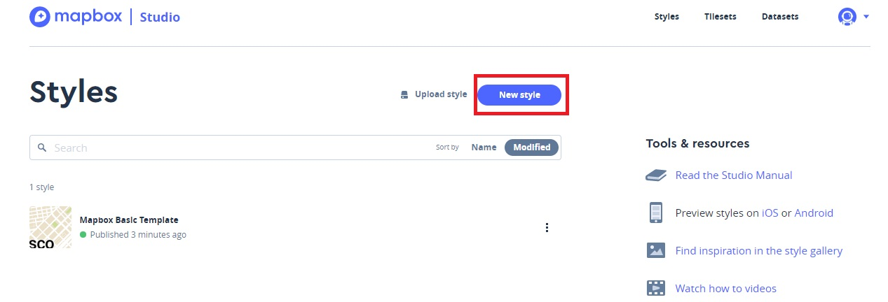

Then, the Mapbox Studio style editor opens, and you should be able to start creating a custom map style.

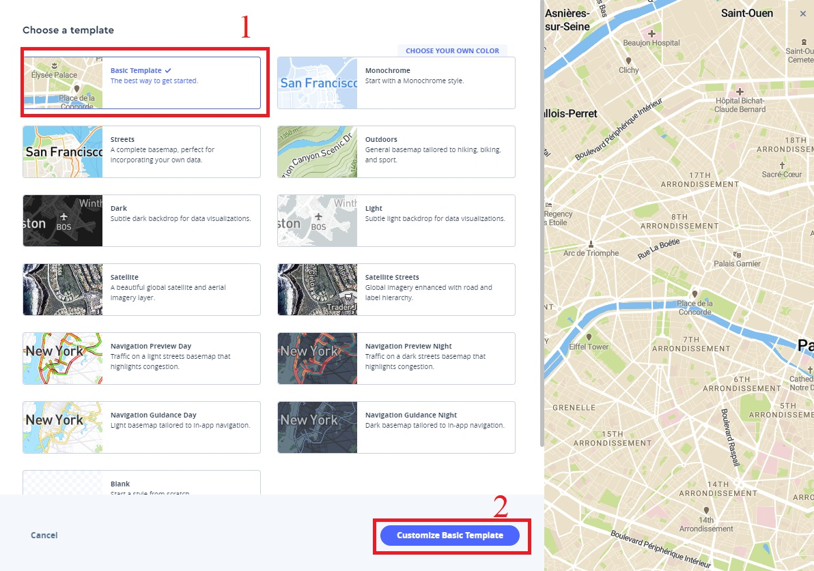

---

## Step 3. Customize your style

### 3.1 The style editor
The **Mapbox Studio style editor** is a visual tool for creating custom map styles. Look at the layers on the left side of the style editor screen. Each layer can be customized in a variety of ways, including by changing its colors. You can also filter layers within the layer list and edit the properties of multiple layers at once. This is the easiest way to change the color of layers with similar properties. To learn more about the Mapbox Studio style editor, visit the [Mapbox Studio Manual](https://docs.mapbox.com/studio-manual/reference/styles/).

In this section, you will change the color of the water, background, and building layers and alter the fonts for various labels to create a customized basemap.

But first, change the name of your new style. Click into the name field in the upper left side of the screen and change the name to Mapbox Style.

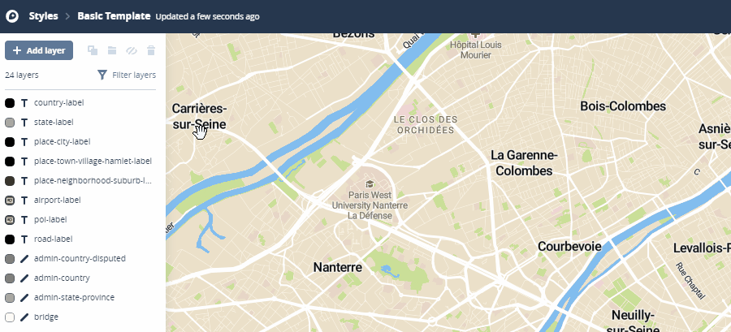

### 3.2 Style background and water layers
When the style editor first opens with the Basic style template, the map is zoomed in at a high level. Zoom out to an approximately level so that you can see a larger geographic region. In the search bar, type in San Francisco (or another region that gives you a good mix of water, land, and city features).


You will start by altering the water and background layers so they match the colors from the Mapbox style guide.

### 3.3 Style the water layer
You will style the water layer with a bright blue color from the Mapbox style guide.

- Click on the water layer in the layer list. When the layer panel opens, click on the Color field if it is not highlighted already.
- Choose or input a color that you like (we recommend #314CCD)
- You can undo the change if you don't like.
- 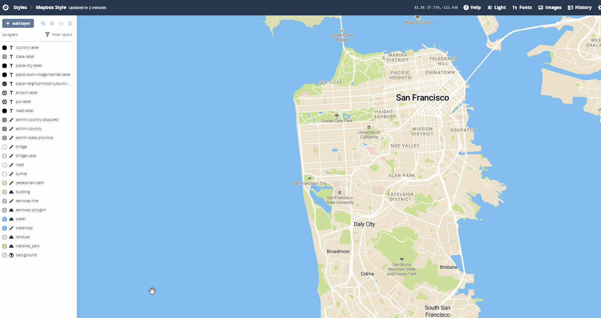

### 3.4 Style the background layer by zoom level
Mapbox Studio lets you adjust styles based on specific data. In this case, you will use the style editor to change the color of the style's background based on the zoom level. Using zoom properties, the background color will become gradually lighter as the map zooms in. To style the background layer by zoom level:

- Click on the **background** layer in the layer list.
- When the layer panel opens, click the **Color** option if it's not already highlighted.
- Click **Style across zoom range**, and then you will see two zoom levels, each with a color.
- Click **Edit** next to each stop. The text field on the top right of the card is the zoom level and the text field on the bottom right is the color. When you're done adjusting the zoom level and the color for a specific stop, click Done.

- Edit the first stop so the zoom level is 6 and the color is #A9B6EF.
- Edit the second stop so the zoom level is 12 and the color is #EDF0FD.
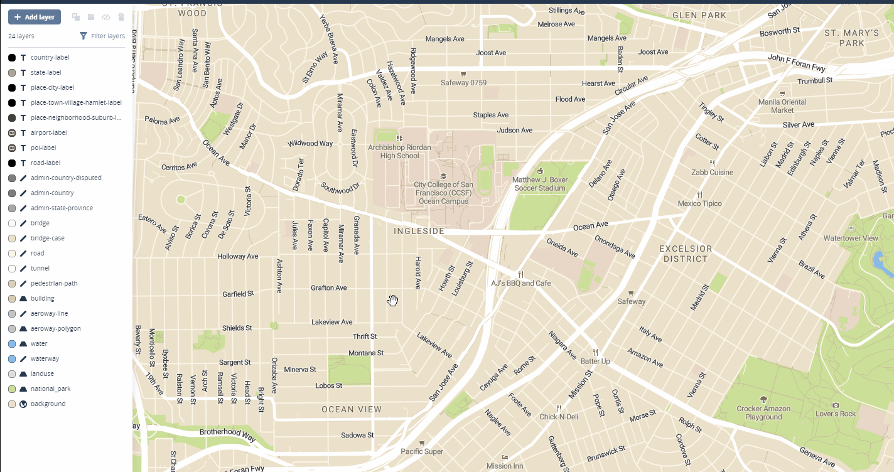

Now, when you zoom in, the background color changes gradually as the zoom level increases.

### 3.5 Style the landuse and national park layers
Now that you have changed the colors for the water and background layers, the green color that is used in the Basic style looks too bold. You will change the color of these layers to a light green from the style guide's secondary colors.

1 Select the **national_park** layer.
2 When the layer panel opens, select the **Color** field. Change the **Color** field to #E8F5EE
3 Select the **landuse** layer.
4 Click on the **Color** field if it is not highlighted already.
5 Click the "class is **park, pitch**" condition.
6 Change the **Color** field to #E8F5EE.

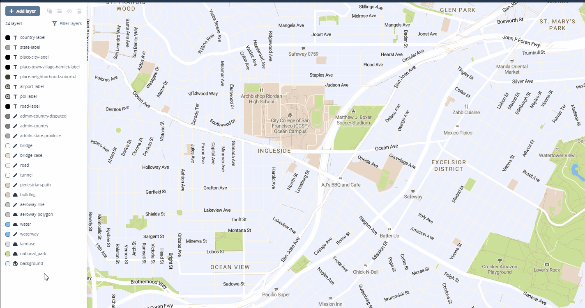

### 3.6 Update fonts
Next, alter the fonts that are used as labels in your style.

1. Click **Filter layers** at the top of the layers list.
2. Choose **Filter by value**.
3. Choose **Fonts**.
4. Select **Roboto Black**. This will return the only layer in which this font is being used, **state-label**.
5. Click on state-label, then click on **Font**. Change the font to `Roboto Condensed Bold`.
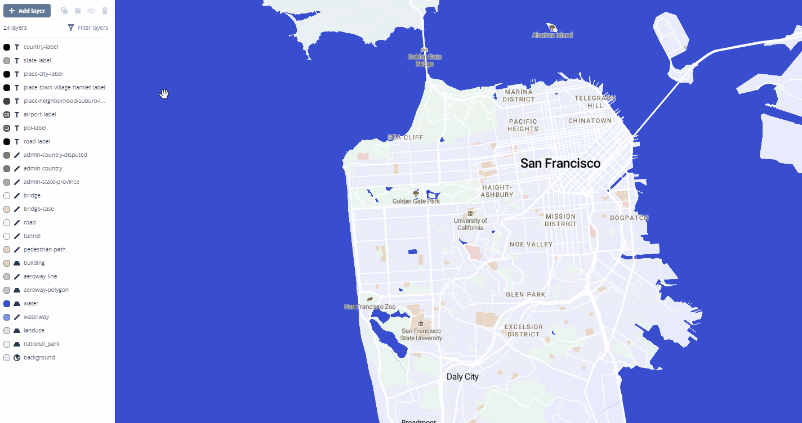
6. Click all values in the filter.
7. Click on **Filter layers** again, and repeat this process for the font `Roboto Regular`, which you will change to `Roboto Medium`.

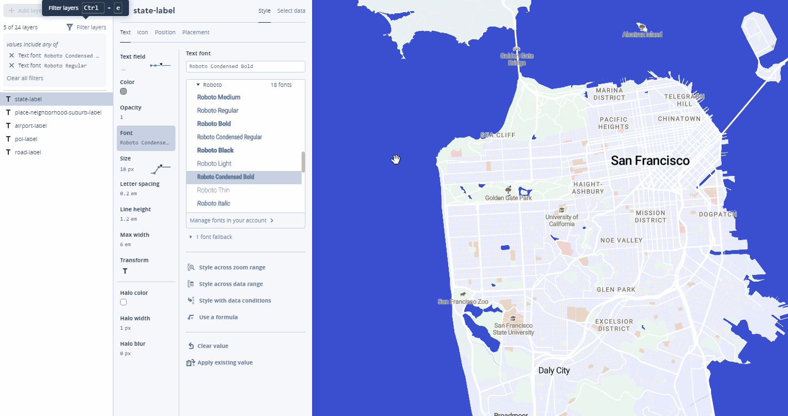

- You can select multiple layers at once by holding down `command` (Mac) or `CTRL` (Windows) while clicking to select layers


### 3.7 Style labels
After you have changed the fonts and set some general options, it's time to update the colors of the various label types used in your style.

1. Click **Filter layers** at the top of the layers list and search for the word label. This search will return 9 layers with the word label in their names.
2. Select **country-label**.
3. When the layer panel opens, select the **Color** field and change it to #ffffff.
4. Change the **Halo color** field to #314CCD.
5. Select **place-neighborhood-suburb-label** and change color to #EE4E8B, halo color to #ffffff


6. Select **place-city-label**. click Clear value and then specify the color #ffffff, halo color #273D56
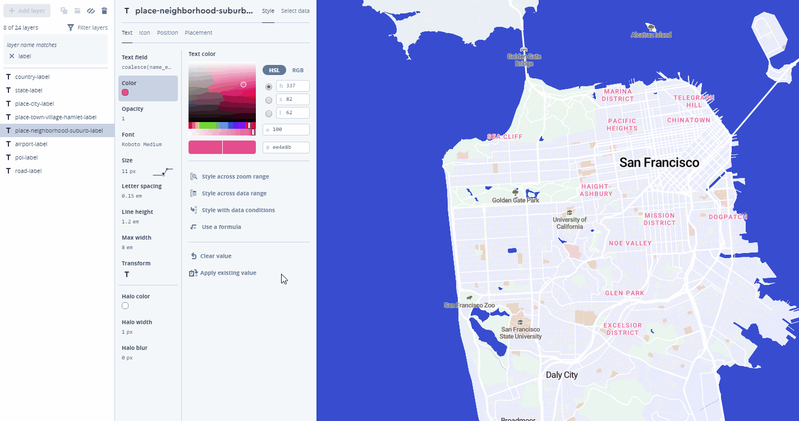


### 3.8 Style buildings
Next, change the color of the buildings in your style to a color from the Mapbox style guide:

1. Click on the **building** layer in the layer list.
2. When the layer panel opens, change the **Color** field to #aab7ef.
3. Change the **1px stroke** field to #aab7ef.

To make sure that Mapbox template styles are performant, layers are not included at every zoom level. The building layer, for example, is visible only at zoom levels 15 and higher. You can use a zoom function to create a fade-in effect as you zoom past level 15 rather than buildings showing up abruptly once you hit zoom level 15:

1. In the **Opacity** field of the **building** layer, select **Style across zoom range**.
2. Click **Edit** to open and edit each stop:

  - Edit the first stop so the zoom level is `15` and the opacity is `0`. To change the opacity, move the opacity slider all the way to the left.
  - Edit the second stop so the zoom level is `16` and the opacity is `1`.
3. Zoom in to see the buildings fade between zoom level `15` and `16`.


---
## Step 4: Publish
When you have finished editing your map style, publish your changes by clicking **Publish** in the upper right side of the screen. When you click the publish button, a window will display the difference between the previous and current version of this style. If you're happy with the changes, click **Publish**. Your style will now be available to share from a variety of tools and applications.

After publishing, click **Style** in the top-left corner to go back to the style dashboard.

---
## Step 5: Adding the basemap to a web map

Once you’ve finished adding data and styling your base map, the next step is to add it to a web page. To use your base map style in Leaflet, you will need the style URL for your map and an Access Token associated with your account.

### 5.1 Style URL
A style URL is how you refer to your map style in other Mapbox tools. Combined with your access token, it allows you to access and use your map with any of the [Mapbox developer tools](https://www.mapbox.com/developers).

The following is the style URL of mine, which includes three components:
```
mapbox://styles/alextoqiang/cjzbv54uv04u31cnxplrpx6cs
```

- `mapbox://styles`: points to Mapbox's style APIs
- `alextoqiang`: your username
- `cjzbv54uv04u31cnxplrpx6cs`: your style's unique ID.

You can find your map's style URL in [Style page of Mapbox Studio](https://www.mapbox.com/studio/styles)
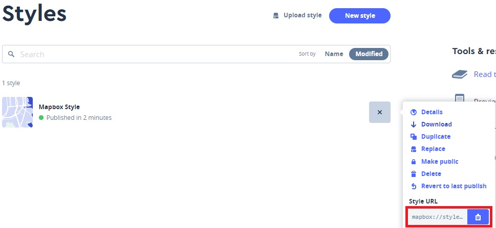

Open a new file in Atom. Copy and paste the style URL to into the file for later use.


### 5.2 Access Token
Mapbox uses **access tokens** to associate your apps and tool usage with your account. Every account has a default public access token, but you can create new access tokens as well. Your default access token is listed on your Mapbox Studio home page. You can also manage your access tokens with Mapbox Studio.

To get your access token, go to your **account**.
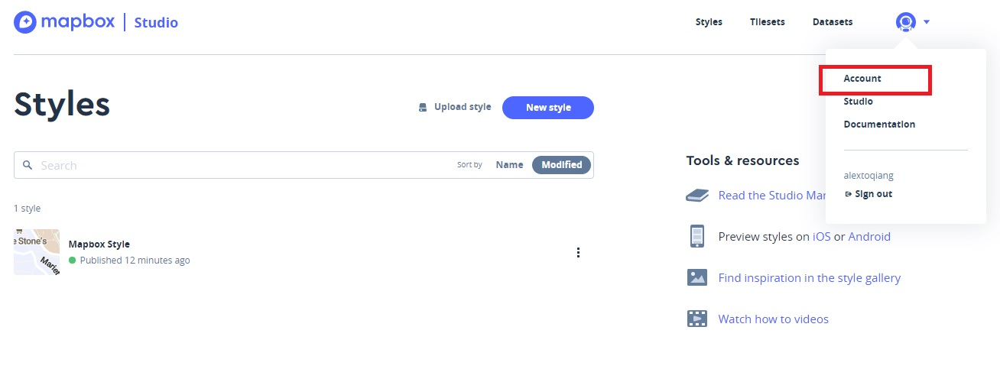

Here is your access token:
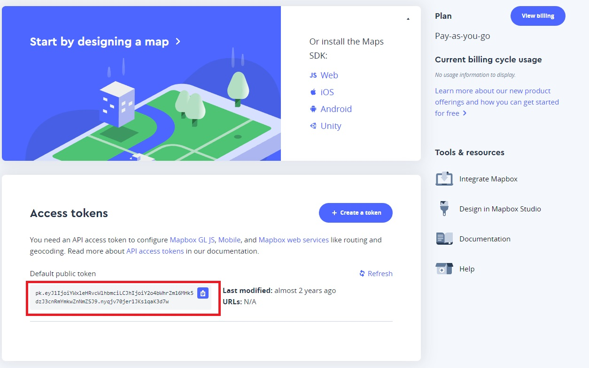

Many other web map services (such as Google Maps and Bing Maps) are using access token to manage the usage of users' accounts.


### 5.3 Use the customized basemap in leaflet
In order to show how to use a customized basemap in leaflet, please refer to the source codes of this lecture.


Insert the following stylesheet and js APIs in the `head` of index.html.

```
<link rel="stylesheet" href="https://unpkg.com/leaflet@1.4.0/dist/leaflet.css" />
<script src="https://unpkg.com/leaflet@1.4.0/dist/leaflet.js"></script></head>

```
You need to compose a URL for the basemap you created in MapBox.

- Find the style URL you have saved (in an empty text file).

- Copy and paste your MapBox **username** and the **style's ID** to replace `YOUR_USERNAME` and `YOUR_STYLE_ID` in the following code.

```javascript
mapURL3='https://api.mapbox.com/styles/v1/YOUR_USERNAME/YOUR_STYLE_ID/tiles/256/{z}/{x}/{y}?access_token=pk.eyJ1IjoiYWxleHRvcWlhbmciLCJhIjoiY2o4bWhrZm16MHk5dzJ3cnRmYmkwZnNmZSJ9.nyqjv70jer1JKs1qaK3d7w';

```

Alternatively, you can get this URL from the **Share** window in the style editor:
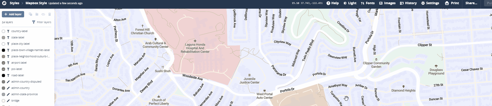
Anyone with the URL can view the map styel you created.

Add another basemap in addition to the two existing basemaps in the web map (index.html) created in the lesson. The new basemap's URL is the URL you just composed.

```javascript
mapURL3=INSERT_STYLE_URL_HERE;

var basemap1 = L.tileLayer(mapURL1, {id: 'MapID'}),
basemap2   = L.tileLayer(mapURL2, {id: 'MapID'});
var basemap3 = L.tileLayer(mapURL3 {id: 'MapID'})

var baseMaps = {
    "Topography": basemap1,
    "Satellite": basemap2,
    "My basemap":basemap3
  };
```


Refresh Chrome. The customized basemap should be added in the layer control.
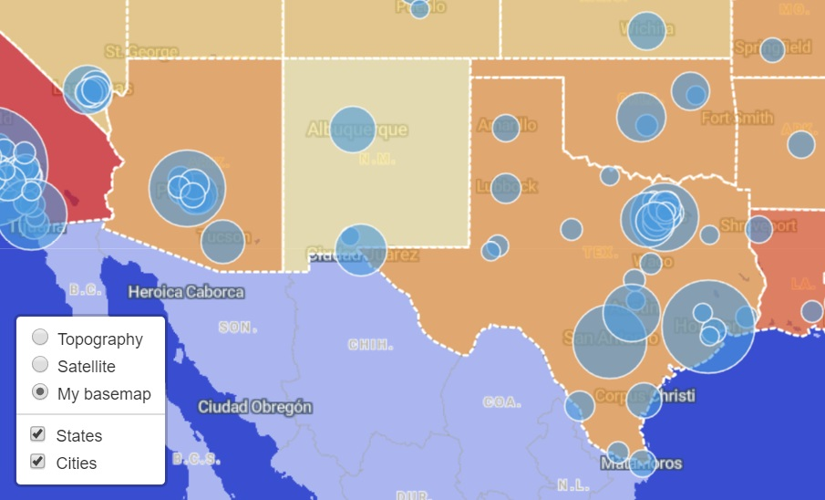

Note: instead of using the style, MapBox provides Javascript APIs that facilitate users to use MapBox maps in many other ways. You can find the methods of using MapBox in various applications in the [account page](https://account.mapbox.com/).
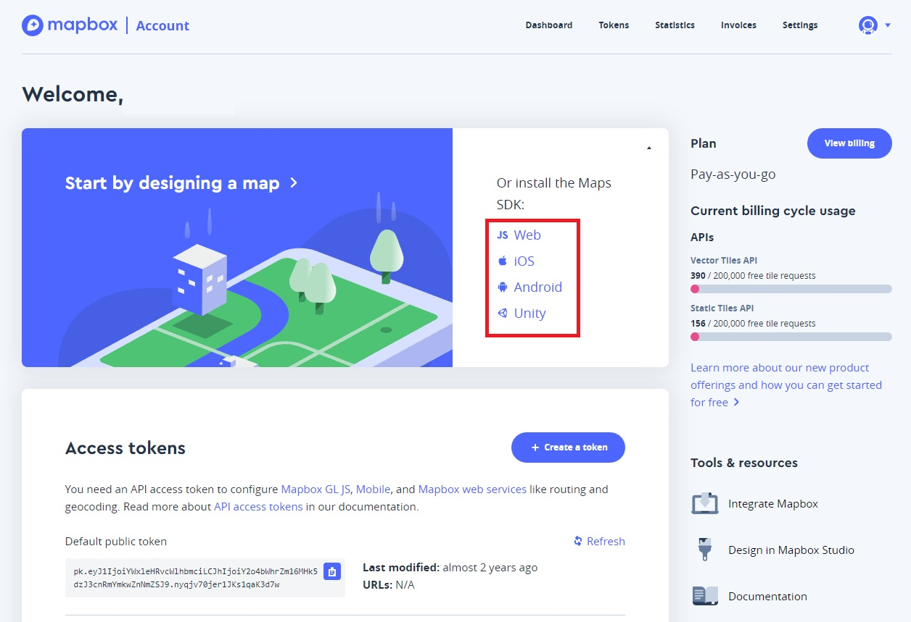

## More about Mapbox
In addition to a basemap, you can create various types maps (e.g. thematic map, 3D map, heat map...) using MapBox. You may refer to [the tutorials in MapBox](https://docs.mapbox.com/help/tutorials/) about how to create these maps.

However, bear in mind, MapBox is not free. MapBox gives you [free monthly usage up to a limit](https://www.mapbox.com/pricing/). If you want to deploy your web map in a website with many users, you should either have the budget to pay for the MapBox usage or build your own web service.

Note, relying your web map functionalities on a commercial provider is always a risk. The price hike of Google Maps in 2018 affected many web map applications built on its APIs. For long-term sustainability of you web map, it is better to prepare back-ups for potential unavailability of the services.


## Submission
Please add the customized basemap you created in MapBox as the 3rd basemap in the web map (index.html) you created in this class.

Upload index.html and associated files to your UH website. Provide a URL of the web map that I can access to the map.

**Note**: your UH web space only has 70M, which can be full if the previous web maps are still there. You may need to back up the previous web maps in your own computer and clean all files and folder in the public_html folder before uploading the new map.

Please submit the complete assignment (the URL to the web map) through Laulima by **Nov. 15th (Friday), 11:55pm**.
