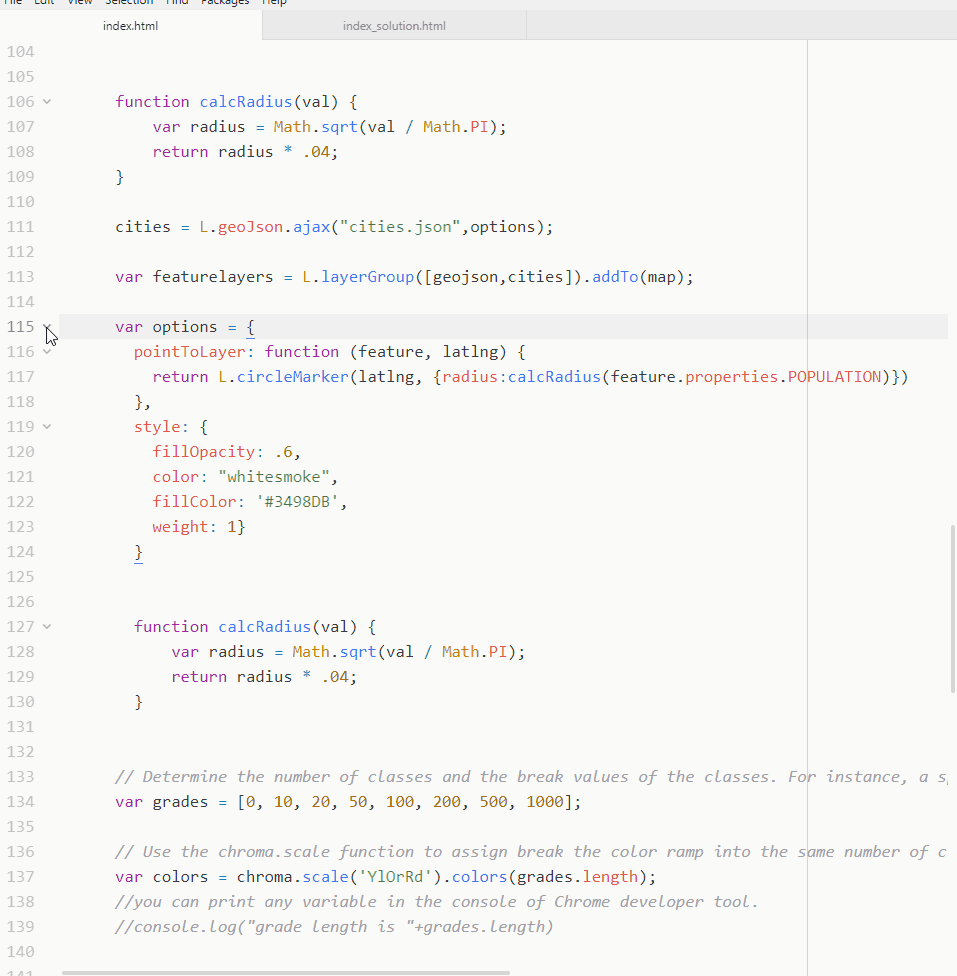
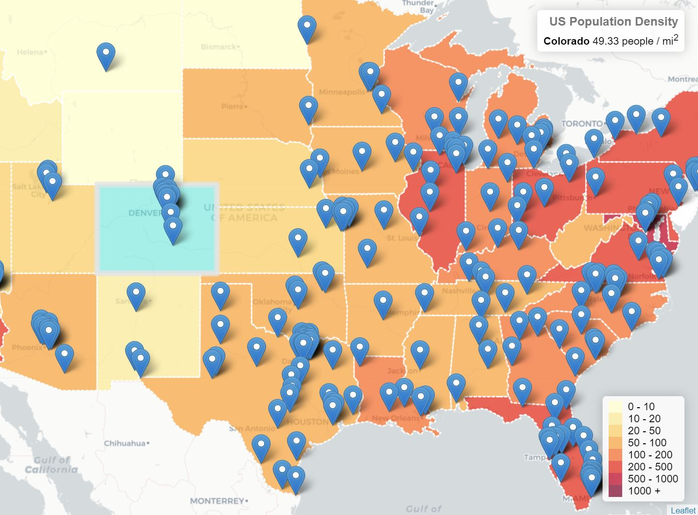
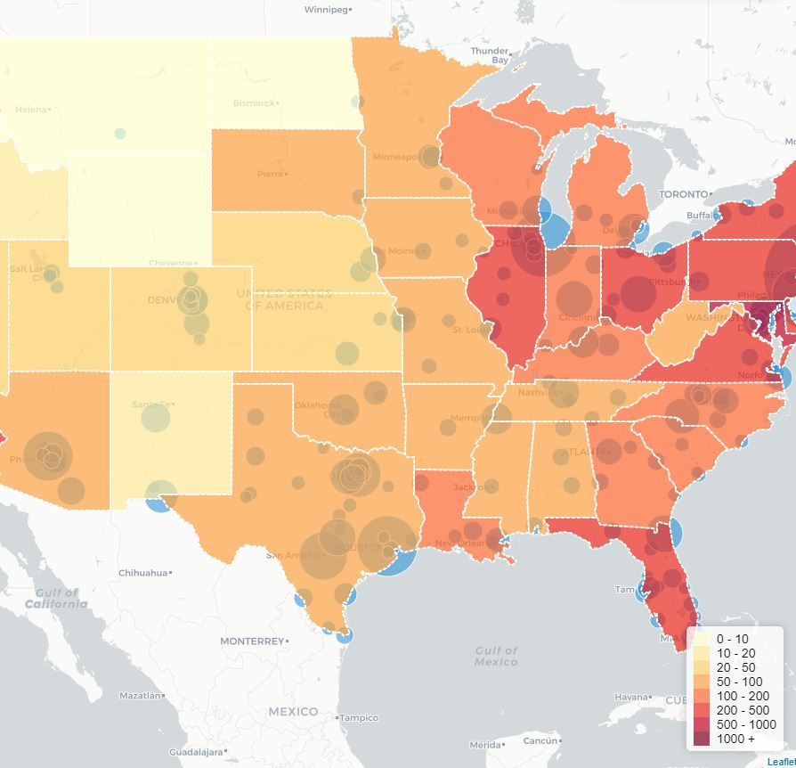
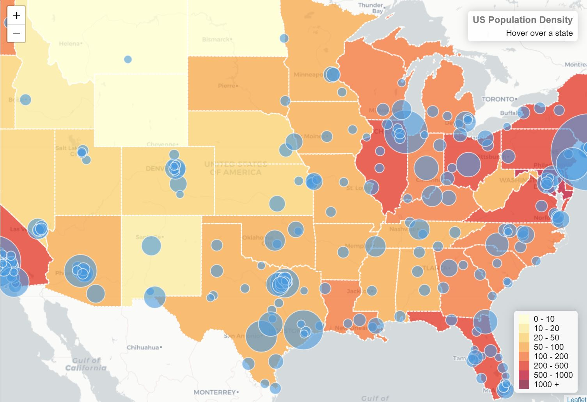
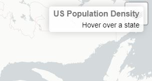

# Layer Group and Layer Control

##### Instructor: Yi Qiang <br/>Email: yi.qiang@hawaii.edu <br/>Nov. 1st, 2019
---

This lesson will introduce how to combine multiple feature layers in a map and add controls to allow users to switch layers on a map. Using this method, you can combine map layers from different sources (e.g. distributed servers and map services) into new maps. This process is also called **map marshup**.


## Learning objectives:
- Learn to add multiple layers in a map
- Learn to add a layer group in a map
- Develop interactive controls to switch map layers


Download files for this lesson from [Google Drive](https://drive.google.com/open?id=1TmyYVW6guW6iRkY_O-ZaeTr9Obn9mjCd). Store the files in a local folder in your computer.

Before proceeding, verify you have correctly set up your development environment with the necessary components. Refer to [Lec 7: getting started with web mapping](https://github.com/qiang-yi/GEOG476/blob/master/lecture/lec7_start_web_mapping.md) for help.


## Step 1. Adding an additional layer to the map
As usual, conduct the following steps to set up the development environment:
- Open index.html in chrome
- Launch a Python HTTP server, using the downloaded folder as the root directory.
- Open the website in Chrome using `localhost` as the domain name.


Review the code in _index.html_. You can find it is actually the choropleth map we created in lecture 8. At this step, we will add another feature layer to the map.

Before editing, it is helpful to hide the content of functions and objects and only show the names. This will help you to navigate through the document and find the function you want to edit. You can expand the function when you need to edit it.



Add the city layer to the map:

```javascript
cities = L.geoJson.ajax("cities.json").addTo(map);
```


You can add as many layers as you want to the map. If there are many layers, it would be easier to combine multiple layers into a _layer group_ and add the entire layer group at one time.

Let's delete `.addTo(map)` from the end of the two `L.geoJson.ajax` functions, and add a _layer group_ of the two layers.

The modified code should look like:
```javascript
// Create a layer of states from us-states.json
geojson = L.geoJson.ajax("us-states.json", {
    style: state_style,
    onEachFeature: onEachFeature
}); //DELETE .addTo(map) here

// Create another layer of cities from cities.json
cities = L.geoJson.ajax("cities.json");

var featurelayers = L.layerGroup([geojson,cities]).addTo(map);
```

The point markers represent cities with >100k population. It would be interesting to express the size of the cities in the map. We can use proportional symbols to represent the population of the cities (you've done this in lecture 8).

Add the `options` object and `calcRadius` function before the creation of `cities` layer.

```javascript
// Define options
var city_options = {
  pointToLayer: function (feature, latlng) {
    return L.circleMarker(latlng, {radius:calcRadius(feature.properties.POPULATION)})
  },
  style: {
    fillOpacity: .6,
    color: "whitesmoke",
    fillColor: '#3498DB',
    weight: 1}
}


function calcRadius(val) {
    var radius = Math.sqrt(val / Math.PI);
    return radius * .04;
}
```

Then, add `options` to the `cities` layer.

```javascript
//Create the cities layer with options
cities = L.geoJson.ajax("cities.json",city_options);

```

Refresh Chrome and you'll see proportional circles are added to the map.


However, the state layer are placed on top of cities, so the circles are partially masked by the polygons.

Delete or comment out the following line in the `highlightFeature` function so the polygons are not brought to the front after mouse hovering over.
```javascript
// layer.bringToFront();
```

Check the map in Chrome (after refresh), you'll see the cities (circles) are placed above the states.


## Step 2: Add a control to add or remove feature layers
If a web map have more layers, it is nice to have a control that allows the user to toggle on or off the layers. In this step, we will add a [Layer Control](https://leafletjs.com/reference.html#control-layers) to turn on/off layers.

Create an objects to contain the two feature layers, and add the object to the layer control.

Add the following code after the `layerGroup` is added to the map.

```javascript
var featureLayers = {
    "States": geojson,
    "Cities": cities
};

L.control.layers(featureLayers).addTo(map); //
```
Check the map, a layer control is added in the top-right corner, right beneath the interactive textbox that shows the state name. Top-right corner is the default position of the control.



We change the control to a different position. Add a `position` property in the `L.control.layers` function to position the control in the bottom left.

```javascript
L.control.layers(null,featureLayers,{position:'bottomleft'}).addTo(map);
```
Note: `null` is a placeholder to skip the basemap object, which is supposed to be the 1st argument of the function.


However, when you toggle off and on the state layer, the state layer will be placed on top of the circle, which we don't want. In oder to keep the cities (circles) always on the top. You need to add the following, which brings the `cities` layer to the top when another layer overlays with it.

```javascript
map.on("overlayadd", function (event) {
  cities.bringToFront();
});
```

## Step 3: Switch basemaps
Basemap is an important component for providing background geographical information in a web map. However, different basemap emphasize on different types of information. For instance, the basemap in Google Maps can switch between map view and satellite view, each shows unique aspects of geography. In this task, we expand the layer control to allowe users to switch between two different basemaps.

Create two basemap layers and combine them in the `baseMaps` object. You can add the code at the bottom of `<script>`.
```javascript
mapURL1=InsertURLHere
mapURL2=InsertURLHere

var basemap1 = L.tileLayer(mapURL1, {id: 'MapID'}),
basemap2   = L.tileLayer(mapURL2, {id: 'MapID'});

var baseMaps = {
    "Topography": basemap1,
    "Satellite": basemap2
};

//Add basemap toggle to the toggle menu
L.control.layers(baseMaps,featureLayers,{position:'bottomleft'}).addTo(map);
```

Go to [this website](https://leaflet-extras.github.io/leaflet-providers/preview/) and select two basemaps that you prefer. Here I choose a topographical basemap and a satellite basemap as example. Replace `InsertURLHere` with the map URL:


Now, you can switch the basemap to show different background information


## More about Mapbox
In addition to a basemap, you can create various types maps (e.g. thematic map, 3D map, heat map...) using MapBox. You may refer to [the tutorials in MapBox](https://docs.mapbox.com/help/tutorials/) about how to create these maps.

However, bear in mind, MapBox is not free. MapBox gives you free usage with a monthly limit. If you want to deploy your web map in a website with many users, you should either have the budget to pay for the MapBox usage or build your own web service.

Note, relying your web map functionalities on a commercial provider is always a risk. The price hike of Google Maps in 2018 affected many web map applications built on its APIs. For long-term sustainability of you web map, it is better to prepare back-ups for the potential unavailability of the service provider.

---

# Assignment

Follow the [instruction](../assignment/lec10_assignment_MapBox.md) to create a customized basemap using MapBox.
