# Web Map Service

##### Instructor: Yi Qiang <br/>Email: yi.qiang@hawaii.edu <br/>Nov. 8th, 2019
---
This lesson will introduce web map services (WMS) and how to set up web map services in GeoServer.


## Learning objectives:
- Introduction to web map server
- Basics of GeoServer, a popular open-source WMS platform
- Develop interactive controls to switch map layers
- Publish a web map layer using GeoServer
- Linking  GeoServer layers in a Leaflet map


Download the [files for this lab](https://drive.google.com/drive/folders/1TBrLFOz-h_I1lHwbg6QAc88uBHH1iZDQ?usp=sharing) and save them in a known location (i.e., a directory in your Documents). The files include a web map template (index.html) and and a shapefile (chicago.shp).

Before proceeding, verify you have correctly set up your development environment with the necessary components. Refer to [Lec 7: getting started with web mapping](../lec7_start_web_mapping.md) for help.

## 1. Basics of Web Map Services
There are various ways to get geospatial data to show up in someone's web browser:

#### Rendering entire dataset
One way is for the server to send a bunch of text-based geographic data to clients' browsers to draw. This is what you have done in previous lessons in which you loaded GeoJson data stored in your local server to the web maps. This simple approach is easy to implement but has limited ability to render large datasets. All the datasets we used are relatively small in size. The U.S. state dataset is the largest, which only contains 51 polygons (88KB). The entire GeoJson dataset needs to be transmitted to the client's browser to be displayed in the web map. In some web applications, the datasets may include hundreds or thousands of polygons at a finer resolution, which leads to larger data sizes. Transmitting large datasets from server to client browser can lead to slow response of the browser and thus negatively affect user experience. This issue can be worse when the web map has many layers.

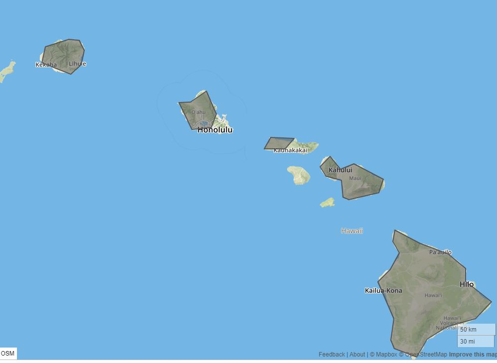

The awkward state boundaries in the GeoJson data are mainly for reducing data size.

#### Web Map Service (WMS)
The OpenGIS® **Web Map Service (WMS)** Interface Standard provides a simple HTTP interface for requesting geo-registered map images from one or more distributed geospatial databases. The WMS receives a request from user detailing the bounding box (or extent) of the map, the layers to include, resolution, the projection to use, and other parameters. It returns a rasterized map image in a common format such as JPG, GIF, or PNG. This technique reduces the data size to be transmitted from server to client and thus increase the response speed of web application. The WMS also supports the ability to specify whether the returned images should be transparent so that layers from multiple servers can be combined or not.

> Web Map Tile Service (WMTS) specification (a subtype of WMS) is an international standard for serving digital maps over the web using cached image tiles. When you create a cached map or image service using a web map server, the service and its tiles are automatically accessible using the WMTS specification. Most raster images (such as leaflet basemaps, Google Map images) are hosted as WMTS.


The basemaps in the [leaflet basemap gallery](https://leaflet-extras.github.io/leaflet-providers/preview/) are essentially WMS.

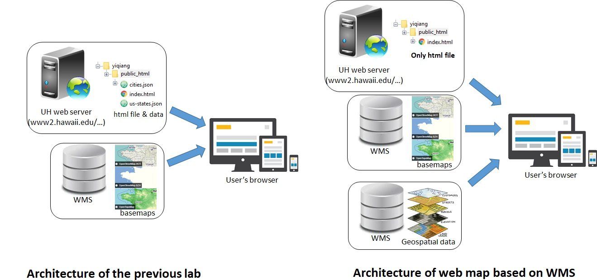


### Software for hosting WMS
There are many software options for hosting Dynamic WMS in a web server.
- [GeoServer](http://geoserver.org/) - is an open source software server written in Java that allows users to share and edit geospatial data.
- [ArcGIS for server](https://enterprise.arcgis.com/en/server/latest/get-started/windows/what-is-arcgis-for-server-.htm) - A back-end server software component of ArcGIS Enterprise (require license purchase).
- [Map Server](http://mapserver.org/) - A Open-source web map server software. Sometimes called the "Minnesota Map Server," this was developed at the University of Minnesota in the 1990s.
- [QGIS Server](https://docs.qgis.org/2.14/en/docs/user_manual/working_with_ogc/ogc_server_support.html) - An extension for QGIS that allows you to publish your QGIS map directly through WMS.
- WMS hosting services. Some web services (e.g. [ArcGIS online](https://www.arcgis.com/index.html) and [MapBox](https://www.mapbox.com/)) allow users to upload geospatial data and publish the data as WMS layers. The payment for such services are monthly billing or a pay-as-you go mode.

We will use [GeoServer](http://geoserver.org/), which is an open-source solution, for this lesson.

## 2. Basics of GeoServer
GeoServer is an open-source software for hosting WMS. Designed for interoperability, it publishes data from any major spatial data source using open standards. Being a community-driven project, GeoServer is developed, tested, and supported by a diverse group of individuals and organizations from around the world.

> GeoServer implements standard open web protocols established by the Open Geospatial Consortium (OGC), a standards organization. GeoServer is the reference implementation of the OGC Web Feature Service (WFS) and Web Coverage Service (WCS) standards, and contains as well a high performance certified compliant Web Map Service (WMS). It is through these protocols that GeoServer can serve data and maps in an efficient and powerful way.

#### Supported Data Format
GeoServer can read from many different data formats, from files on the local disk to external databases. Through the medium of web protocols, GeoServer acts as an abstraction layer, allowing a standard method of serving geospatial data regardless of the source data type.

The following is a list of the most common data formats supported by GeoServer. This list is by no means exhaustive.
- Vector
  - Shapefile
  - GeoPackage - QGIS layer with styling
  - PostGIS - spatial database
  - Web Feature Server (NG) - Provides access to the Features published a Web Feature Service
- Raster
  - ArcGrid - ARC/INFO ASCII GRID Coverage Format
  - GeoPackage (mosaic) - GeoPackage mosaic plugin
  - GeoTIFF - Tagged Image File Format with Geographic information
  - ImageMosaic - Image mosaicking plugin
  - WorldImage - A raster file accompanied by a spatial data file

## 3. Data Management in GeoServer
In GeoServer, data are stored in different levels of containers in a hierarchical structure.
### [Workspace](https://docs.geoserver.org/latest/en/user/data/webadmin/workspaces.html)
A workspace (sometimes referred to as a namespace) is the name for a notional container for grouping similar data together. It is designed to be a separate, isolated space relating to a certain project. Using workspaces, it is possible to use layers with identical names without conflicts.

**Stores** and **layers** must be contained in a specific workspace. **Styles** may optionally be associated with a workspace, but can also be global.


### [Store](https://docs.geoserver.org/latest/en/user/data/webadmin/stores.html)
A **store** is the name for a container of geographic data. A store can contain many layers, such as the case of a database that contains many tables. A store can also have a single layer, such as in the case of a shapefile or GeoTIFF. A store must contain at least one layer.

GeoServer saves the connection parameters to each store (the path to the shapefile, credentials to connect to the database). Each store must also be associated with one (and only one) workspace. A store can be considered as a sub-folder of the workspace it is associated with.

A store is sometimes referred to as a “datastore” in the context of vector data, or “coverage store” in the context of raster (coverage) data.

### [Layer](https://docs.geoserver.org/latest/en/user/data/webadmin/layers.html)
The term “layer” refers to a raster or vector dataset that represents a collection of geographic features. Vector layers are analogous to “featureTypes” and raster layers are analogous to “coverages”. All layers have a source of data, known as a Store. The layer is associated with the Workspace in which the Store is defined.

### [Layer Groups](https://docs.geoserver.org/latest/en/user/data/webadmin/layergroups.html)
A layer group is a container in which layers and other layer groups can be organized in a hierarchical structure. A layer group can be referred to by a single name in WMS requests. This allows simpler requests, as one layer can be specified instead of multiple individual layers. A layer group also provides a consistent, fixed ordering of the layers it contains, and can specify alternate (non-default) styles for layers.

You can add layers in different stores and workspaces in a layer group.

The following graphic shows the various relationships between workspaces, stores, layers, and layer groups.


### [Style](https://docs.geoserver.org/stable/en/user/styling/webadmin/index.html)
A style is a visualization specification for rendering geographic data. A style can contain rules for color, shape, and size, along with logic for styling certain features or points in certain ways based on attributes or scale level. Every layer must be associated with at least one style. The default style will be used if no style is specified. In GeoServer, the style information is stored in SLD files, which can be associated (applied) to the layers.

## 3. Publishing Layers in GeoServer

### GeoServer Installation and Configuration
GeoServer is open-source software, which you can freely download and install in your own computer. You may refer to [the GeoServer tutorial](https://docs.geoserver.org/stable/en/user/installation/win_installer.html) for the installation and configuration. However, since your computer is not a web server (which needs a static IP and domain name), the WMS deployed in your computer is not accessible from the internet (only accessible from http://localhost). In this lesson, you will learn to publish geospatial data in GeoServer WMS which is set up in a web server (accessible from the internet).

### Step 1: Administration Interface

Please go to http://spatial.manoa.hawaii.edu:8080/geoserver/ in your browser. You'll see the Administration interface of GeoServer.

Please log in to your account using the username and password assigned in class.
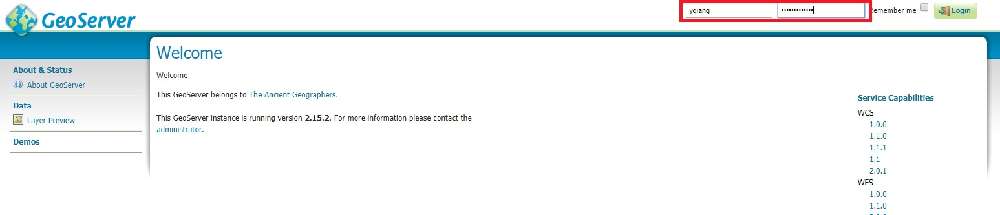

When logged in successfully, you can see a number of items in the **Data** panel on the left. These are where you create, edit and manage different data containers in the server.
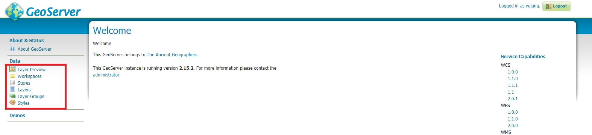

First, go to **Layer Preview**. You can see a list of published layers in the server.  These published layers are accessible and can be used in web maps hosted in any servers.

Click **Open Layers** to preview the layer of 'USA Population'.
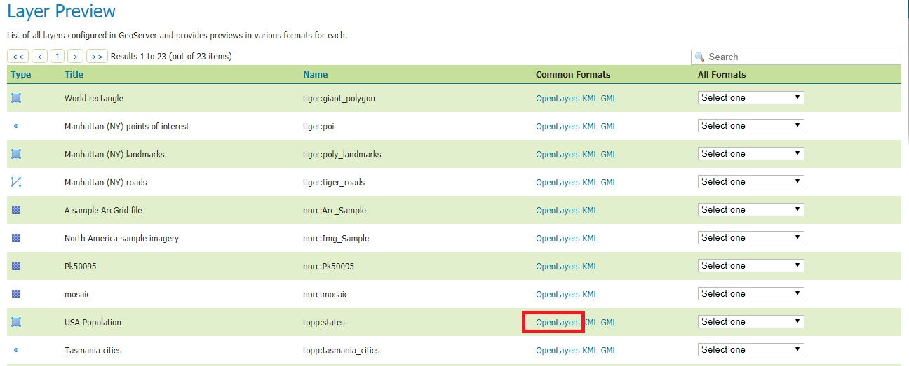


A map view pops up and shows the boundaries of the states. You can click on a state to view its attributes.

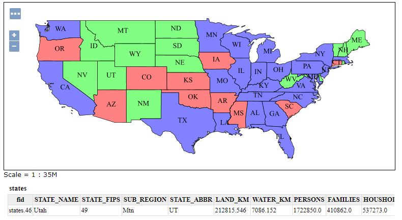

### Step 2: Publish a simple data layer
At this step, we are going to publish a polygon layer in GeoServer.
For management reasons, you share the same workspace with other students for layer publishing. You will create your own **store** to store your data.

First, we use FTP protocal to transfer the shapefile to the GeoServer server. You need a FTP to do this is because I can't give you full access to the server. When you have your own server, you can upload data in easier ways (e.g. remote desktop).
- Log in ftp://128.171.126.21/ in Filezilla client or or Windows File Explorer. (**Note: you are logging into a different FTP from the UH web space.**)
- Enter your username, which is your first name initial + last name (e.g. John Smith -> jsmith), and password (your student ID).

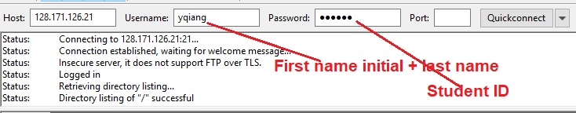<br>

- Copy and paste the shapefile (chicago.shp) to the server. Note, you need to upload all the component files of the shapefile.

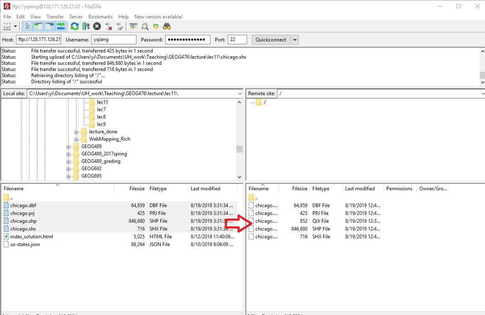<br>

Next, we create a store that points to the folder where you uploaded the shapefile through FTP.
- Click **Stores** in the interface and click **Add new Store**. Click **Directory of spatial files (shapefile)**.
- Name the store using your name initial + last name.
- Write a short description of the store (optional).
- Click **Browse...** and navigate to `D:/http_website/spatial_manoa_hawaii_edu/webmapping/YOURUSERNAME/`
- Click **Save** to create the store.


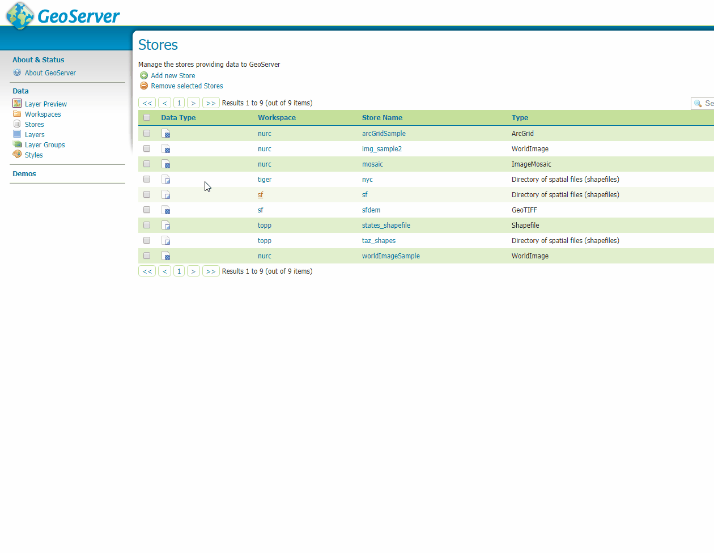

Now, the store points to a directory in your FTP site in the server, which means you can publish data layers uploaded in the store.

- Click **Save**, and you will be directed to a page of new layers for publishing. Click **Publish** to proceed.
- If you are not directed to the publishing page, you could also create a layer in the store.
- Click **Layers** -> **Add a new layer**.
- Add a layer from **student:chicago_yourname**. Then click **Publish**.

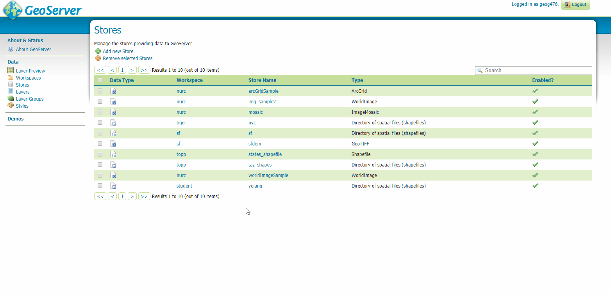<br>

Note: you may see layers created by your classmates in the **Layers** interface. **Please be careful and DO NOT delete others' files**

- Name the layer as **chicago_yourname**.

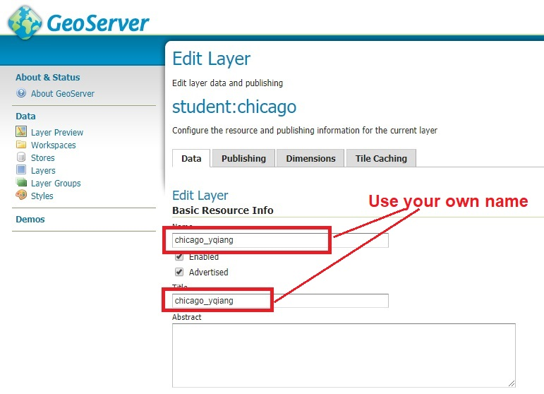

- Computer Native Bounding Box and Lat/Lon Bounding Box.

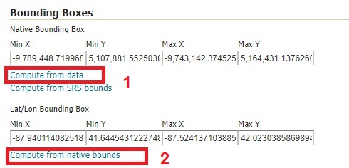<br>

- Click **Save** on the bottom of the page to publish the data layer. Then, you can find the layer in the **Layers** page.
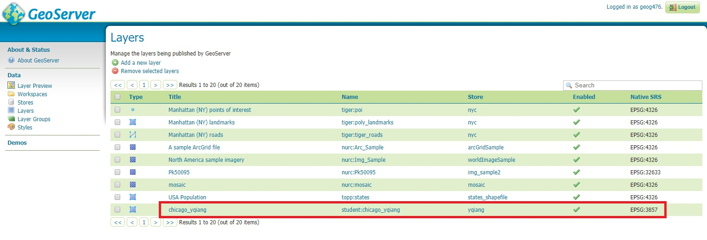<br>


- You can preview the published layer in **Layer Preview**.
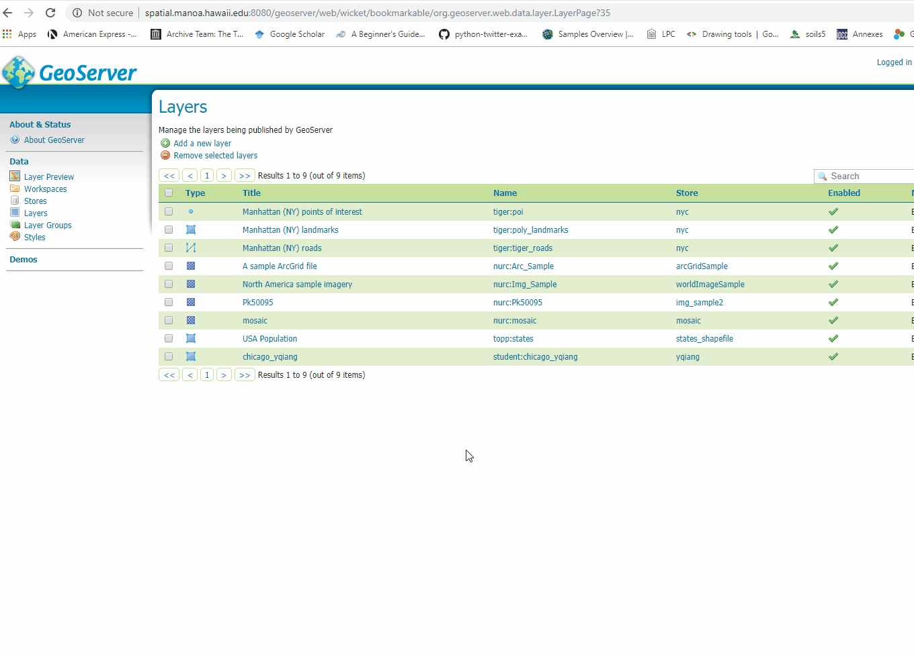<br>

- This is the URL of the WMS, which you will use to link the layer to a web map.

<br>

Now, you have published a data layer as a WMS in GeoServer. The WMS can be accessed in web maps and GIS software using the URL of the WMS.

### Step 3: Creating a style
Now, the chicago layer you published only shows gray color. You can create a **style** file to define the color, boundary line, and transparency. In GeoServer, the style file (**.SLD**) and the layer are two objects that are associated with each other. You can use **QGIS** to define a style, and then upload into GeoServer and associate with the layer.

First, add chicago.shp into QGIS.
- Open QGIS desktop.
- Click the **Layer** menu -> **Add Layer** -> **Add Vector Layer..**
- Navigate to the folder that contains **chicago.shp**, click to add chicago.shp into QGIS.
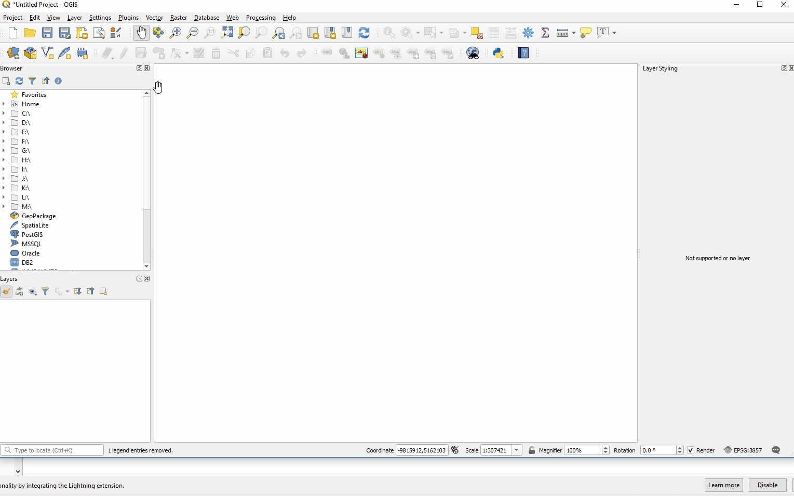<br>

Then, define symbology of the chicago layer to assign graduated colors represent an attribute (BirthRate) of the polygon layer.
- Right click on the chicago layer in the **Layers** panel.
- Select **Graduated** on the top of the **Symbology** window.
- Select **BirthRate** as the attribute.
- Increase **Classes** into 8, choose **Natural Breaks (Jenks)** mode for color classification.
- Click **Classify** to apply the color classification.
- Keep the **Symbology** window open.

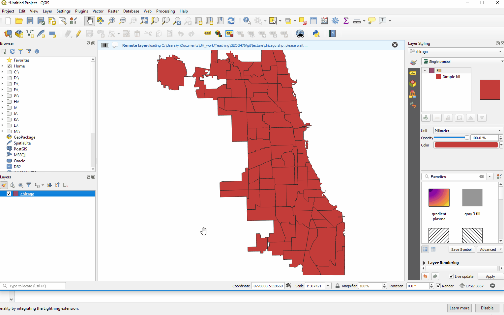<br>

Now, the graduated color scheme (white -> red) is applied to the polygons. Next, we will save the symbology into a SLD file, which will be uploaded to GeoServer.
- Click the **Style** menu on the bottom of the **Symbology** window.
- Click **Save Style**.
- Save style **As SLD style file**
- Name the style file **chicago_style_yourname.sld** in the same folder of chicago.shp (not necessary, only for easy management).

<br>

Now, the symbology (graduated colors) has been saved in a SLD style file in your computer. Next, we are going to upload the style file into GeoServer and associate it with the published chicago layer.

- Go to the [GeoServer interface](http://spatial.manoa.hawaii.edu:8080/geoserver), log in if needed.
- Click **Styles** in the left panel.
- Click **Add a new style**.
- Name the style **chicago_style_yourname**, and choose **student** as the workspace.
- Click **Choose File**, navigate to your data folder, click to choose the SLD file you just saved in QGIS. Click **Upload...** to upload the SLD file into GeoServer.
- Click **Validate**, it should show 'no error' if the file is successfully uploaded. Click **Apply**.
- Go to the **Publishing** tab (on the top). Check both **Default** and **Associated** after the **chicago_yourname** layer. Click **Apply** and then **Submit**.
Now, the SLD style is applied in the chicago layer. You can check if the new colors in **Layer Preview**.
<br>


### Step 4: Viewing the WMS in QGIS
Other than viewing the WMS layer in the GeoServer Layer Preview, you can use client tools to view layers in a WMS. Now let's take a few minutes to see how QGIS works with WMS layers. This is important if you want to bring web services into your desktop maps as backgrounds or thematic layers.

- Launch QGIS, start a new project. Click **Layer -> Add Layer -> Add WMS/WMTS Layer...**
- Click **New** to add a WMS/WMTS connection. Name it "chicago_wms". Copy and paste `http://spatial.manoa.hawaii.edu:8080/geoserver/wms` to the URL box.
- Click Choose the newly created connection and click **Connect**. Then, you can see all WMS layers published in GeoServer in the table, including the Chicago layer you just published.

- Click to choose the **chicago_yourname** layer, click **Add** to add it to QGIS.

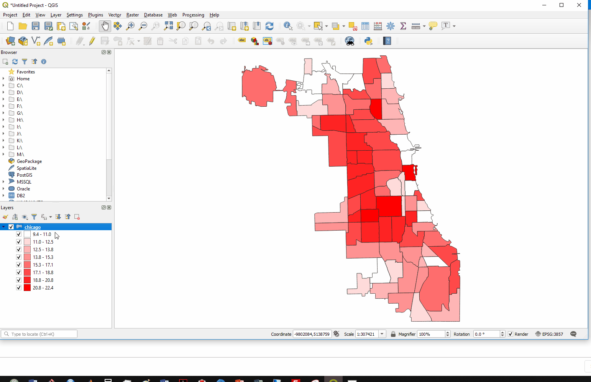<br>

Unlike the previous chicago layer which was loaded from your computer, the chicago_wms layer is rendered from the chicago layer in the WMS in a web server. In QGIS and web map, you can render layers from distributed sources (e.g. different WMS) to make maps.

Additionally, you can pull a basemap from other WMS to integrate with the chicago layer QGIS.

- In QGIS, click **Plugins > Manage and Install Plugins**. Search **"OSM"** and install **OpenLayers Plugins** (or called **QuickMapServices** in certain versions of QGIS).

<br>

- Then, click **Web -> OpenLayers plugin -> OpenStreetMap -> OpenStreetMap** to add the OSM basemap into QGIS.

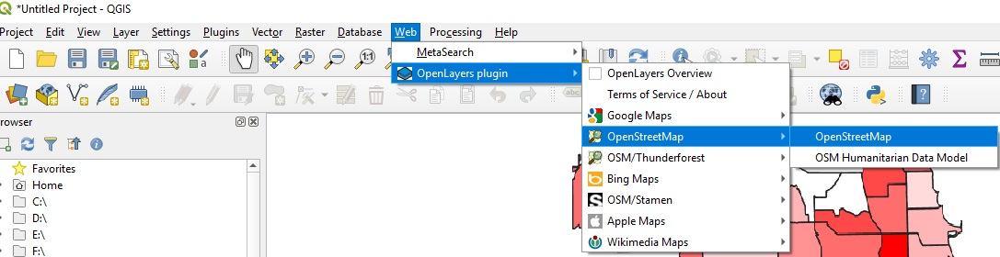<br>

Note: the naming can be different if you use QuickMapServices.

- In the **Layer** panel, place the OMS basemap under the Chicago layer. You'll see the two layers overlaid in the map view.


In QGIS, both layers are pulled from WMS hosted in remote servers. In a web map, you can render and display layers from WMS hosted in different servers. Integrate geospatial data published in distributed servers is called **map mashup**, which is an important advantage of WMS compared with desktop GIS. There is a set of international standard of WMS, which facilitate map mashup with WMS layers from different sources.

### Step 5: Adding the WMS layer in a Leaflet maps
Launch a Python HTTP server, pointing to the folder of the downloaded "index.html" file. Open Chrome, log on to "index.html" using LocalHost.

Add the following code in the `<script>` tabs. Replace "YOUR_LAYER_NAME" with the name of the layer you published.

```
var chicagoLayer = L.tileLayer.wms("http://spatial.manoa.hawaii.edu:8080/geoserver/wms", {
  layers: 'student:YOUR_LAYER_NAME',
  format: 'image/png',
  transparent: true,
  version: '1.1.0',
  attribution: "myattribution"
}).addTo(map);
```

Refresh Chrome, you can see the polygons from the WMS showing in the map:


Unlike the previous maps you created, which use GeoJson data stored in the local server, this map lodas a WMS layer published in a web map server.

---
## Assignment
Download the data from [here](https://drive.google.com/file/d/1_HlKQWpGjhrZW2NlYlioOSks8B1gaP4f/view?usp=sharing) and extract the shapefile (floodzone.shp) into a folder in your computer. The shapefile contains counties where flood maps are available.
Follow the same procedure in this lesson, do the following:
1. Upload and publish three shapefiles (floodzone.shp, cities.shp, and rivers.shp) as a WMS layer in GeoServer, name the layer as fz_YOURNAME, cities_YOURNAME, and rivers_YOURNAME.
2. Using QGIS to create a style (SDL file) to assign graduated colors to the polygons according to the attribute **r_pop_fz**, which is ratio of population in 100-year-flood zone. Name the style (fz_style_YOURNAME)
3. Upload the style file into GeoServer and apply the style to the published flood zone layer (fz_YOURNAME).
4. Create a simple web map with the following layers:
  1. a city layer showing cities as points
  2. a river layer showing the major rivers in US as polylines
  3. a choropleth map "the ratio of population in flood zone per county"
  4. a basemap.

Delete all javascript codes between the `<script>` tags in index.html. Modify and add the following code to create a web map to show the multiple layers.

```javascript

      //Define two basemaps
      mapURL1='URL of BASEMAP 1'
      mapURL2='URL of BASEMAP 2'

      var basemap1 = L.tileLayer(mapURL1, {id: 'MapID'}),
      basemap2   = L.tileLayer(mapURL2, {id: 'MapID'});

      var baseMaps = {
          "BASE_MAP1": basemap1,
          "BASE_MAP2": basemap2
      };

      //Create a map view centered at Chicago with an appropriate zoom level.
      //Use basemap1 as the default basemap
      var map = L.map('map', {
      	center: [38, -95],
      	zoom: 4,
        layers:basemap1
      });

      var layers = {

        'Ratio of population in flood zone': L.tileLayer.wms('http://spatial.manoa.hawaii.edu:8080/geoserver/wms', {
            layers: 'YOUR_LAYER_NAME',
            format: 'image/png',
            transparent: true
        }),

        'Cities': L.tileLayer.wms('http://spatial.manoa.hawaii.edu:8080/geoserver/wms', {
            layers: 'YOUR_LAYER_NAME',
            format: 'image/png',
            transparent: true
        }),

        'Rivers': L.tileLayer.wms('http://spatial.manoa.hawaii.edu:8080/geoserver/wms', {
          layers: 'YOUR_LAYER_NAME',
          format: 'image/png',
          transparent: true
        })
      };

    L.control.layers(baseMaps, layers,  {collapsed: false, position:'bottomright'}).addTo(map);


```

The map should have a control so you can switch and turn on/off the layers.

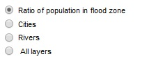<br>

Finally, upload the web map (index.html) into your UH web server.

#### Submission
Submit the URL (e.g. www2.hawaii.edu/~yourusername...) to the web map through Laulima by **Nov 22th (Friday), 11:55pm**.

**Important**: as you are sharing the same account in GeoServer, please name your layers and styles with your username (e.g. fz_yourname and fz_style_yourname) to distinguish them from others. Please be careful not to delete others' files. If you did in accident, please let me or other know.
