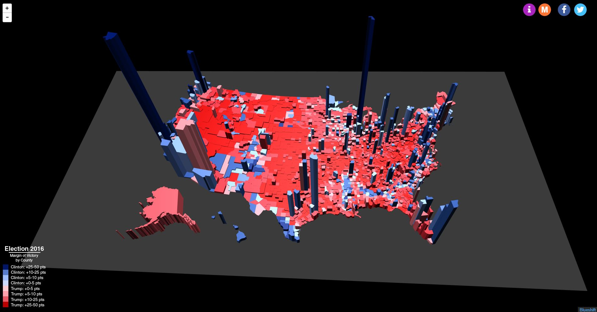
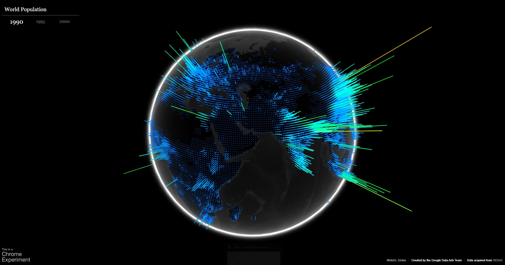
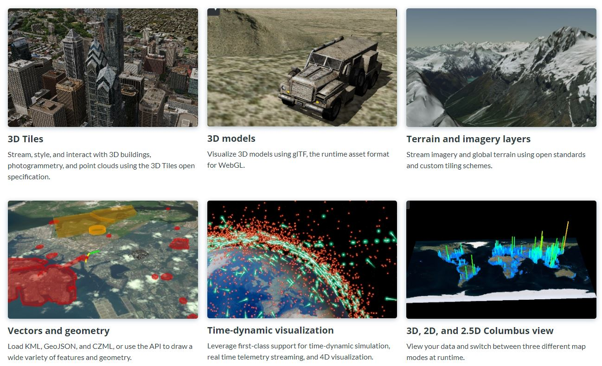
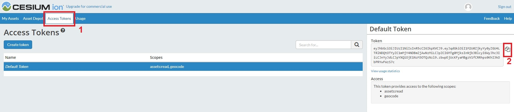
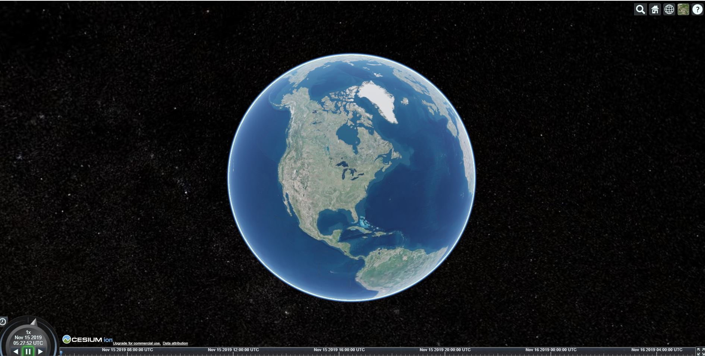
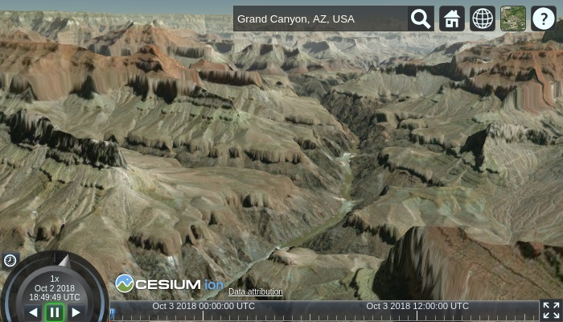
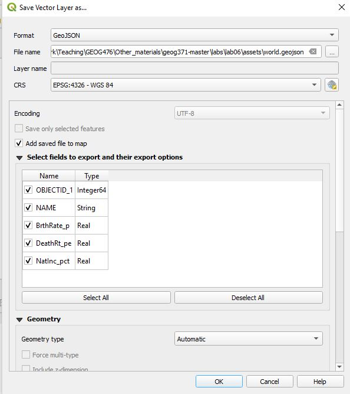
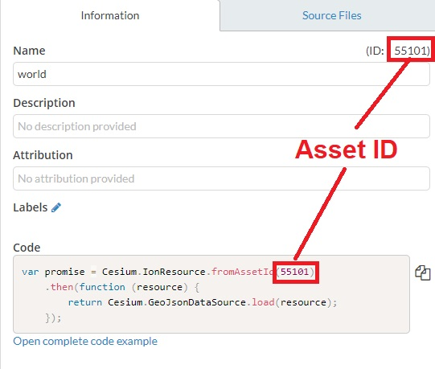
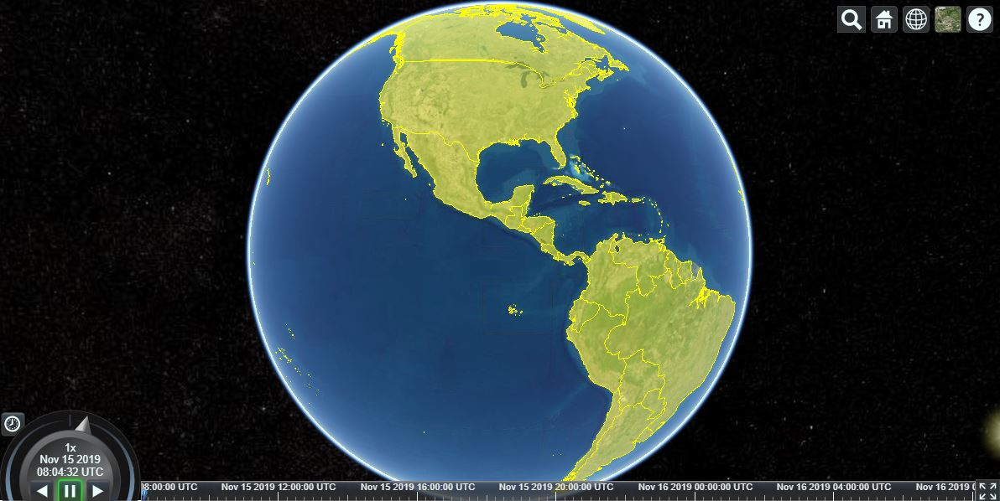
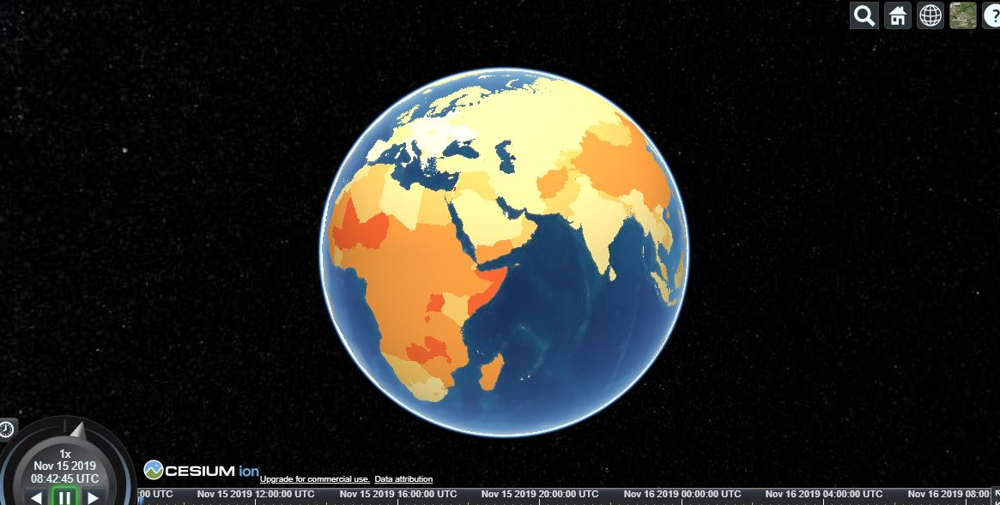

# 3D Mapping

##### Instructor: Yi Qiang <br/>Email: yi.qiang@hawaii.edu <br/>Nov. 15th, 2019
---
This lesson introduces platforms and libraries that can be used for 3D mapping.


## Learning objectives:
- Introduction to 3D maps
- Using [Cesium.js](https://cesium.com/) to create a choropleth map in a virtual globe
- Using [Cesium.js](https://cesium.com/) to create a prism map in a virtual globe

Download the [zip file for this lab](https://drive.google.com/file/d/1--uHlWjgODOtScB71g1FyPUyIZxJCC47/view?usp=sharing) and extract it in a known location (i.e., a directory in your Documents). The file contains a shapefile (i.e. world.shp).

As usual, please launch a local HTTP server in Python. The local HTTP server can help you to identify errors (in Chrome Developer Tools) in your code. Refer to [Lec 7: getting started with web mapping](../lec7_start_web_mapping.md) for help.

## 1. 3D maps
3D visualization opens up an additional dimension (the height) for maps. Compared with traditional 2D maps, a 3D virtual globe can preserve the real shapes and sizes of spatial features, which can be distorted when projected in 2D maps. 3D thematic maps (e.g. prism map) can use height and volume of spatial features to represent additional themes. For instance, the following map is an excellent example of using 3D to add an additional theme (population as height) to represent the 2016 presidential election result.

<br>

[This website](https://blueshift.io/blueshift-demo-3d-election-map/) explains how to create this map.

Another example of 3D bin map on a virtual globe.
<a href="http://globe.chromeexperiments.com/"></a><br>

Source codes and tutorials of the 3D bin map can be found [here](https://sandcastle.cesium.com/?src=Custom%20DataSource.html).


There are a quite few Javascript libraries available for 3D maps, including:
-[WebGL Globe](https://experiments.withgoogle.com/chrome/globe)
-[WebGL Earth](http://www.webglearth.org/)
-[Cesium.js](https://cesium.com/cesiumjs/)

We will learn [Cesium.js](https://cesium.com/cesiumjs/) in this lesson. You are free to explore the other options. Most of these 3D mapping libraries are built on [WebGL](https://developer.mozilla.org/en-US/docs/Web/API/WebGL_API), a Javascript API for 2D and 3D graphic rendering in web browsers.

# 2. Cesium.js
**Cesium** is an open-source JavaScript library for world-class 3D globes and maps. It creates the leading 3D globe and map for static and time-dynamic content, with the best possible performance, precision, visual quality, platform support, community, and ease of use.

Cesium was founded by AGI (AGI) in 2011 as a cross-platform virtual globe for dynamic-data visualization in the space and defense industries. Since then, Cesium has grown into a 3D globe serving industries from geospatial and oil and gas to agriculture, real estate, entertainment, and sports. Currently, Cesium is lead by the Cesium Consortium, started by Analytical Graphics, Inc. and Bentley Systems. The consortium was started to accelerate open-source Cesium development and support long-term open-source Cesium sustainability.

The following figure shows example applications built on Cesium.js



# 3. Creating a virtual globe

To get started, create an empty file in Atom. Copy and paste the following codes into the empty file. Save it in a folder in your computer and name it 'index.html'.

```html
<!DOCTYPE html>
<html lang="en">
<head>
  <meta charset="utf-8">
  <!-- Include the CesiumJS library in the HTML’s head section. -->
  <script src="https://cesium.com/downloads/cesiumjs/releases/1.63.1/Build/Cesium/Cesium.js"></script>
  <link href="https://cesium.com/downloads/cesiumjs/releases/1.63.1/Build/Cesium/Widgets/widgets.css" rel="stylesheet">

  <!-- Include libraries of JQuery and chroma (for color scheme). -->
  <script src="https://cdnjs.cloudflare.com/ajax/libs/chroma-js/1.3.4/chroma.min.js"></script>
  <script src="https://ajax.googleapis.com/ajax/libs/jquery/3.1.0/jquery.min.js"></script>

</head>
<body>
  <!-- Create an HTML element to hold the CesiumJS widget: -->
  <div id="cesiumContainer"></div>
  <script>
    // Replace `Your_Access_Token` with your access token after sign up an account
    Cesium.Ion.defaultAccessToken = Your_Access_Token;

    //  create the top-level Cesium widget, named Viewer, and tell it to use the HTML element you defined above
    var viewer = new Cesium.Viewer('cesiumContainer');
  </script>
</body>
</html>

```
## 3.1 Create a Cesium account
You need to create a Cesium ion account to use the 3D content (e.g. virtual globe) in this lesson. [Sign up here](https://cesium.com/ion/signup?gs=true) and the above sample code will automatically update with your token. If you already have an account, [sign in](https://cesium.com/ion/signin).

Not all services in Cesium are free. [Here](https://cesium.com/pricing/) is the pricing details.

**Important: do not register your billing information (e.g. credit card) in any of the web services unless you are surely ready**


When logged in, go to the **Access Tokens** page. Copy the long string of access token, and paste it to replace `Your_Access_Token` in index.html.

<br>

Now, you can see a virtual globe appeared in the HTML preview and Chrome (after refresh).

<br>

You can use your mouse to rotate the globe or use the scroll to zoom in and out. Try the different controls in the interface.

## 3.2 Adding 3D terrain
Cesium World Terrain is a high resolution global terrain asset included with your ion account. Add it to your Cesium app by replacing the line that creates the Viewer widget with the following:

```JavaScript
var viewer = new Cesium.Viewer('cesiumContainer', {
    terrainProvider: Cesium.createWorldTerrain()
});
```

Now when you zoom to a specific location, such as “Grand Canyon, AZ”. Press down the scroll in your mouse to change the view angle. Then, you can see the Cesium World Terrain in action.

<br>

You can change the `options` of `Cesium.Viewer` to activate or deactivate controls in the interface. For instance, you can replace the codes that create `Cesium.Viewer` to the following:

```JavaScript
var viewer = new Cesium.Viewer('cesiumContainer', options);
var options = {
    terrainProvider : Cesium.createWorldTerrain(),
    vrButton: true,  // virtual reality support
    sceneModePicker: true, // 2d, 2.5d and 3d
    navigationHelpButton: true,
    baseLayerPicker : true,
    fullscreenButton: true,
    geocoder: true,
    homeButton: false,
    animation: false,
    timeline: false
  }
```

Try to change the true to false or false to true to see how the interface changes.

# 4. Plotting data in virtual globe
## 4.1 Upload data to Cesium ion
You can upload your own geospatial data into **Cesium ion** and plot the data on top of a virtual globe. Cesium ion will optimize it, tile it into web friendly formats, serve it up in the cloud, and stream it out to any device. Essentially, Cesium ion is a web map service where you can publish your data and utilize the data in Cesium 3D maps. However, there is a usage limit for your data to be rendered from Cesium ion. Here is the billing plans for the usage of Cesium ion. You can also check the your usage in the **Usage** tab in your Cesium ion account.

First, use QGIS to convert the shapefile ('world.shp') into a geojson file (world.geojson). world.shp stores countries boundaries as polygons with three major attributes:
- **BrthRate_p**: Birth rate in 2014
- **DeathRt_pe**: Death rate in 2014
- **NatInc_pct**: Natural population increase in 2014

To convert the shapefile into geojson, you need to:
- Open QGIS desktop
- Go to **Layer** menu -> **Add Layer** -> **Add Vector Layer** to add world.shp into QGIS
- Right click on the **world** layer -> **Export** -> **Save Feature As**
- Save the feature as a GeoJson data, named **world.geojson** and save it in the same folder as index.html.



## 4.2 Add data to the virtual globe
Click **Add Data** in your Cesium account. Upload world.geojson into your Cesium ion account.

<image src="images/anim38.gif" width=700>

Next, we add the uploaded GeoJson data into the virtual globe.

Add the following codes after the `options` object.

```JavaScript
// Add the GeoJson data in Cesium ion to the virtual globe, using Asset ID
var promise = Cesium.IonResource.fromAssetId(YOUR_ASSET_ID).then(function (resource) {
  var dataSource = Cesium.GeoJsonDataSource.load(resource).then(
    function(dataSource) {
      viewer.dataSources.add(dataSource);
      viewer.zoomTo(dataSource);
    }
  );
})
```

Replace `YOUR_ASSET_ID` with the asset ID in of the GeoJSON data in your account.

<br>

Refresh chrome, you'll see the country boundaries are added on the virtual globe.

<br>

## 4.3 Create a choropleth map

Next, we add the following codes which break the attribute values into classes and assign colors to the classes. We used similar codes in [lesson 9: choropleth map](lec9_choropleth_map.md). These codes need to be added above the `Cesium.IonResource.fromAssetId` function.

```JavaScript
// determine the number of classes and their respective break values.
var grades = [0, 10, 20, 30, 40, 50,60];

// Create a color scheme according to the number of grades (classes).
var colors = chroma.scale('YlOrRd').colors(grades.length+1);

// set the color.md based on the class which the input value falls in.
function setColor(d) {
    for (var j = 0; j < grades.length - 1; j++) {
        if ( d >= grades[j] && d < grades[j+1] ) return colors[j];
    }
    // Assign color for all values above the last breaking point
    if (d >= grades[grades.length - 1]) return colors[grades.length -1];
}
```

Add two lines in the `Cesium.IonResource.fromAssetId` function to assign colors to the country polygons according to the `BrthRate_p` attribute.

> Note, `._value` is added after `BrthRate_p` as a special rule in Cesium.js. You usually don't need to add `_value` to access attribute values.

```JavaScript
var promise = Cesium.IonResource.fromAssetId(55116).then(function (resource) {
  var dataSource = Cesium.GeoJsonDataSource.load(resource).then(
    function(dataSource) {
        var p = dataSource.entities.values;

        for (var i = 0; i < p.length; i++) {
          if(typeof(p[i].properties.BrthRate_p._value) != 'undefined'){
            p[i].polygon.material = Cesium.Color.fromCssColorString(setColor(p[i].properties.BrthRate_p._value));
            p[i].polygon.outline = false;
          }
        }
        viewer.dataSources.add(dataSource);
        viewer.zoomTo(dataSource);
    }
  );
})
```

At this step, the countries are assigned different colors, which represent their birth rates.
<br>

## 4.3 Create a prism map
The 3D virtual globe allows you to make use of the x-dimension (height). You can create a prism map where the heights of the prisms can represent an additional theme. Next, we will elevate the polygon boundaries into different heights. The heights will represent the the natural population increase (**NatInc_pct**).

This step is easy, simply add the following line between the lines of `p[i].polygon.material` and `p[i].polygon.outline`.

```JavaScript
p[i].polygon.extrudedHeight = Math.pow(p[i].properties.NatInc_pct._value,2)*500 ;

```
This line makes `height = BrthRate_p * BrthRate_p * 500`.

Check your map, you'll see the country polygons are elevated. The heights represent the natural population increase.

<br>

## 4.4 Legend
Finally, we add a legend to show the color assignment.

Create a pair of `<style>` tags in the `<head>` of index.html. Add the following CSS style code between the `<style>` tags. These styles defines the docking position, extent and font of the legend.

```css
.legend {
  line-height: 16px;
  width: 280px;
  position: absolute;
  z-index: 1000;
  right: 2%;
  bottom: 10%;
  color: #a0a0a0;
  font-family: 'Open Sans', sans-serif;
  padding: 6px 8px;
  background: #000000;
  background: rgba(38, 38, 38, 0.5);
  box-shadow: 0 0 15px rgba(0,0,0,0.2);
  border-radius: 5px;
}


.legend i {
    width: 16px;
    height: 16px;
    float: left;
    margin-right: 8px;
    opacity: 0.7;
}

.legend p {
    font-size: 12px;
    line-height: 16px;
    margin: 0;
}
```

Add the legend in a HTML block. You can modify the HTML code to reflect the actual information of your map.

```HTML
<div id="cesiumContainer"></div>
<div class="legend">
    <h4> Birth rate and population natural increase in the world </h4>
    <p><b> Birth rate in 2014 per country </b></p><br/>
    <div id="patches"></div><br/>
    <p> This 3D prism map shows the birth rate and natural population increase per country in 2014. The data is acquired from ArcGIS online and used for illustrative purpose. More accurate and updated data can be acquired from the <a href="https://data.worldbank.org">World Bank</a></p><br/>
    <p> Author: <a href="https://gis.hawaii.edu/qiang">Yi Qiang </a>|  UH-Manoa </p>
</div>
```

Finally, add the following Javascript code at the end of `<script>` tags to create legend in the `cesiumContainer` block.

```JavaScript
// insert legend patches.
var labels =[]
for (var i = 0; i < grades.length - 1; i++) {
    labels.push('<i style="background:' + colors[i] + '"></i> <p>' + grades[i] + ' - ' + (grades[i + 1] + 1).toString() + '</p>');
}
labels.push('<i style="background:' + colors[grades.length - 1] + '"></i> <p>' + (grades[grades.length - 1] +1 ).toString() + ' +' + '</p>');
$("#patches").html(labels.join(''));
// hide the credit banner, however you should credit the map libraries or data somewhere else.
document.getElementsByClassName("cesium-widget-credits")[0].style.visibility = "hidden";
```

# Submission
Upload your map (index.html) to your UH web space. Submit the URL to the map through Laulima by **Friday 22th (Friday), 11:55pm**.
