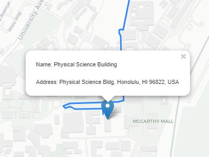
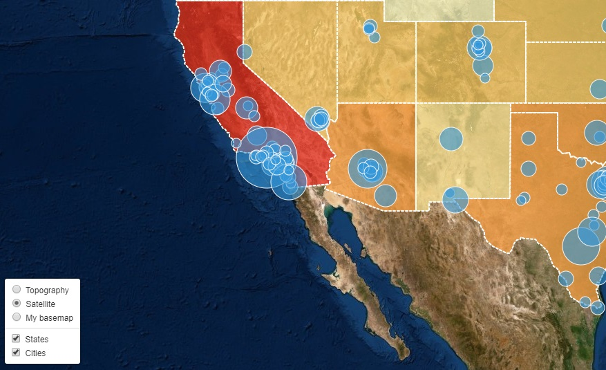

# Final review and project

##### Instructor: Yi Qiang <br/>Email: yi.qiang@hawaii.edu <br/>Nov. 22th, 2019
---
This lesson reviews the important knowledge and skills taught in the previous lessons and introduces the guidelines and evaluation criteria of the final project.


# 1. Web server

### How do you set up a web server?
1. Set up a server computer.
  - A computer
  - A server software (e.g. IIS, Apache)
  - Static IP address (e.g. 128.171.121.16)
  - A domain name (e.g. https://www.hawaii.edu) (optional)
  - A SSL certificate (optional)

2. Rent a virtual or cloud server
  - Have everything you need for a web server (only upload your files and data)

### How a website is organized in a web server?
- How to access files in a server from the internet?
  - How to access index.html in a server?
  - How to access other files in a server, including files stored in sub-folders (e.g. how to access `public_index/images/profile.jpg` from the internet)?

- How you link files between each other in a server?
  - How to insert a image in index.html?
    - If the image is in the same folder as index.html, you should write `` to insert the image.
    - What if the image is stored in the "image" folder?

      ```
      public_html
      │   index.html
      └───images
          │   profile.jpg

      ```

    - The same linking rule applies to all types of files. For instance, how to link the "style.css" file stored in the "css" folder in index.html.

      ```
      public_html
      │   index.html
      └───css
            │   style.css

      ```

# 2. HTML
HTML (Hypertext Markup Language) defines varies elements (e.g. text, image, table, blocks) and their arrangement (e.g. text in a table) in a webpage.

### Syntax of HTML
- Annotate elements using tags (an pair of opening tag and closing tag), e.g.
- Tags can be nested, meaning an element can contain other elements.

  ```html
  <html>
  	<body>

  		<h1>My <b>First</b> Heading</h1>
  		<p>My <b>first</b> paragraph.</p>

  	</body>
  </html>
  ```
  The above codes show as:

  <h1>My <b>First</b> Heading</h1>
  <p>My <b>first</b> paragraph.</p>

- If not specific defined, the built-in elements (e.g.`<p>, <h1>, <h2></h2>`) use default styles.

# 3. CSS
CSS (Cascading Style Sheet) is used to define styles (e.g. color, font size, position, extent) of HTML elements.

### 3.1 Insert CSS into a HTML document
  1. Inline - by using the style attribute in HTML elements (least used)
  ```html
  <!DOCTYPE html>
  <html>
  <head>
    <style>
      p {
        color: red;
        text-align: center;
      }
    </style>
  </head>
  <body>

  <p>Hello World!</p>
  <p>These paragraphs are styled with CSS.</p>

  </body>
  </html>

  ```
  2. Internal - by using a `<style>` element in the <head> section (sometimes)
  ```html
  <h1 style="color:blue;">This is a Blue Heading</h1>
  ```

  3. External - by using an external CSS file (most used)
  ```HTML
  <!DOCTYPE html>
  <html>
  <head>
    <link rel="stylesheet" href="styles.css">
  </head>
  ```

### 3.2 CSS selectors
You can create different types of CSS selectors.

- Element selector, for example
  ```css
  p {
  text-align: center;
  color: red;
  }
  ```
  When used in HTML:
  ```HTML
  <p>Every paragraph will be affected by the style.</p>
  ```
- Class Selector, for example:
  ```css
  .center {
    text-align: center;
    color: red;
  }
  ```
  When used in HTML:
  ```html
  <h1 class="center">Red and center-aligned heading</h1>
  ```

- The CSS id Selector, for example:
  ```css
  #para1 {
    text-align: center;
    color: red;
  }
  ```
  When used in HTML:
  ```html
  <p id="para1">Hello World!</p>
  ```

  The difference between an ID and a class is that an ID can be used to identify one element, whereas a class can be used to identify more than one.


# 4. Javascript
Defines the behaviors and interactive functions in a website.

### 4.1 Object
In javascript, you can define objects with some properties and methods (functions of objects).

- In the following code, an `options` object is defined with two properties: `center` and `zoom`, with values `[21.299245, -157.816041]` and `12`.
- Note: multiple property:value pairs are separated by `,`.
- The `options` object is then used in the `L.map` function.

```Javascript
var options = {
  center: [21.299245, -157.816041],
  zoom: 12
}
console.log(data); // print the GeoJSON data in the console of deverloper tools in Chrome


var map = L.map('map', options);

```
### 4.2 Function
A JavaScript function is a block of code designed to perform a particular task.

- You can declare a function and use (call) it when you use it. For instance, the following codes define a `calcRadius` function that convert the value of a feature attribute (e.g. GHG_QUANTITY) into the diameter of the circle marker.

  ```JavaScript

  // Define a function to convert GHG quantity to circle diameter
  function calcRadius(val) {
      var radius = Math.sqrt(val / Math.PI);
      return radius * .04;
  }

  function drawMap(data) {
    var options = {
      pointToLayer: function (feature, latlng) {
        return L.circleMarker(latlng, {radius:calcRadius(feature.properties.GHG_QUANTITY)})  // Call the defined function
      },

      ...
  }
  ```

- Many objects have inherent functions (called methods), for instance, a `car` object can have a function `run`. The inherent functions of objects are already defined in the library. Here is an example:

  ```javascript
    L.geoJson(data, options).addTo(map);

  ```

___

# 5. Where the three codes goes
- CSS codes go between the `<style>` tags or inserted from an external file
- HTML codes go between the `<body>` tags
- Javascript go between the `<script>` tags, which are usually placed towards the end in the `<body>` tags.

```html
<!DOCTYPE html>
<html>
<head>
    <meta charset=utf-8 />
    <title>Green House Gas Emissions</title>
    <meta name='viewport' content='initial-scale=1,maximum-scale=1,user-scalable=no' />

    <!-- Insert an external CSS file -->

    /* INSERT JAVASCRIPT FROM AN EXTERNAL FILE */
    <link rel="stylesheet" href="https://unpkg.com/leaflet@1.3.1/dist/leaflet.css" />

    <style>
      /* WHERE CSS CODES GO */
    </style>
</head>

<!-- Where CSS CODES GO -->

<body>
    <script src="http://code.jquery.com/jquery-3.1.1.min.js"></script>

    <script>
        // WHERE JAVASCRIPT CODES GO
    </script>

</body>

</html>
```


# 6. Creating a map.
Before loading data or adding layers, the first step is creating a leaflet map object. You can consider the map object as an empty canvas where you can add layers and data.

You can define center location, zoom level, and projection in the [options](https://leafletjs.com/reference-1.6.0.html#map-option) of the map object.

```JavaScript
var options = {
  center: [21.299245, -157.816041],
  zoom: 12
}

var map = L.map('map', options);
```

# 7. Add data into map
## 7.1 Add Basemap
Use `L.tileLayer` to add a base map to a Leaflet map.
```javascript

var map = L.map('map', options);

L.control.zoom({ position: 'topright'}).addTo(map);

var tiles = L.tileLayer('http://{s}.basemaps.cartocdn.com/light_all/{z}/{x}/{y}.png', {
    attribution: '&copy; <a href="http://www.openstreetmap.org/copyright">OpenStreetMap</a> &copy; <a href="http://cartodb.com/attributions">CartoDB</a>',
    subdomains: 'abcd',
    maxZoom: 19
}).addTo(map);

```

## 7.2 Add GeoJson Data
You can add geospatial data in GeoJSON format into your web map. As the entire dataset will be rendered in user's browser, you can only add small GeoJSON datasets (e.g. <1Mb) into web maps.

During the classes, you have learned to add GeoJSON data into a leaflet map in three different ways.

- Using the native `L.geoJson` function, for example in [Lesson 7](lec7_start_web_mapping.md):

  ```JavaScript
  var myRoute = L.geoJson(data,{
    onEachFeature: function(feature, layer) {
      layer.bindPopup('<p>Name: '+feature.properties.name+'</p><p>Address: '+feature.properties.desc+'</p>');
  }
  }).addTo(map);

  ```
  Use the `L.geoJson` function, you need to
  > - include `var data = ` in front of the data in the GeoJson file.
  - Change the file's extension to `.js` or `.json`.

- Using the JQuery function `$.getJSON`, for example in [Lesson 8](lec8_thematic_map_point.md):

  ```JavaScript
  $.getJSON('ghg-hi-2018.json', function (data) {
      drawMap(data);
  });

  function drawMap(data) {
    var options = {
        ...
      }
    L.geoJson(data, options).addTo(map);
  }
  ```
  Your don't need add `var data = ` in the geojson data.

  You need to change the extension of GeoJSON to `.json`

  You need to insert the JQuery library in the `<head>` of index.html:
  ```html
  <script src="http://code.jquery.com/jquery-3.1.1.min.js"></script>

  ```
- Use the built-in function in Leaflet (`L.geoJson.ajax`). Examples are in [Lesson 9](lec9_choropleth_map.md#step-1-plotting-polygons-in-a-map) and [Lesson 10](lec10_layer_control.md#step-1-adding-an-additional-layer-to-the-map):

  ```JavaScript
  // determine the style class based on the input feature
  function style(feature) {
      return {
          weight: 2,
          opacity: 1,
          ...
      };
  }

  // Assign the geojson data path, style option and onEachFeature option. And then Add the geojson layer to the map.
  states = L.geoJson.ajax("us-states.json", {
      style: style,
      onEachFeature: onEachFeature
  });

  ```

## 7.3 Add WMS layer
Use `L.tileLayer.wms` to add WMS layers (published in GeoServer) to a Leaflet map.
Example can be found in [Lesson 11](lec11_web_map_service.md#step-5-adding-the-wms-layer-in-a-leaflet-maps).
```JavaScript
var chicagoLayer = L.tileLayer.wms("http://spatial.manoa.hawaii.edu:8080/geoserver/wms", {
  layers: 'student:YOUR_LAYER_NAME',
  format: 'image/png',
  transparent: true,
  version: '1.1.0',
  attribution: "myattribution"
}).addTo(map);
```
### 7.3.1 How to publish a WMS layer in GeoServer
To publish a WMS layer in GeoServer, you need to do the following:
- Use FileZila to upload the layer file (shapefile) into my web server (ftp://128.171.126.21/) through FTP .
- Create a data store pointing to the folder in the web server
- Create a layer from the uploaded shapefile and publish the layer

### 7.3.1 How to apply a style (SLD) to a WMS layer
To create style for the WMS layer, you need to:
- Create a style (e.g. applying a gradual color scheme) to the shapefile in QGIS.
- Save the style as a SLD file in QGIS.
- Upload the SLD to geoserver
- Associate the SLD to the published layer of the shapefile.

### 7.3.3 Comparing GeoJSON and WMS layer
The entire process of publishing WMS layers and styles can be found in [Lesson 11](lec11_web_map_service.md).

Compared with GeoJSON data, advantages of using WMS layers are:
- Fast rendering of large datasets (GeoJSON is usually < 1Mb)
- Symbology (style) is drawn in server (no need to program to assign colors)

However, the disadvantage is:
- Lack of interactive functions in the layer (e.g. no popup on click, no mouse-over highlight)


# 8. Interactive Controls
## 8.1 Popup
A popup window appears when clicking on a map feature. You've done this in [Lesson 7](lec7_start_web_mapping.md)

- You can compose the html codes to display a combined string of html elements (e.g. `<p>`) and javascript variables (e.g. `feature.properties.name`).
- `+` is used to combine html elements and javascript variables
- html codes need quotation, while Javascript codes don't

  ```javascript
  var myRoute = L.geoJson(data,{
    onEachFeature: function(feature, layer) {
      //layer.bindPopup(feature.properties.name);
      layer.bindPopup('<p>Name: '+feature.properties.name+'</p><p>Address: '+feature.properties.desc+'</p>');
  }
  }).addTo(map);

  ```
  

## 8.2 Proportional symbol sizes
Use different sizes of circles to represent a variable (also called theme) of spatial features (e.g. GHG_QUANTITY in [Lesson 8](lec8_thematic_map_point.md)).
```javascript
$.getJSON('ghg-hi-2018.json', function (data) {
    drawMap(data);
});

function drawMap(data) {
  var options = {
    pointToLayer: function (feature, latlng) {
      return L.circleMarker(latlng, {radius:calcRadius(feature.properties.GHG_QUANTITY)})
    }
  }
    L.geoJson(data, options).addTo(map); // creating the layer from geojson data with options
}

```


## 8.3 Display attributes and highlight features when mouse is over
Change the outline of circles when mouse is over. An example can be found in [Lesson 8](lec8_thematic_map_point.md)
- Use `bindPopup` show a popup window to show attribute information when mouse is over a spatial feature.
- Use `mouseover` and `mouseout` listeners to respond to mouse over and out actions.

```javascript
function showAttribute(feature, layer) {
    var facilityInfo = "Name: " + feature.properties.FACILITY + "<br>" +
        "C02: " + feature.properties.GHG_QUANTITY.toLocaleString() + "<br>" +
        "Address: " + feature.properties.ADDRESS + ', ' +
        feature.properties.COUNTY + ', CO'
    layer.bindTooltip(facilityInfo, { sticky: true });

    layer.on({
        mouseover: function () {
            layer.setStyle({
                color: "yellow",
                weight: 3
            });
        },
        mouseout: function () {
            layer.setStyle({
                color: "whitesmoke",
                weight: 1
            });
        }
    });
}
```
<br>

The example for polygon features can be found in [Lesson 9](lec9_choropleth_map.md#step-3-adding-interaction).

<br>


## 8.4 Color assignment and legend
### 8.4.1 Assign colors to GeoJson layer
For layers created from GeoJSON data, you need write Javascript to assign colors according to an attribute (e.g. population density of states) of spatial features.

```javascript
var grades = [0, 10, 20, 50, 100, 200, 500, 1000];

// Use the chroma.scale function to break the color ramp into the same number of classes.
var colors = chroma.scale('YlOrRd').colors(grades.length);

// get the color based on the class which the input value falls in.
function getColor(d) {
    for (var i = 0; i < grades.length - 1; i++) {
        if ( d > grades[i] && d < grades[i+1] ) return colors[i];
    }
    if (d > grades[grades.length - 1]) return colors[grades.length];
}

function style(feature) {
    return {
        weight: 2,
        opacity: 1,
        color: 'white',
        dashArray: '3',
        fillOpacity: 0.7,
        fillColor: getColor(feature.properties.density)
    };
}

geojson = L.geoJson.ajax("us-states.json",{
  style:style,
  onEachFeature: onEachFeature
}).addTo(map);
```

The legend needs to be created using the following snippet:
```JavaScript
// Create an empty list called labels
var labels = [];

//Use a for loop to add the colors and value classes in the list
for (var i = 0; i < grades.length - 1; i++) {
    labels.push('<i style="background:' + colors[i] + '"></i> ' + grades[i] + ' - ' + grades[i + 1]);
}

//Add the last color into the list
labels.push('<i style="background:' + colors[grades.length - 1] + '"></i> ' + grades[grades.length - 1] + ' +');

//Add the list in the legend block.
$(".legend").html(labels.join('<br>'));

function zoomToFeature(e) {
    map.fitBounds(e.target.getBounds());
}
```
### 8.4.2 Define style (including colors) for WMS layer
Colors (and othe symbological elements) of a WMS layer is pre-defined in the style file:
- create a style (SLD file) in QGIS to define colors and other symbology of a layer.
- upload the SLD file to GeoServer and associate the style with the published WMS layer.
- legend of WMS layers can be retrieved using a URI of the SLD file in GeoServer. You can find how to add legend for WMS layer in [Step 2 of the assignment in Lesson 11](https://github.com/qiang-yi/GEOG476/blob/master/lecture/lec11_web_map_service.md#step-2-optional-add-interactive-legend-for-the-wms-layers).


## 8.5 Layer control
You can create checkboxes to turn on/off layers using the `L.control.layers` function. The example is in [Lesson 10](lec10_layer_control.md):
```javascript
states = L.geoJson.ajax("us-states.json", {
    style: style,
    onEachFeature: onEachFeature
});

cities = L.geoJson.ajax("cities.json",options);

var featureLayers = {
    "States": states,
    "Cities": cities
};

L.control.layers(baseMaps,featureLayers,{position:'bottomleft'}).addTo(map);

```



## 8.5 3D map
Creating prism map in a 3D virtual globe using [CesiumJS](https://cesium.com › cesiumjs).
- Creating a virtual globe.
- Upload the data layer (GeoJson or KML, no shapefile!) as an asset to [Cesium ion](https://cesium.com/ion/). You need to create an account or log in to upload the data layer.
- Add the uploaded asset (data layer) into the virtual globe:
- The colors of features need to be assigned using [Javascript codes](https://github.com/qiang-yi/GEOG476/blob/master/lecture/lec12_3D_map.md#43-create-a-choropleth-map).

# 9. Other Web Mapping Platforms
## 9.1 [MapBox](mapbox.com)

We created a customized basemap in MapBox in [this assignment](./lec10_assignment_MapBox.md). In addition, you can create various maps using data (e.g. land cover) available in MapBox or data uploaded by yourself.

Web Mapping can be done done in a graphic user interface (You don't need to write code).

However, the limitations of MapBox are.
- Limited sizes of data you can upload. [More informaiton](https://docs.mapbox.com/help/troubleshooting/uploads/#accepted-file-types-and-transfer-limits).
- MapBox only grants you limited monthly quota to load your layers in a web map. [More information here](https://www.mapbox.com/pricing/#session-user-pricing).


## 9.2 [ArcGIS Online](https://www.arcgis.com/index.html)

Similar to MapBox, you can upload data onto ArcGIS Online and create various web maps without coding. However, the limitations of ArcGIS online are:
- Vector data (e.g. shapefile) is limited to 4,000 point features or 2,000 line or polygon features. [More information](https://support.esri.com/en/technical-article/000011508)
- Uploaded vector data can't be larger than 10MB.
- You are limited to certain controls in the map interface.

## 9.3 [ArcGIS Server](https://enterprise.arcgis.com/en/server/)

Similar product as GeoServer, a commercial software to host WMS layers.

Compared with GeoServer, advantages of ArcGIS Server are:
- Higher performance: faster rendering of large datasets, 3D visualization, more interactive controls...
- Seamless interoperation with ArcGIS Desktop: you can directly publish layers from ArcGIS Desktop onto ArcGIS server.
- In addition to standard WMS layers, ArcGIS Server can host various types of data layers (e.g. Feature Layer, Image Layer, Base Tile Layer, Building Scene Layer...).

However, you need a license to install ArcGIS Server in your server computer, while GeoServer is free. The license cost is not trivial (~$2000 annually for a private company).

## 9.4 [ArcGIS Javascript API](https://developers.arcgis.com/javascript/)
Similar functions as Leaflet. A programming interface for developers to built web maps and apps based on ArcGIS platforms (e.g. ArcGIS Online or ArcGIS Server).

For instance, Leaflet can only add a WMS layer hosted in GeoServer as a tile layer (no clicking, mouse over interactions). In contrast, ArcGIS Javascript API can add a Feature Layer hosted in ArcGIS Online, which support more interactive functions such as clicking, mouse-over, popup windows.
