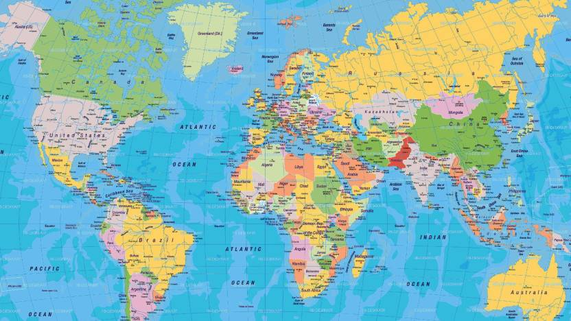
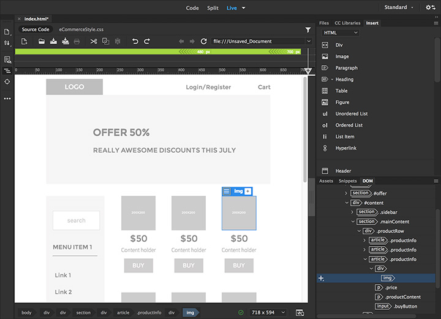

# Preparing for Web Mapping

##### Instructor: Yi Qiang  Email: yi.qiang@hawaii.edu  August 29th, 2019
---

## Learning objectives:
- Basics web development and web map development
- Understanding the skills you will learn
- Preparing hardware and software for this course

## 1. What is Web Mapping
Web mapping is the process of using the maps delivered by geographic information systems (GIS) in the World Wide Web (WWW). A web map on the World Wide Web is both served and consumed, thus web mapping is more than just web cartography, it is a service by which users may choose what the map will show. Web GIS emphasizes geodata processing aspects more involved with design aspects such as data acquisition and server software architecture such as data storage and algorithms, than it does the end-user reports themselves.

Web mapping is essentially a kind of web development. Common elements for a regular webpage include text, tables, pictures, videos and animations. Web mapping focuses on developing 'maps' in web pages. Such maps are not a static graphic image, but often include **interactive** and **moving (dynamic)** functionalities.

Examples of web maps:
- [Google Maps](maps.google.com)
- [US. Census Maps](https://www.census.gov/programs-surveys/geography/data/interactive-maps.html)
- [NOAA Flood Exposure Mapper](https://www.census.gov/programs-surveys/geography/data/interactive-maps.html)

Other than the commonly used programming languages and development tools (e.g. Python, R), web mapping utilizes special tools, protocols and services for creating such interactive maps.

## 2. What languages do I need to learn?
The languages for web mapping are not different from general software development. The following are a list of languages or protocols that are associated with web development:

- Hypertext Markup Language (HTML)
- Cascading Style Sheets (CSS)
- JavaScript and DOM scripting
- Server-side programming and database management (e.g. PHP, JSP, Ruby, ASP.NET, Java, Python...)

Which languages and technologies you learn will depend on the role you see yourself in within the web development process. Using this techniques you can build very sophisticated web system such as Google, Yahoo...

**Front-end componnent**: elements in websites that appears in or relates directly to the browser. Most script of the front-end component will be downloaded with the browser when user is viewing the site. Open a webpage in the Chrome browser and hit Ctrl+Shift+I, you will be able see most of the front-end program in the _Element_ tab. Front-end application include light computation and small data volume.
Front-end development usually include the following tasks
  - Graphic design and image production
  - Interface design
  - HTML document and CSS development
  - Light-weighted programming with Javascript

**Back-end component**: programs that work on the server behind the webpages. The backend component usually carries out intensive computing and large datasets stored in server. Only output of backend processing will be transmitted to users' browsers. Backend development falls in the hands of experienced programmers for sophisticated online systems.
The following tasks take place on the backend:
 - Database development and management
 - Form processing
 - Algorithms for computation and processing, developed in PHP, JSP, Ruby, .NET, Java or Python.

This course will focus on the front-end development where HTML, CSS and JavaScript will be the basics.

To learn more about the difference between front-end and back-end development, please click [here](https://www.coursereport.com/blog/front-end-development-vs-back-end-development-where-to-start).

### 2.1 Hypertext Markup Language (HTML)
HTML is a language used to create web pages. There are a few versions of HTML in use today: HTML4.01 is the most firmly established and the newer, more robust HTML5 is gaining stream and browser support. HTML is not a programming language: it is a markup language, which means it is a system for identifying and describing the various elements of a web page including headings, paragraphs, pictures, videos and tables. HTML defines the document's basic structure. HTML defines hierachical/enclosing relations among the elements (e.g. picture is in a table, text is under a header). There are no objects (variable) or logical controls (if-else, loops) you commonly see in other programming languages. HTML is very easy to learn. You only need patience and common sense to write HTML.

### 2.2. Cascading Style Sheets (CSS)
When you use Microsoft Word, you can choose a style for the document so that the text and headers are in consistent size and font. CSS is the style file of HTML document. CSS controls the fonts, colors, background images, line spacing, page layout and more of elements in a webpage. CSS makes it convenient to change the properties of a certain type of elements in a website. For instance, if you want to enlarge the font size of level-2 hearders in all webpages, you can only change the property once in CSS instead of change it in all webpages.

Although it is possible to develop web pages only using HTML without CSS, it is hard to keep the format of all webpages consistent without it. Imaging, if you work on a MS Word document without using a style, you would have to re-define the font size and line spacing for each paragraph you write, which is labor intensive and error-prone.

### 2.3 JavaScript (JS)
JavaScript (JS) is nothing to do with the programming language Java. JS is a high-level, interpreted programming language that is used to add interactivity and dynamic controls to webpages. Although some back-end application is developed in JS. JS is commonly used in front-end development.
With JS, websites can:
- check form entries for valid entries.
- take corresponding actions to respond to the users' actions in the website (e.g. click on a bottom, input a text box)
- building interface widgets, such as expanding menus.
- interact with APIs of other web service.

JS is the most commonly used programming language to interactive with web map APIs and services. Google maps, MapBox, Leaflet all provide Application Programming Interfaces (APIs) for JS.

### 2.4 How much do I need to learn?
Although it is great to be a master of these languages, you can start to develop web maps using some basic syntax and templates. A professional web developer can write efficient programs for beautiful and sophisticated web sites. For the non-professionals such as geographer, data analyst, or scientific researcher, a good learning strategy is capture the basics to get started and improve your skills while you working with them. There are plenty of learning materials on the internet that can help you to overcome problems you encountered. For web developers, Google is best teacher that is always available. For instance, if you search 'how to insert an image in HTML' in Google, you can easily find useful answers on the top of the list.

## 3. What hardware do I need?
**A solid, up-to-date computer**
Any Macintosh, Windows, or Linux computer you bought in last 5 years should be fine. Creative departments in professional web development companies tend to be Mac-based (I use PC anyway). For backend work, Linux and Windows are popular. Although it is nice to have a super-fast machine, the files that make up web pages are very small and tend not to be too taxing on computers. Unless you’re getting into sound and video editing, don’t worry if your current setup is not the very latest and greatest.

**A large monitor or multiple monitors**
Although not a hard requirement, a large monitor or multiple monitors can make web development easier. The more monitor real estate you have, the more windows and control panels you can open at the same time. In web development, you need to often shift between a text editor for programming and a browser for testing. It would be good to have a monitor to open all windows of the tools.

**Mobile devices**
Remember that some people may use mobile devices (e.g. smart phone, ipad, tablet) to visit your website. Having a mobile device can be useful for testing the appearance and performance of your site on a mobile browser. It would be great if you already have a smartphone or tablet. If you don't, you may ask your fiends if you spend a few minutes to look at your site on theirs.

**Backup storage**
Any computer system can crash, be stolen or damaged. It is important to keep an additional backup of your work. I recommend you to have a USB flash stick to frequently backup your work. It can also be useful for transporting your work from one computer to another. Google Drive is an alternative solution.

## 4. What software do I need?
There are many software tools available for web development. Most of these tools help people create webpages and writing programming code in webpages. I can't list all tools available in the market. The following are a number of commonly used tools for web development. All tools and packages used in this course will be open-source.

### 2.1 Web page authoring
Web-authoring tools are similar to desktop publishing tools, but the end product is a web page (an HTML file and supporting files). These tools provide a visual "WYSIWYG" (What You See Is What You Get) interface in which you can add and move elements in a webpage. These tools also provide an interactive coding window that is dynamically linked with the webpage display. Any changes in the code can be simultaneously reflected in the webpage display. However, these tools won't excuse you from learning the languages. Even the most powerful tools won't generate HTML files as clean or well as a professional writing by hand, but they can speed up the process once you know what you're doing.

Most of the WYSIWYG tools cost $ for the license.

The following are some population web-authoring program:
- Adobe Dreamweaver.
- Microsoft Expression Web (previously known as Microsoft FrontPage) (windows only)
- Nvu (Linux, Windows and Mac OS X)

Interface of FrontPage

### 2.2 Text editor
HTML files are essentially text files with a .html suffix. HTML files can be opened and edited in any text editors. Thus, any text editors can be used for HTML editing. Unlike the WYSIWYG tools, text editors do not support dynamic code updating while you are creating and moving graphic elements. Some editors don't even display the webpage you are developing. Developers need to check their work in a browser. There are many good text editors which are free. Actually, many professional web designers prefer to author HTML documents using text editors. Some of the commonly used text editors include:

- TextPad (default in Windows)
- Subline Text (Windows, Mac, Linux)
- Brackets (Windows, Mac, Linux)
- Notepad++ (Windows, Mac, and Linux)
- Atom (Windows, Mac, and Linux)

Interface of Atom

This class will use [Atom]((https://atom.io/). So please install the appropriate version in your computer if you plan to work on your own computer.

### 2.4 Browser
Your web pages will be finally shown in a web browser. A browser is an important tool to check the product of you work. There are a variety of browsers available. Although they share common standards, a web page may look different in different browsers. It is important to check if your web pages look good in all kind of browsers.

Some commonly used browsers include:
- Internet Explorer/Edge
- Chrome
- Firefox
- Safari

This class will use [Chrome](https://www.google.com/chrome/?brand=CHBD&gclid=Cj0KCQjw753rBRCVARIsANe3o45MIPFlL3L2_Vwu5-HAPft0uui3SnU_BSIWJBpRSu4zDAVwjXXfMLwaAuxfEALw_wcB&gclsrc=aw.ds). Please install it in your computer.

### 2.3 Anaconda Python
Anaconda Python is a free and open-source distribution for scientific computing in Python. You won't do any work in Python. But you would need the simple HTTP server in Python to test websites developed.

Please download [Anaconda Python (Python 3.7 64-bit)](https://www.anaconda.com/distribution/) and install it in your computer.

### 2.4 GIS
Like other GIS courses you've taken before, we will also deal with geospatial data (vector and raster) in this course. The geospatial data used for web maps are in different formats (e.g. KML and GeoJson are more common). Similar to shapefile and raster images which you probably worked before, the web-based GIS data are based on the same representations of space, i.e. discrete objects (vector model) or continuous field (raster model). GIS software will be used for editing, converting and processing the geospatial data into formats that can be published in a web map. Although ArcGIS is more powerful for advanced spatial modeling work, QGIS can do most of the data processing work and, most importantly, it is free! If you want to work on your laptop, please download and install an appropriate version of [QGIS](https://qgis.org/en/site/forusers/download.html).

### 2.5 FTP client
FTP stands for File Transfer Protocol that can be used in any computer (Windows, Mac, Linux). Using an FTP client is a method to upload, download, and manage files on our server. Although Windows File System has FTP functionality, it is recommend to use a FTP client for this course. There are many free FTP client software tools. We recommend to use [FileZilla FTP](https://filezilla-project.org/download.php?platform=win64).

## 3. Course Materials
All course materials (syllabus, lectures, and assignments) will be posted in a [GitHub repository](https://github.com/qiang-yi/GEOG476).

No textbook required. Most learning materials are from the web. We will learn web mapping from the web.

## 4. Format of lectures
- Teaching technical skills of web development and web map development.
- Including lectures about the principles, on-screen demonstration, and lab exercises
- Additional after-class readings will be recommended.
- Evaluation will be based on assignments, mid-term and final project.

## 5. Assignment submission
There will be 10 lab exercises which will be assignments for you to complete by yourself. The assignments need to be submitted through Laulima. The submission can be a zip file of a website you developed or a URL to the website you uploaded to the server. Submit them through Laulima (**Don't email assignments to me without my consent!**.)

**Late submission of assignment will lead to -20% in credits. Submission later than 1 week will receive NO CREDIT.**

Submission will be occupy 50% of your final grade.
