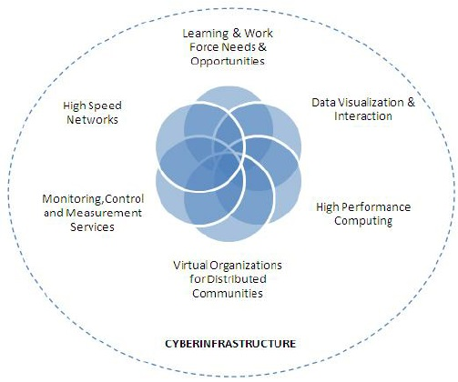
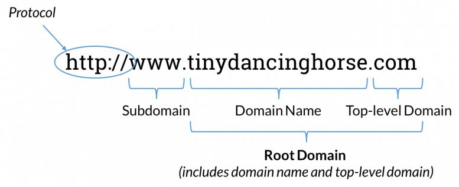
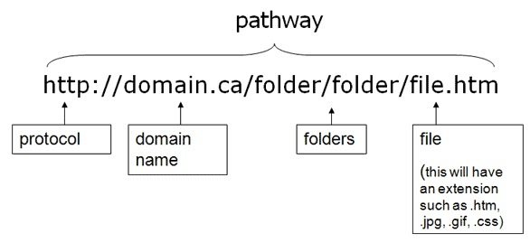

# How the Web Works

##### Instructor: Yi Qiang  Email: yi.qiang@hawaii.edu  Aug. 29, 2019
---

## Learning objectives:
- Understand the Common Concepts in Web Development

## 1. The Internet, the Web and cyberinfrastructure
These terms means similar things and have been interchangably used in many contexts. However, it would be helpful to point out their difference.

### 1.1 The Internet
The internet is a massive network of networks, a networking infrastructure. It connects millions of computers together globally, forming a network in which any computer can communicate with any other computer as long as they are both connected to the Internet. Information that travels over the internet does so via a variety of languages known as protocols.

Quick Points about The Internet:
- It is a global network connecting millions of computers.
- The Internet is decentralized.
- Each Internet computer is independent.
- There are a variety of ways to access the internet.
- There are more than 3.5 billion internet users in the world.

### 1.2 The Web
The World Wide Web (the Web) is a way of transmitting and sharing information over the medium of the internet. It is an information-sharing model that is built on top of the Internet. The web mainly uses the HTTP protocol, one of the languages spoken over the internet, to transmit data. Web services, which use HTTP to allow applications to communicate in order to exchange business logic, use the web to share information. The web also utilizes browsers, such as Internet Explorer or Firefox, to access Web documents called webpages that are linked to each other via hyperlinks. Web documents also contain graphics, sounds, text and video.

Quick Points about The Web:
- It is a system of internet servers that support specially formatted documents.
- Documents are formatted in a markup language that supports links to other documents.
- You can jump from one document to another simply by clicking on hot spots (hyperlinks).
- Applications called web browsers that make it easy to access the World Wide Web.
- There are more than 1,275,000,000 websites.

### 1.3 Cyberinfrastructure (CI)
Nowadays, the term cyberinfrastructure (CI) has been increasingly used in computer and information science. Cyberinfrastructure — also known as e-research, e-science, and e-infrastructure in Europe, Australia, and Asia; consists of computing systems (especially High-Performance Computing), large data storages, advanced instruments and data repositories, visualisation environments, and people; all linked by high-speed networks, which makes difficult innovation and discoveries possible, which otherwise are very difficult.

## 2. Web Servers
Servers are information hubs that provide various services in the Internet. Servers can publish webpages for users to browse. Servers can store data for people to download. Servers can provide algorithms to do computing for users. Servers not only refers to the computers that provide the services, but also the software. Nowadays, the concept of server become blurry in the cloud computing, which is a network of remote servers that provide the same services.

In order for a computer to be a server, it must be running special web server software that allow it to handle HyperText Transfer protocol (HTTP) transactions. There is a long list of HTTP server software (details in [here](https://en.wikipedia.org/wiki/Comparison_of_web_server_software)). The most commonly used HTTP server software include Apache, Nginx, Internet Information Services (IIS) or IIS Express (only for Windows). Server computers that provide HTTP services are also called HTTP servers.

> **Hypertext Transfer Protocol Secure (HTTPS)** is an extension of the standard web transfer protocol (HTTP) that adds a layer of security on the data in transit through a secure socket layer (SSL) or transport layer security (TLS) protocol connection. HTTPS enables encrypted communication and secure connection between a remote user and the primary web server. [More about HTTPS](https://www.howtogeek.com/181767/htg-explains-what-is-https-and-why-should-i-care/). In addition,
>
> **The File Transfer Protocol (FTP)** is a standard network protocol used for the transfer of computer files between a client and server on a computer network. [More about FTP](https://www.cloudwards.net/what-is-ftp/)

## 3. IP Address
Every computer and device (modem, router, smartphone, cars, etc) connected to the Internet is assigned a unique Internet Protocol (IP) Address. These devices include servers (e.g. HTTP servers) that provide web services and users that access to the servers. For instance, the IP address of the server that host UH's main website is "128.171.149.56". You can find out the IP address of servers of any website using [IP checker](https://ipinfo.info/html/ip_checker.php).

#### Dynamic and Static IP
IP address can be dynamic or static. Most client-side devices (e.g. your computers, mobile phones) have a dynamic IP address, which is a temporary IP address assigned when the device is connected to a network. Dynamic IP addresses are generally implemented by Internet service providers and networks that have a large number of connecting clients or end-nodes. A dynamic IP address can change every time the device reconnected to the internet (e.g. a computer reboot). A static IP address is permanently registered in the Internet service providers. Most server devices have a static IP so that clients can access to them without interruptions. Not only for web servers, a static IP is convenient for people to use Remote Desktop to their computers. Within the UH network, you can request the ITS to reserve a static IP for your computer ([how](http://www.hawaii.edu/its/micro/mac/network.html#os9static)).

Here are different ways of checking IP address of your device:

- [Windows computer](https://kb.wisc.edu/page.php?id=27309)
- [Macbook](http://osxdaily.com/2010/11/21/find-ip-address-mac/)
- [Iphone](http://www.macinstruct.com/node/547)
- [Android phone](https://kb.k12usa.com/Knowledgebase/Find-the-IP-address-of-an-iPad-or-Android-Tablet)

>The original format of IP address (also called IPv4) is ###.###.###.###, which allows us to produce 4.3 billion unique addresses. This seems plenty when the Internet 'experiment' was first conceived in 1977. But nowadays, every computer, phone, tablet and even Roku TV and smart air-conditioner has an IP address. The solution is a new IP format (IPv6) that allows for trillions and trillions of unique IP numbers.

## 4. Domain Name System (DNS)
The numeric format of IP address is not intuitive for humans to remember. Therefore, most websites have a domain name, which is the address of a website in the internet, and most importantly, easier for people to remember. For instance, the domain name of the UH's main website is www.hawaii.edu, which is easier to remember than the IP address (although you can access the same website using the IP address 128.171.149.56). A Domain Name System (DNS) associates the domain name of a website with the IP address of the web server that hosts the website. With DNS, you are automatically directed to the correct server after typing the domain name. Each website has a domain name, and a web server (assigned a unique IP address) may host multiple websites. Therefore, different domain names may be directed to the same IP address if they are hosted by the same server.

#### Levels of domain names
Doman names are made up of three parts: a top-level domain (sometimes called an extension or domain suffix), a second-level domain name (or IP address), and an optional subdomain (3rd-level).

The top-level and second-level domain names are mandatory for a website. A domain name points to the front page of a website (index.html) or a web service. 'www' can be omitted when you type a domain name in a browser.

## 5. Uniform Resource Locator (URL)
Every page and resource on the web has its own special address called Uniform Resource Locator (URL). Unlike domain name which is the address of a web site, URL is the address of individual elements in a website, including webpages , pictures, videos, files and so on. A URL usually starts with the domain name of the websites, followed by the directory path and file name.

Webpages and other elements are linked together using  URLs. Web users can navigate from one webpage to another by clicking elements embedded with URLs. In a web browser, you can see the URL of different elements in the page by placing the mouse cursor above the elements.

## 6. How files are organized in a websites
The file system in a website is very similar to the file system in Windows, Mac OS and Linux systems. The domain name point to the root folder of the website, which is the highest level of directory of the website. Elements of the website (e.g. webpages, pictures and other files) are stored in the root folder or subfolders under the root folder. For instance, if a web server set `C:/inetpub/wwwroot` as the root folder of a website. The domain name (e.g. `www.mywebsite.com`) will point to the default file (index.html) in the root folder. `www.mywebsite.com/mycv.pdf` points to mycv.pdf in the root folder. www.mywebsite.com/images/myphoto.jpg points to the file myphoto.jpg stored in the folder `C:/inetpub/wwwroot/images/`. The full path of myphoto.jpg in the server is `C:/inetpub/wwwroot/images/myphoto.jpg`.
