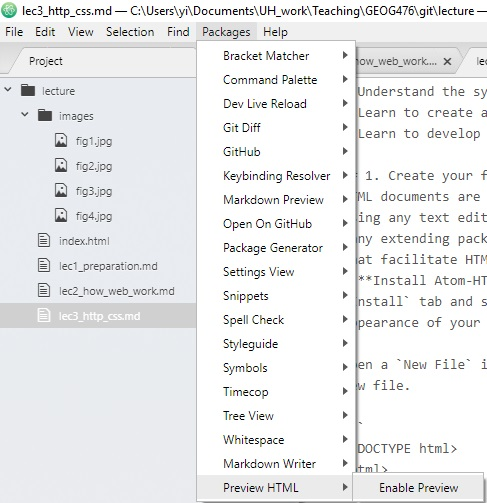
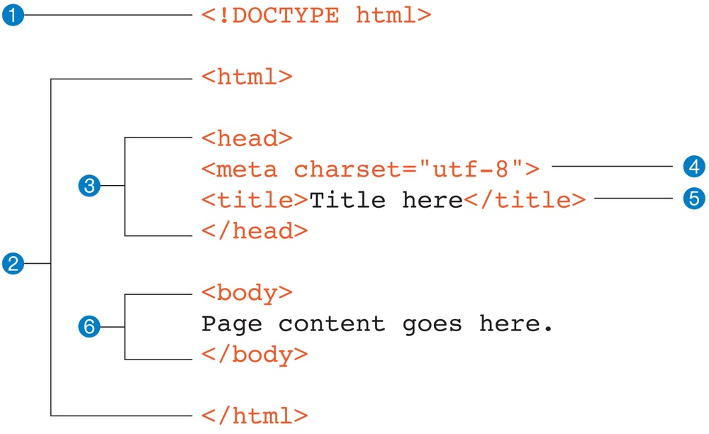
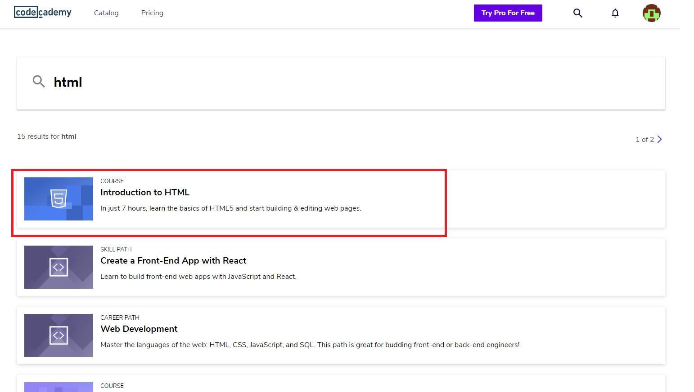

# HTTP and CSS

##### Instructor: Yi Qiang <br/>Email: yi.qiang@hawaii.edu <br/>Sept. 9th, 2019
---

## Learning objectives:
- Understand the syntax of HTML
- Learn to create a simple HTML webpage
- Learn to develop webpages using existing template

## 1. HTML
HTML documents are essentially text files following HTML syntax. You can edit HTML documents using any text editor. We choose ATOM as the text editor for this class as it is free and has many extending packages that are community-built and maintained. It can also install packages that facilitate HTML editing and preview.

- Please download **atom** from [here](atom.io) and install in your computer.

- Install Atom-HTML-preview package: open the `File` menu and click `Settings`. Click the `Install` tab and search for `atom-html-preview`. This package will allow you toe view the appearance of your webpage while you are editing HTML.

Open a `New File` in the `File` menu in Atom. Copy the following codes and paste them in the empty new file.

```
<!DOCTYPE html>
<html>
<head>
<meta charset="utf-8">
<title>Page Title</title>
</head>
<body>

<h1>This is a Heading</h1>
<p>This is a paragraph.</p>

</body>
</html>
```

> You can preview the HTML file in Atom while you are editing. `Package` -> `Preview HTML` ->
`Enable Preview`. You can preview the web page while you are editing the HTML. However, to guarantee the appearance of the web page, you should try it in a browser.



Save the file as "index.html" in a local folder in your computer. Right click on index.html and open it in Chrome.

## 2. HTML Elements
As you can see, your browser only displays the text between ```<title>``` and ```</title>``` and between ```<p>``` and `</p>`. The code embraced by <> are tags that define types of elements being displayed. According to the tags, 'This is a Heading' is an 'h1' element, enclosed between a starting tag `<h1>` and an closing tag `</h1>`. Actually, the 'h1' stands for Header 1. Similarly, 'This is a paragraph' is a 'p' element, which means a paragraph.

A HTML webpage is made of various elements such as "heading", "paragraph", "table". The types of elements are defined by the tags in <>. Browsers do not display the HTML tags, but use them to render the format (e.g. font, font size, color) of the element. A tag **without** a slash (`/`) (e.g. `<h1>`) is the start tag, while a tag with a slash (`/`) (e.g. <`/h1>`) is a closing tag. The text between a pair of start tag and closing tag are content of the element, which will be displayed in the browser.


## 3. HTML document structure
The HTML script in Section 1 showss the minimal skeleton of an HTML document.



1. The first line in the example isn’t an element at all; it is a document type declaration (also called DOCTYPE declaration) that identifies this document as an HTML5 document. This line lets modern browsers know they should interpret the document as written according to the HTML5 specification.

2. The entire document is contained within an html element. The html element is called the root element because it contains all the elements in the document, and it may not be contained within any other element.

3. Within the html element, the document is divided into a head and a body. The head element contains descriptive information about the document itself, such as its title, the style sheet(s) it uses, scripts, and other types of “meta” information.

4. The meta element within the head element provides information about the document itself. A meta element can be used to provide all sorts of information, but in this case, it specifies the character encoding (the standardized collection of letters, numbers, and symbols) used in the document. I don’t want to go into too much detail on this right now, but know that there are many good reasons for specifying the charset in every document, so I have included it as part of the minimal document structure.

5. Also in the head the title element is mandatory. According to the HTML specification, every document must contain a descriptive title.

6. The body element contains everything that we want to show up in the browser window.

## 5. Semantic Markup
Such syntax where content is enclosed in tags is called Semantic Markup. The purpose of the markups is to add meaning and structure to the content. The markups also define how the content should look like (its presentations)

Your job when marking up content is to choose the HTML element that provides the most meaningful description of the content.  For example, the most important heading at the beginning of the document should be marked up as an h1 because it is the most important heading on the page. The content will be presented in the default style (e.g. font, font size, color) of h1. However, you can easily change the style with a style sheet. The important thing is that you mark elements with tags that makes the most sense for the content.

In addition to adding meaning to content, the markup gives the document structure. The way elements follow each other or nest within one another creates relationships between the elements. You can think of it as an outline (its technical name is the DOM, for Document Object Model). The underlying document hierarchy is important because it gives browsers cues on how to handle the content.

## 6. Attributes
- HTML elements can have attributes, which provide additional information about an element.
- Attributes are always specified in the start tag.
- Attributes usually come in name/value pairs like: name="value" (value with space has to be quoted)

For instance, you can add the title attribute to the p element.

`<p title="Title of the paragraph">This is another paragraph.</p>`

## 7 Tags
### 7.1 Formatting tags
| HTML code  | Webpage  |
|---|---|
|`<B> Bold Face </B>`|<B> Bold Face </B>|
|`<I> Italics </I>`|<I> Italics </I>|
|`<U> Underline </U>`|<U> Underline </U>|
|`Text <BR> Next Line`|Text <BR> Next Line|

### 7.2 Font tags
The expression `<FONT FACE = “fontname”> … </FONT>` can be used to change the font of the enclosed text. For instance, `<FONT FACE = "Comic Sans MS"> The font is Comic Sans MS </FONT>` shows <FONT FACE = "Comic Sans MS">The font is  Comic Sans MS </FONT>.

You can also change the color and size of the font. You only need to add more attributes in the font tag.

For example,  `<FONT FACE = "Comic Sans MS" color="green" size="15">The font is  Comic Sans MS </FONT>` shows <br>
<FONT FACE = "Comic Sans MS" color="green" size="12">The font is  Comic Sans MS </FONT>

> Note: HTML is NOT case sensitive. So `<I>Italic</I>` and `<i>Italic</i>` shows the same output.

### 7.3 Heading Tags
Web pages are typically organized into sections with headings; To create a heading use the expression `<Hn>….</Hn>` where n is a number between 1 and 7.

|  `<H1>Heading 1</H1>`  | <H1>Heading 1</H1>  |
|---|---|
|  `<H2>Heading 2</H2>`  | <H2>Heading 2</H2>  |
|  `<H3>Heading 3</H3>`  | <H3>Heading 3</H3>  |
|  `<H4>Heading 4</H4>`  | <H4>Heading 4</H4>  |
|  `<H5>Heading 5</H5>`  | <H5>Heading 5</H5>  |

### 7.4 Aligning Text
The ALIGN attribute can be inserted in the `<P>` and `<Hn>` tags to right justify, center, or left justify the text. For example, `<H1 ALIGN=CENTER> The New York Times </H1>` would create a centered heading of the largest size.

<H1 ALIGN=CENTER> The New York Times </H1>

### 1.5 Inserting images
Type ``, where "image.jpg" indicates the location of the image file. You can more attributes to adjust the image, for instance:
- The width=n and height=n attributes can be used to adjust the size of an image
- The attribute border=n can be used to add a border n pixels thick around the image

For example: `` shows


The picture won't show in your browser. Do you know why? How to fix it?


### 1.6 Nested Tags
Whenever you have HTML tags within other HTML tags, you must close the nearest tag first. For example, `<b>Bold <I>Bold and Italic Nation </I> </b>` shows as <b>Bold <I>Bold and Italic Nation </I> </b>

### 1.7 Tables
Tables can be used to display rows and columns of data, create multi-column text, captions for images, and sidebars.
- `<TABLE>` is used to create a table;
- `<TR>` defines the beginning of a row
- `<TD>` defines the beginning of a cell
- You can add other attributes to the table, for instance "border"

```
<TABLE BORDER=10>
	<TR>
		<TD>One</TD>
		<TD>Two</TD>
	</TR>
	<TR>
		<TD>Three</TD>
		<TD>Four</TD>
	</TR>
</TABLE>
```
shows as
<TABLE BORDER=10>
	<TR>
		<TD>One</TD>
		<TD>Two</TD>
	</TR>
	<TR>
		<TD>Three</TD>
		<TD>Four</TD>
	</TR>
</TABLE>


## 8. Debugging HTML

The previous demonstration went smoothly, but it’s easy for small things to go wrong when typing out HTML markup by hand. It is OK if you have typos in the text between the tags. However, your document may go wrong if you have missed characters in the element tags and attribute.

> Something to try:
- Delete the closing tag of the 'h1' element and see what happens
- Delete the '/' in the closing tag ```</title>``` and see what happens
- Delete the quotation in ```width="500"``` in the image lement and see what happens


# Assignment
Please create an account in Code Academy(https://www.codecademy.com/) or you can login with your google, facebook, linked in or github account. Search and finish the course **Introduction to HTML**.




When finished, take a **screenshot** of the webpage showing you finished all the 16 classes and **submit the screenshot through Laulima**.
