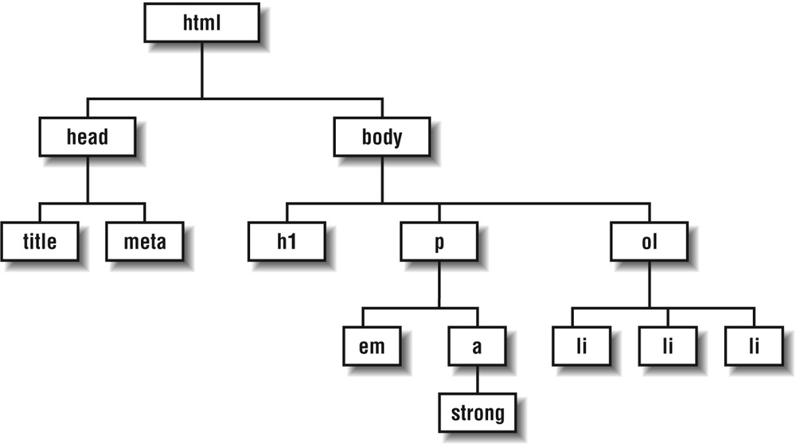

# Cascading Style Sheets (CSS) and Web Template

##### Instructor: Yi Qiang <br/>Email: yi.qiang@hawaii.edu <br/>Sept. 9th, 2019
---

## Learning objectives:
- Understand CSS and why we need it
- Basic syntax of CSS
- Build your website by modifying a template

## 1. Introduction to CSS
In the previous class, you created the first webpage (index.html) where the elements were rendered using the default styles of the tags. However, the default styles cannot satisfy creative people who want to customize their website in special looks. You can 'pretty up' your website using other styles that you like, which can be done by editing the Cascading Style Sheets (CSS).

CSS describes how HTML elements are displayed in a webpage. Using CSS can save you lots of time as it can control the layout of multiple web pages all at once. For instance, the font size, colors and layout in all pages of the UH website are the same, because all webpages in the website are using the same CSS.

CSS can be associated with a HTML document in 3 ways:

- Inline - by using the style attribute in HTML elements (least used)
- Internal - by using a ```<style>``` element in the ```<head>``` section (sometimes)
- External - by using an external CSS file (most used)

The following HTML code embed CSS to re-define the style of the paragraph element (`<p>`).  The code between the ```<style>``` and tags ```</style>``` is CSS, which override the default style of ```<p>``` in the browser and re-defined the font color to red and aligned the text to the center. You can copy these code to overwrite the existing code in index.html that you created in the previous class to see the effect.


```
<!DOCTYPE html>
<html>
<head>
  <style>
    p {
      color: red;
      text-align: center;
    }
  </style>
</head>
<body>

<p>Hello World!</p>
<p>These paragraphs are styled with CSS.</p>

</body>
</html>

```


From the preview of the HTML document you can see the font color of ```<p>``` becomes red and the text is aligned to the center. This means that the added CSS styles for color and text alignment override the default styles.

Now, delete the code between the `style` tags and see what happens.

## 2. CSS Syntax
A CSS rule-set consists of a selector and a declaration block:
- The selector points to the HTML element you want to style.
- The declaration block contains one or more declarations separated by semicolons.
- Each declaration includes a property name (e.g. color) and a value (e.g. red), separated by a colon.


A CSS declaration always ends with a semicolon (easy to forget), and declaration blocks are surrounded by curly braces.

You can group selectors with the same declaration.

Selectors with the same declaration:
```
h1 {
  text-align: center;
  color: red;
}

h2 {
  text-align: center;
  color: red;
}

p {
  text-align: center;
  color: red;
}
```

Define the properties with the same values of grouped selectors:

```
h1, h2, p {
  text-align: center;
  color: red;
}

```
## 3. CSS Selectors
### 3.1 Element selector
The element selector selects elements based on the element name. You can select all `<p>` elements on a page like the following (in this case, all `<p>` elements will be center-aligned, with a red text color):
```
p {
  text-align: center;
  color: red;
}
```

### 3.2 ID selector
Sometimes, you may want a ```<p>``` element slightly different from other ```<p>``` elements. For instance, you want to highlight a ```<p>``` element using red color but keep the other properties the same. The id selector can be used to create a slightly different element. The id of an element should be unique within a page, so the id selector is used to select one unique element! To select an element with a specific id, write a hash (#) character, followed by the id of the element. The style rule below will be applied to the HTML element with id="para1":
```
#para1 {
  text-align: center;
  color: red;
}
```
The following is an example of applying the id selector of ```#para1``` to ```<p>``` element to make it different (in red and center aligned).
```
<!DOCTYPE html>
<html>
<head>
<style>
#para1 {
  text-align: center;
  color: red;
}
</style>
</head>
<body>

<p id="para1">First paragraph use red font and isaligned to center </p>
<p>This paragraph use the default style.</p>

</body>
</html>
```

In the example, only the color and alignment of the element has changed, the font and font size of `<p>` are the same. An ID selector can be applied to different element. Imagine if you apply the `#para1` selector to a `<h1>` selector, what will happen?

### 3.3 Class selector
Class selectors can be used to define sub-types of an element. To select elements with a specific class, write a period (.) character, followed by the name of the class. In the example below, all HTML elements with class="center" will be red and center-aligned:

```
<!DOCTYPE html>
<html>
<head>
<style>
p.center {
  text-align: center;
  color: red;
}
</style>
</head>
<body>

<h1 class="center">This heading will not be affected</h1>
<p class="center">This paragraph will be red and center-aligned.</p>

</body>
</html>

```

As you defined a class selector 'center' for the `<p>` element (but not for `h1`), the `<p.class>` is red and center aligned.

What will be the appearance of the following element?
`<p>This paragraph will be red and center-aligned.</p> `

> Note: try to feel the different functions between ID selector and class selector. Styles defined in an ID selector can be applied to different elements (e.g. p, h1, h2...). However, a class selector defines a subtype of an element, which can only be applied to this element.

## 4. External Style Sheet
As mentioned above, CSS can be added to a HTML document in three ways. The previous example shows how CSS can be inserted between the style tags in a HTML. However, CSS can become lengthy if many new styles are added. To make the HTML succinct and easy to read, people would like to link HTML documents to an external CSS file.

Please copy the following line of code and paste it between the ```<head>``` tag (not betwee the style tag) in index.html. This line of code is linking the HTML document to a external css file. The 'href' attribute defines the path of the css file, which is in the same (root) directory as the HTML file.

```
<link rel="stylesheet" type="text/css" href="mystyle.css">
```

You don't see any change in the webpage, because you don't have 'mystyle.css' in the directory of index.html.

Now, please open a New File in Atom, copy and paste the following code to in the new file. Save the new file to the same folder of index.html, and name it 'mystyle.css'.

```
body {
  background-color: lightblue;
}

h1 {
  color: navy;
  margin-left: 20px;
}
```
Check the changes of the webpage. This externally linked CSS re-defined the background color of the body element and the font color and alignment of the h1 element.

## 5. Hierarchical Structure of Elements
HTML documents have an implicit structure or hierarchy. For example, index.html has an html root element that contains a head and a body. The body contains heading (e.g. h1, h2) and paragraph elements (p). Some of the paragraphs contain inline elements such as image (img) and emphasized text (em). You can visualize the structure as a upside-down tree like below.

In the hierachy (tree), all the elements contained within a given element are said to be its descendants. For example, h1, h2, p, em, and img elements in the tree are descendants of the body element. All elements higher than a particular element in the hierachy are its ancenstors.

When you write a font-related style rule for an element (e.g. `<p>`), the style applies to all the elements in the documents as well as its descendants (e.g. `<a>` and `<em>` elements). Note, only the font-related styles (e.g. font style, size and color) are inherited. Styles such as border, margin, and background will not be passed down.




## 6. CSS Template
So far, you feel you have learned lot about HTML and CSS, but you are still confused where to start to build a website? Most people don't build a website from scratch. Instead, they usually start working from a template. You can find different HTML and CSS template in different websites, which may be free or paid. In the W3C school website, you can find some free template ([click here](https://www.w3schools.com/w3css/w3css_templates.asp)).

## 7. Bootstrap
If the free template cannot satisfy your creativity and sense of aesthetics, Bootstrap may help you. Bootstrap is the most popular HTML, CSS, and JavaScript framework for developing responsive, mobile-first websites.
- Bootstrap is a free front-end framework for faster and easier web development
- Bootstrap includes HTML and CSS based design templates for typography, forms, buttons, tables, navigation, modals, image carousels and many other, as well as optional JavaScript plugins
- Bootstrap also gives you the ability to easily create responsive designs
- Bootstrap is free to download

In this class, we will not learn the specifics of bootstrap. If you are interested, you can learn it from the [W3C school website](https://www.w3schools.com/bootstrap).

## 8. Mobirise
If you don't want to learn the specifics of Bootstrap, you can use [Mobirise](https://mobirise.com/) to build websites based on the Bootstrap framework. In Mobirise, you can build a website by dragging different components into a webpage and edit the specifics of the components. It get rid of the learning process of coding in the Bootstrap, and still keeps many advantages of Bootstrap (e.g. Mobile friendly and responsive).

## 9. Upload website to UH Server
In this class, I will demonstrate how to upload your developed website to your website in the UH Server. You can find the instructions [here](http://hawaii.edu/askus/694).

## Assignment
**Due on Sunday Sept 22nd**

First, complete the first two lessons (**CSS Setup and Selectors** and **CSS Visual Rules**) in Learning CSS in [Code Academy](https://www.codecademy.com/learn/learn-css).<br>
<br>

Second, please build a website to describe yourself, your band, your pet, your business or anything you are interested. I recommend you to start the development from a CSS template in the [W3C school website](https://www.w3schools.com/w3css/w3css_templates.asp) or using Mobirise. Upload the website to the UH server and send me the URL to your website through Laulima.
>Note: you can only upload up to 70M in the UH web server. So please try not to use lots of large pictures.
