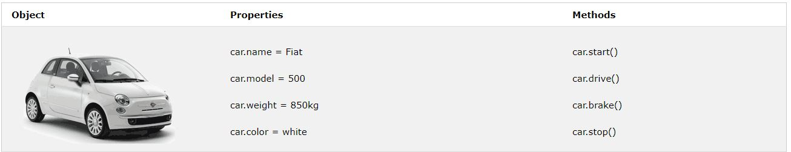
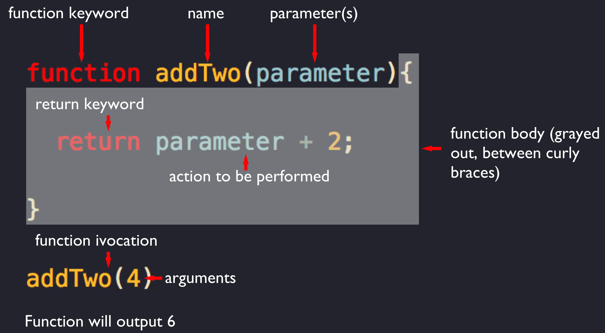
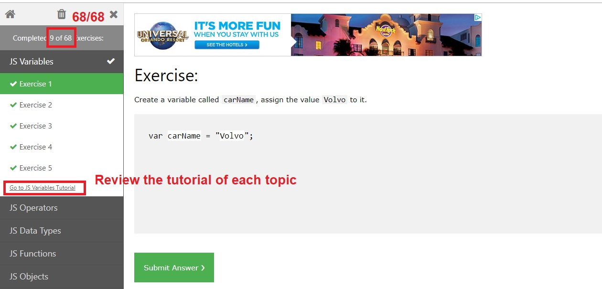

# Basics of JavaScript

##### Instructor: Yi Qiang <br/>Email: yi.qiang@hawaii.edu <br/>Sept. 20th, 2019
---

## Learning objectives:
- Understand the basic syntax of Javascript
- Being able to read Javascript and write simple Javascript programs

## 1. Introduction to JavaScript
Despite its name, JavaScript has nothing to do with Java. Javascript is a client-side scripting language, which runs programs on the user's browser instead of the server. JavaScript is lightweight but powerful. We most frequently encounter Javascript in our web browswer. But Javascript support almost everything from native applications to PDF to ebooks. Even webservers themselves can be powered by JavaScript.

As a dynamic programming language, Javascript doesn't need to be run through any form of compiler that interprets our human-readable code into something the browser can understood. The browser effectively reads the code the same way we do and interprets it on the fly.

Adding JavaScript programs into HTML files can enhance interactivity to a page. We can write JavaScript programs that react to user's input, alter either the content of the page, the CSS styles, or the browser's behavior on the fly. You've likely seen this when you attempted to register for a website, entered a username, and immediately received feedback that the user name you've entered is already taken by someone else. The alert message "sorry, this username is already in use" is an reaction programmed in JavaScript. In short, JavaScript allows you to create highly responsive interfaces that improve the user experience and provide dynamic functionalities, without waiting for the server to respond.

## 2. Adding JavaScript to a Page
Like CSS, you can embed a script in a HTML document or keep it in an external file and link it to the page. Both embedded and external JavaScript code must be inserted between `<script>` and `</script>` tags.
### 2.1 Embedded scripts
To embed a script on a page, just add the code as the content of a script element:
```
<script>
  Javascript code goes here
</script>
```

You can place any number of `<script>` tags in an HTML document. Scripts can be placed in the `<body>`, or in the `<head>` section of an HTML page, or in both. Placing scripts at the bottom of the `<body>` element improves the display speed, because script interpretation slows down the display.


### 2.2 External scripts
The other method uses the src attribute to point to a script file (with a .js suffix) by its path. This is similar of embeding an external CSS file. External scripts are practical when the same code is used in many different web pages. It also makes HTML and JavaScript easier to read and maintain. Imaging it is hard to read a HTML document with JavaScript inserted here and there. When inserting the script from an external file, the script element has no content, for instance
```
<script src="myScript.js"></script>
```

The JavaScript code is stored in the myScript.js file in the same directory as the HTML file.

## 3. JavaScript Consoles
There are many online coding editors that you can use to write and test your JavaScript and HTML scripts. Some popular ones are:
- [jsFiddler](https://jsfiddle.net/)
- [PlayCode](https://playcode.io/)
- [CodeSandbox](https://codesandbox.io/)

Alternatively, you can use the Javascript console in your browser such as Firefox firebug, Google Chrome console. Open up your browser (Google Chrome), navigate to a page (e.g., www.google.com), and open the browser JavaScript console and do some basic coding to show some of the principles.
Chrome’s integrated JavaScript console allows you to input and explore JavaScript. Use CTRL+SHIFT+J (Windows) / CMD+OPTION+J (Mac) to open the console.
In your JavaScript code, if you ever want to print something in a pop-up window, use:
```
alert('Hello world')
```


You can also print the variable in the console.
```
console.log('Hello world!')
```

Or load a webpage in the browser:
```
document.location.href="http://google.com";
```

## 4. Basic Syntax of JavaScript
### 4.1 Statement
A script is made up of a series of statements. A statement is a commond that tells the browser what to do. Here is a simple statement that makes the browser display an alert with the phrase "Thank you."
```
alert("Thank you");
```
The semicolon at the end of the statement tells the browser that it is the end of the command. Although a line break also indicates the end of a statement, it is a best practice to end each statement with a semicolon.

### 4.2 Comments
Commnents are important in programming languages as it explains what the code does and can be used for debugging. Programs will skip the comments when executed. In JavaScript, you can define a single-line comment use two slash characters (//) at the beginning of the line, for instances

```
// This is a single-line comment
```

Multi-line comments use the same syntax as that in CSS. Evertying within the `/* */` are comment. You can use it to "comment out" notes and even chunks of script when debugging.
```
/*
The code below will change
the heading with id = "myH"
and the paragraph with id = "myP"
in my web page:
*/
```

### 4.3 Variables
Variables are named containers for storing data values. Variables give us a convenient way to reference that value by the name of the variable. In the following code, x, y, and z, are defined as variables that stores different values:
```
var x = 5;
var y = 6;
var z = x + y;
```

From the example above, you can expect:

- x stores the value 5
- y stores the value 6
- z stores the value 11

You can use anthing you like as a variable name, as long as it makes sense to you. There are a few rules for naming variables:
- It must start with a letter or an underscore
- It may contain letters, digits and underscores in any combination
- It may not contain character spaces (people usually use underscore to substitute space)
- It may not contain special characters such as (!. , / \ + * = ...)

### 4.4 Data types
#### Numbers
You can assign variables numerical values. x, y, and z in the previous example are all numbers. Unlike other programming languages, JavaScript has only one type of number. Numbers can be written with decimals (float or double) or without decimals (integer).

The following code assign 5 to the variable foo.

```
var foo = 5;
alert(foo); //This will open a dialog containing '5'
```

Arithmetic operations can be applied to number variables, for instance:
```
var x = 5;
var y = 10;
alert(x + y); // The dialog will contain 15.
```

#### String
String is a data type that stores characters, symbols and numbers. You need to use a single or double quote to enclose the value of a string variable, for instance:

```
var foo = 'Hello, 2019 Fall Sememster';
alert(foo); // The dialog will print 'Hello, 2019 Fall Sememster'
```

Note, when a number is contained by quotes, the number will be recognized as a string. For instance, the following code assign '10' to the variable year as a string.
```
var a = '10' // a is a string variable and a / 2 will not return 5 but an error.
```

When applied to number variables, '+' is the addition operator. However, when applied to string variables, '+' is the concatenation operator, wchich combines two strings.

```
var s1 = 'Hello';
var s2 = '2019';
alert(s1 + s2); // the dialog will print 'Hello2019', which is the combination of the two strings.
```

#### Boolean
We can also assign a variable a "true" or "false" value. This is called a Boolean value. Boolean values use the true and false keywords built in JavaScript, so quotation marks are not necessary.

`var foo = true;`

#### Undefined and Null
You can declare a variable but do not assign a value to it. People usually do this to preserve a variable name and assign a value to it later. There are two ways to do it.

```
var foo;
alert(foo); // The dialog will print "undefined".
```

```
var foo = null; // null is a built-in keyword of Javascript
alert(foo); // The dialog will print "null".
```

#### Arrays
An array is a matrix of values. You can assign and obtain the values in an array using the indices of the values. In a 1D array, the index of the first value is 0, the second is 1 (similar to Python's indexing). The following example shows how to declare an array variable and get values at different positions using indices. You can store different types of values (e.g. numbers,strings and null) in an array.

```
var foo = [5,'five','5'] // define a string with three values.
```

```
alert(foo[0]); //Alert "5"
alert(foo[1]); //Alert "five"
alert(foo[2]); //Alert "5"
```
#### Operators
There are several common types of operators in JavaScript.
- Assignment operator(=)
- Arithmetic operators (+, -, *, /, %, ** ...)
- Comparison operators (==, ===, !=, !===, >, <, >=, <=)
- Logical operators (&&, ||, !)
More information and examples of these operators can be found in the [W3C school tutorial](https://www.w3schools.com/js/js_operators.asp).

### 4.5 Object
In object-oriented (OO) programming languages, an object defines an entity with some **properties** and **methods**.  Properties describe the characteristics of an object. Methods of an object are functions that can only be performed by the object. For instance, a car can be defined as an object, which has properties like weight and color, and methods like start and stop.


You have already learned that JavaScript variables are containers for data values. The following code assigns a simple value (Fiat) to a variable named car:
```
var car = "Fiat";
```

Objects can be considered as complex variables, which include multiple characteristics of an entity. The following code assigns many values (Fiat, 500, white) to a variable named car. In this case, the variable with multiple properties and values is called an object.

```
var car = {type:"Fiat", model:"500", color:"white"};
```

As you can see, the properties of the car object are written as **property:value** pairs. Once an object is defined, you can access to the properties and methods of the object. [This example](https://www.w3schools.com/js/tryit.asp?filename=tryjs_objects_create_1) demonstrate how to define an object for a person and then access to the age property of the object.

You can access object properties in two ways: `objectName.propertyName` or `objectName["propertyName"]`.

[Examples 1](https://www.w3schools.com/js/tryit.asp?filename=tryjs_objects_properties_1)
[Examples 2](https://www.w3schools.com/js/tryit.asp?filename=tryjs_objects_properties_2)

**Note**: HTML, CSS and Javascript all use **property:value** pairs to define attributes/property of elements/objects. However, their syntax are different and people often get confused. The most important point is that  multiple attributes are separated by ` ` (space), `;` and `,` respectively

- Define multiple attributes of `img` element in HTML:
```

```


- Define multiple attributes of `h1` element in CSS
```
h1 {
  color: blue;
  font-family: verdana;
  font-size: 300%;
}
```

- Define a Javascript object with multiple attributes
```
var car = {type:"Fiat", model:"500", color:"white"};
```


### 4.6 If/else statement
If/else statement controls Javascript programs to execute actions depending on whether a condition is met or not. An example of the logic in reality is "If it rains, we take umbrella. Otherwise (else), we don't take umbrella "

'If' can be a single statement, meaning do something if the condition is met. Please pay attention to the syntax of the if statement. The condition statement is enclosed in '()', while the action statement is enclosed in '{}'.
```
if (rain == true) {
  alert('Please bring umbrella');
}
```
Following the if statement, an else statement specifies a block of code to be executed if the condition is false.
```
var rain = prompt("Is it raining today?")

if (rain == true) {
  alert("Please bring an umbrella"); // print "Please bring an umbrella" if the variable 'rain' is true
} else {
  alert("You don't need an umbrella"); // if rain is not true, print "You don't need an umbrella"
}
```

You can use the 'else if' statement to specify an action when a new condition is met. Note, the new condition should be exclusive with the condition in the 'if' statement.

```
var rain = prompt("Is it raining today?")

if (weather == 'rain') {
  alert('You must bring an umbrella'); // print "Please bring umbrella" if the variable 'weather' equals to 'rain'
} else if (weather == 'shower') {
  alert("You may bring an umbrella"); // print "Please bring umbrella" if the variable 'weather' equals to 'rain'
} else {
  alert("You don't need an umbrella");  //if non of the above condition is met, print " You don't need an umbrella"
}
```

### 4.7 Loops
Loop is an efficient way to repeating the same action to a list of elements of the same type. Without a loop, you would need to write 100 statement to repeat the 'alert' statement to 100 strings, which is tedious and inefficient. However, with a loop statement, you only need to write one alert statement but print the 100 string iteratively. There are different ways to control a loop. However, the *for* loop is the most commonly used. The basic structure of a for loop is as follows:
```
for( var i = 0; i <= 2; i++){
  alert(i) // This loop will print "0", "1" and "2" in a sequence.
}
```
You can see there are three statement in the parentheses after `for`. These statements are separated by semicolon(;).
- Statement 1 (`var = 0;`) This statement creates a new variable `i`, with its initial value set to zero. Thus, zero is the starting number of `i` in the loop.
- Statement 2: (`i <= 2;`) This statement define the condition of looping. If the condition is true, the loop will keep running, until the condition becomes false.
- Statement 3: (`i++`) Finally, i++ is short for "in every loop, add one to the value of i". Note, without this step, i would always equal zero, and the loop would run forever (a dead loop).

You can omit Statement 1 or/and 3 in the `for` statement. However, you would need to define them somewhere else. Statement 2 is necessary.

```
cars = ['ford','fiat','honda']

var i = 0; // initialize i before the loop
var len = cars.length;
text = ""

for (; i < len; ) {
  text += cars[i] + "<br>";
  i++; // add one to i in the loop
}

alert(text)
```

### 4.8 Functions
#### Basic Syntax
A JavaScript function is a block of code designed to perform a particular task. A  function is executed when it is invoked (called). There are hundreds of pre-defined functions in Javascript that you can directly use. For instance, alert() is one of them. Other examples include `confirm()`,`prompt()`, `Date()` and `parseInt()`. The usage of these functions can be found in Google.

You can also define a new function by yourself, which is called a custom function. When defining a function, the function name is always immediately followed by a pair of parentheses, then a pair of curly braces that contains the code in the function. The parentheses may contain the input information of the function, which is called arguments. For instance, in `alert('Hello world!')`, the string 'Hello world!' is the argument. A function can also has no argument.



#### Argument
If a function has no argument, when it is called, it will just execute the program it contains. There is no external influence to the actions taken inthe function. However, with arguments (input parameters), the function may give different output or take different actions.

For instance, the following function has a as an argument.

```
function CalSum(a, b) {
  c = a+b
  alert("the sum of the input is " + c);             // Function returns the product of a and b
}
```

When different arguments are assigned to the function, the function will print different results.
```
a = 5;
b = 10;
CalSum(a, b); // this will print 'the sum of the input is 15'

```

```
c = 100;
CalSum(c, 100);

```
#### Return
A function can return an value using the `return` keyword. The returned value is like an output of the function after some actions or calculations. In the previous example, instead of print the calculation result in a dialog, you can actually return the output and store it in another variable.

First, we would need to re-define the function by returning c.

Note: the return keyword is the end the function. Any actions after the return keyword will not take place.
```
function CalSum(a, b) {
  c = a+b
  return c;             // Function returns the product of a and b
  alert("we'll never see this alert.")
}
```

The following code call the function `CalSum` and store the output in a variable c.

```
a = 10;
b = 10;
c = CalSum(a, b); // this store the output of the function in an variable c
alert(c) // the dialog will show the value of c, which is the output of function CalSum.
```

## 5. Document Object Model
The DOM is a W3C (World Wide Web Consortium) standard. The DOM defines a standard for accessing web documents.
When a web page is loaded, the browser creates a Document Object Model (DOM) of the page.

The HTML DOM model is constructed as a tree of Objects:


The HTML DOM is a standard object model and programming interface for HTML. It defines:

- The HTML elements as **objects**
- The **properties** of all HTML elements
- The **methods** to access all HTML elements
- The **events** for all HTML elements
- In other words: The HTML DOM is **a standard for accessing, changing, adding, or deleting HTML elements.**

### 5.1 DOM Programming Interface
The HTML DOM can be accessed with JavaScript (and with other programming languages).
In the DOM, all HTML elements are defined as objects.
The programming interface is the properties and methods of each object.
A property is a value that you can get or set (like changing the content of an HTML element).
A method is an action you can do (like add or deleting an HTML element).

#### Modify HTML by `getElementById`
The following example changes the content (the innerHTML) of the `<p>` element with id="demo".
```
<html>
<body>

<p id="demo"></p>

<script>
document.getElementById("demo").innerHTML = "Hello World!";
</script>

</body>
</html>
```

In the example above, `getElementById` is a method, while `innerHTML` is a property which returns the HTML within the tags with the ID. Essentially, the JavaScript codes modify the HTML document by inserting the string 'Hello World!' in the `<p>` element.  `innerHTML` is used to access `<p>` element using its 'id'.

Another example. What does the web page show?

```
<!DOCTYPE html>
<html>
<body>

<h2>Finding HTML Elements by Id</h2>

<p id="intro">Hello World!</p>
<p>This example demonstrates the <b>getElementsById</b> method.</p>

<p id="demo"></p>

<script>
var myElement = document.getElementById("intro");
document.getElementById("demo").innerHTML =
"The text from the intro paragraph is " + myElement.innerHTML;
</script>

</body>
</html>
```

You can also access elements in a HTML document using the `getElementsByTagName` and `getElementsByClassName` method.
- [An example of `getElementsByTagName` ](https://www.w3schools.com/js/tryit.asp?filename=tryjs_dom_getelementsbytagname2)
- [An example of `getElementsByClassName` ](https://www.w3schools.com/js/tryit.asp?filename=tryjs_dom_getelementsbyclassname)

### 5.2 DOM Event
An event is an action that can be detected with JavaScript, such as when the user clicks on an element or when the mouse moves over an element. In HTML, JavaScript programs can be tied to events triggered by the user or the browser itself. In Javascript, an event is identified by an event handler. For example, the **onclick** event handler trigger a script when user click on an element. Other examples of HTML events include:
- When a user clicks the mouse
- When a web page has loaded
- When an image has been loaded
- When the mouse moves over an element
- When an input field is changed
- When an HTML form is submitted
- When a user strokes a key
A full list of event handlers can be found [**here**](https://www.w3schools.com/jsref/dom_obj_event.asp)

There are three common methods for applying event handlers to HTML elements:
- As an HTML attribute
- As a method attached to the element
- Using addEventListner


#### As an HTML attribute
In this example, the content of the ``<h1>`` element is changed when a user clicks on it.

```
<!DOCTYPE html>
<html>
<body>

<h1 onclick="this.innerHTML = 'Ooops!'">Click on this text!</h1>

</body>
</html>
```
In the example above, you assigned an `onclick` event to the `<h1>` elements by adding it in the attribute of the element. [Try the example](https://www.w3schools.com/js/tryit.asp?filename=tryjs_event_onclick2)

[Another example of calling a function in the event of 'onclick'](https://www.w3schools.com/js/tryit.asp?filename=tryjs_events1)

#### As a Method
The following example changes the content (the innerHTML) of the `<p>` element with id="demo". [Try the example](https://www.w3schools.com/js/tryit.asp?filename=tryjs_events2)
```
<html>
<!DOCTYPE html>
<html>
<body>

<p>Click "Try it" to execute the displayDate() function.</p>

<button id="myBtn">Try it</button>

<p id="demo"></p>

<script>
document.getElementById("myBtn").onclick = displayDate;

function displayDate() {
  document.getElementById("demo").innerHTML = Date();
}
</script>

</body>
</html>

```

#### Using addEventListner
The addEventListener() method attaches an event handler to the specified element. Compared to the other two methods, using `addEventListner` has the following advantages:

- The addEventListener() method attaches an event handler to an element without overwriting existing event handlers.
- You can add many event handlers (even the same type) to one element.
- You can add event listeners to any DOM object not only HTML elements. i.e the window object.
- When using the addEventListener() method, the JavaScript is separated from the HTML markup, for better readability and allows you to add event listeners even when you do not control the HTML markup.
- You can easily remove an event listener by using the removeEventListener() method.

Here's an example that calls an function when the browser window resized. The event listener is added to the window object, which is not an HTML element.  [Try the example](https://www.w3schools.com/js/tryit.asp?filename=tryjs_addeventlistener_dom)
```
<!DOCTYPE html>
<html>
<body>

<h2>JavaScript addEventListener()</h2>

<p>This example uses the addEventListener() method on the window object.</p>

<p>Try resizing this browser window to trigger the "resize" event handler.</p>

<p id="demo"></p>

<script>
window.addEventListener("resize", function(){
  alert('Window resized');
});
</script>

</body>
</html>
```
Another example of adding three events to the same HTML element. [Try the example](https://www.w3schools.com/js/tryit.asp?filename=tryjs_addeventlistener_add_many2)
```
<!DOCTYPE html>
<html>
<body>

<h2>JavaScript addEventListener()</h2>

<p>This example uses the addEventListener() method to add many events on the same button.</p>

<button id="myBtn">Try it</button>

<p id="demo"></p>

<script>
var x = document.getElementById("myBtn");
x.addEventListener("mouseover", myFunction);
x.addEventListener("click", mySecondFunction);
x.addEventListener("mouseout", myThirdFunction);

function myFunction() {
  document.getElementById("demo").innerHTML += "Moused over!<br>";
}

function mySecondFunction() {
  document.getElementById("demo").innerHTML += "Clicked!<br>";
}

function myThirdFunction() {
  document.getElementById("demo").innerHTML += "Moused out!<br>";
}
</script>

</body>
</html>
```


## Assignment

Please complete the Javascript exercises in [the W3CSchools website](https://www.w3schools.com/js/exercise_js.asp?). Submit a screenshot showing you have completed all the 68 exercises through Laulima by **Sept 29 (Sunday), 11:55pm**.

<!--
Please learn other JavaScript syntax in the [tutorial in the W3Cschool website](https://www.w3schools.com/js/js_object_properties.asp). Depending on your time availability, you can focus on the following topics. Please make sure you understand the Javascript syntax introduced in the tutorial. You should try to run the example code to see how it works. In-class quizzes will be assigned next week to evaluate your learning outcomes, which will be an assignment.
- JS tutorial
  - [JS HOME](https://www.w3schools.com/js/default.asp)
  - [JS Introduction](https://www.w3schools.com/js/js_intro.asp)
  - [JS Where To](https://www.w3schools.com/js/js_whereto.asp)
  - [JS Output](https://www.w3schools.com/js/js_output.asp)
  - [JS statements](https://www.w3schools.com/js/js_statements.asp)
  - [JS syntax](https://www.w3schools.com/js/js_syntax.asp)
  - [JS comments](https://www.w3schools.com/js/js_comments.asp)
  - [JS variables](https://www.w3schools.com/js/js_variables.asp)
  - [JS operators](https://www.w3schools.com/js/js_operators.asp)
  - [JS Arithmetic](https://www.w3schools.com/js/js_arithmetic.asp)
  - [JS Data Types](https://www.w3schools.com/js/js_datatypes.asp)
  - [JS Functions](https://www.w3schools.com/js/js_functions.asp)
  - [JS Object](https://www.w3schools.com/js/js_objects.asp)
  - [JS Strings](https://www.w3schools.com/js/js_strings.asp)
  - [JS Numbers](https://www.w3schools.com/js/js_numbers.asp)
  - [JS Array](https://www.w3schools.com/js/js_arrays.asp)
  - [JS Comparisons](https://www.w3schools.com/js/js_comparisons.asp)
  - [JS Conditions](https://www.w3schools.com/js/js_if_else.asp)
  - [JS Switch](https://www.w3schools.com/js/js_switch.asp)
  - [JS Loop for](https://www.w3schools.com/js/js_loop_for.asp)
  - [JS Scope](https://www.w3schools.com/js/js_scope.asp)
  - [JS JSON](https://www.w3schools.com/js/js_json.asp)

- JavaScript HTML DOM
  - [Methods](https://www.w3schools.com/js/js_htmldom_methods.asp)
  - [Document](https://www.w3schools.com/js/js_htmldom_document.asp)
  - [Elements](https://www.w3schools.com/js/js_htmldom_elements.asp)
  - [HTML](https://www.w3schools.com/js/js_htmldom_html.asp)
  - [Events](https://www.w3schools.com/js/js_htmldom_events.asp)
  - [Event Listener](https://www.w3schools.com/js/js_htmldom_eventlistener.asp)
-->
