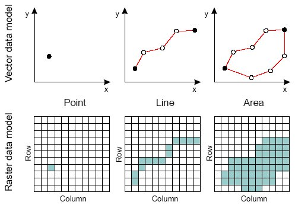
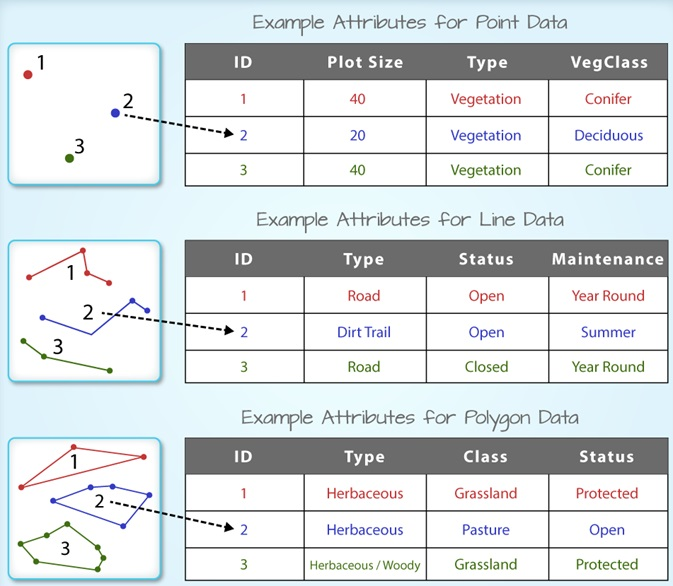
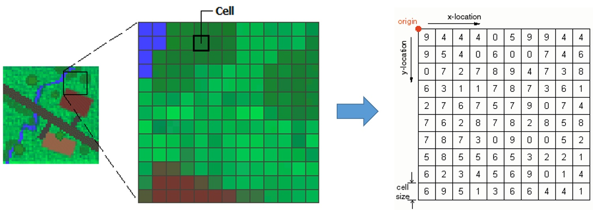
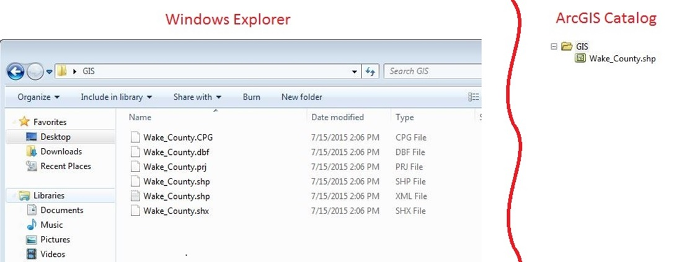

# Spatial Data for Web Mapping

##### Instructor: Yi Qiang <br/>Email: yi.qiang@hawaii.edu <br/>Sept. 27th, 2019
---

## Learning objectives:
- Know the commonly used spatial data formats for web mapping
- Understand the structure of the spatial data formats for web mapping
- Learn to process and convert the spatial data formats


## 1. Discrete Object and Continuous Field
As you have learned in other GIS courses, discrete objects and continuous field are the two fundamental representation of space.

- **Discrete object**: the world is empty, except where it is occupied by objects with well-defined boundaries that are instances of generally recognized categories, for instance, a land parcel, a lake, a park or a building on the Earth surface.
- **Continuous field**: the world is filled values of one or multiple variables (e.g. elevation, temperature, population density). The variable(s) have values at every position.
- Discrete objects are represented in **vector** model, while continuous field is represented in **raster** model.

Lecture slides about the raster (continuous field) and vector (discrete object) data model can be found [here](https://drive.google.com/open?id=1XwgjbnT1BiSErpKvCiw3CBgwNLsbFv7j).



## 2. Vector and Raster Data Structure
### 2.1 Vector Data Structure
Vector data consists of geometries (point, line and polygon) that describe spatial locations and extents of discrete objects and attribute information (e.g. name, feature type, population, income) associated with the objects. In vector data, geometries are all formed by points. For instance, a line is a sequence of points. A polygon is created by a closed ring of points which defines the boundary of the polygon. Attributes are organized in a table format where each columns represent an attribute (also called field) while each row represent the attributes of an object. Attributes are linked with geometries using unique IDs of objects.



### 2.2 Raster Data
Some phenomena (e.g. temperature, elevation and average rainfall) are continuously changing in space and don't have clear boundaries like discrete objects. Raster data try to use a dense grid of cells to represent the values of a spatial phenomenon at 'very' location to imitate the continuous variation. Thus, a raster is essentially a 2D matrix of numbers. Raster data is similar to a digital photo, which almost replicate what you see in a scene. However, when zooming in close enough, you can see the photo is essentially formed by square pixels in different colors. Different from a digital photo, a raster data is georeferenced to a specific area.

Different from vector data where each point has coordinates, only the coordinates in the top-left corner are stored in raster data. The locations of all other pixels can be easily calculated from the top-left corner and cell (pixel) size.


## 3. Vector Data Formats
### 3.1 Shapefile
The shapefile format is a popular geospatial vector data format for geographic information system (GIS) software. It is developed and regulated by Esri as a (mostly) open specification for data interoperability among Esri and other GIS software products. The shapefile format can spatially describe vector features: points, lines, and polygons, representing, for example, water wells, rivers, and lakes. Each item usually has attributes that describe it, such as name or temperature. Shapefile consists of a collection of files with a common filename prefix, stored in the same directory. The three mandatory files have filename extensions .shp, .shx, and .dbf. The [ESRI resource documentation](http://resources.arcgis.com/en/help/main/10.2/index.html#//005600000003000000) describes what information the different files stores. In general, shapefile is more often used by desktop GIS software such as QGIS and ArcGIS Desktop.


### 3.2 KML
Keyhole Markup Language (KML) is an XML notation for expressing geographic annotation and visualization within Internet-based, two-dimensional maps and three-dimensional Earth browsers. KML was developed for use with Google Earth, which was originally named Keyhole Earth Viewer. KML gained widespread use as the simple spatial data format used to place geographic data on top of Google Earth. It is also supported in Google Maps and various non-Google products. Now, KML becomes an international standard maintained by the Open Geospatial Consortium, Inc. (OGC).

KML is a form of XML, wherein data is maintained in a series of structured tags. The syntax of KML is similar to HTML where different elements are marked with specific tags, and the elements fall into a hierachical structure. For instance, the following KML code describe the point location of New York City. Please pay attention to the hierachical structure of data in the KML file. A placemarker element includes elements of its name, description and point (including a coordinate element).

```
<?xml version="1.0" encoding="UTF-8"?>
<kml xmlns="http://www.opengis.net/kml/2.2">
<Document>
<Placemark>
  <name>New York City</name>
  <description>New York City</description>
  <Point>
    <coordinates>-74.006393,40.714172,0</coordinates>
  </Point>
</Placemark>
</Document>
</kml>
```

You can copy and paste the above code into the [kml-display website](https://display-kml.appspot.com).

> Question: how the KML file will look like if KML file include another placemarker of Los Angeles?

Copy and paste the following code to [kml-display website](https://display-kml.appspot.com) and see what it is.
```
<?xml version="1.0" encoding="UTF-8"?>
<kml xmlns="http://www.opengis.net/kml/2.2">
  <Placemark>
    <name>The Pentagon</name>
    <Polygon>
      <extrude>1</extrude>
      <altitudeMode>relativeToGround</altitudeMode>
      <outerBoundaryIs>
        <LinearRing>
          <coordinates>
            -77.05788457660967,38.87253259892824,100
            -77.05465973756702,38.87291016281703,100
            -77.05315536854791,38.87053267794386,100
            -77.05552622493516,38.868757801256,100
            -77.05844056290393,38.86996206506943,100
            -77.05788457660967,38.87253259892824,100
          </coordinates>
        </LinearRing>
      </outerBoundaryIs>
      <innerBoundaryIs>
        <LinearRing>
          <coordinates>
            -77.05668055019126,38.87154239798456,100
            -77.05542625960818,38.87167890344077,100
            -77.05485125901024,38.87076535397792,100
            -77.05577677433152,38.87008686581446,100
            -77.05691162017543,38.87054446963351,100
            -77.05668055019126,38.87154239798456,100
          </coordinates>
        </LinearRing>
      </innerBoundaryIs>
    </Polygon>
  </Placemark>
</kml>
```

You can delete the `outerBoundaryIs` element and see how it looks.

### 3.3 GML
 Similar to KML, **Geography Markup Language (GML)** is a markup language to encode geographic content for any application. In general, GML has capacities to describe more aspects of geographic data than KML. GML and KML can be converted using software tools. However, due to the difference between the two format, a conversion between the two data types may lead to an information loss.

### 3.4 GeoJSON
 When exchanging data between a browser and a server, the data can only be text. JSON is such kind of text data that can be easily transferred between server and clients' browser. JSON is easily-readable for human users and can be converted to JavaScript objects. GeoJSON is based on JavaScript Object Notation (JSON) and can store various vector objects (e.g. Point, LineString, Polygon, MultiPoint, MultiLineString, and MultiPolygon) with attributes. Due to its text format, light weight and simple structure, GeoJSON becomes popular for spatial data exchange and visualization in front-end applications. GeoJSON can be easily converted from shapefile format.

 Similar to the markup languages (e.g. HTML and KML), GeoJSON (also JSON) is based on a hierarchical structure where an ancestor object has several descendant objects. The following notation syntax is applied in a GeoJSON file:
 - Objects are organized in key:value pairs
 - Key (name) can only be strings, while value can be number, string, Boolean, date, time or arrays.
 - Key:value pairs and objects are separated by commas
 - Curly braces hold objects
 - Square brackets hold arrays
 - Hierachical levels are formatted in levels of parentheses, e.g. a descendant object is enclosed in the curly braces of an ancestor object.


 The following code is a simple GeoJSON file.
 ```
 {
  "type": "Feature",
  "geometry": {
    "type": "Point",
    "coordinates": [125.6, 10.1]
  },
  "properties": {
    "name": "Dinagat Islands"
  }
}
 ```
You can copy and paste the code above to http://geojson.io/.

In the following GeoJSON file, the top ancestor is a FeatureCollection, which include several feature as descendants. Each feature include descendant objects including type, geometry and property. Each geometry element has type and coordinate elements.

 ```
 {
   "type": "FeatureCollection",
   "features": [
     {
       "type": "Feature",
       "geometry": {
         "type": "Point",
         "coordinates": [102.0, 0.5]
       },
       "properties": {
         "prop0": "value0"
       }
     },
     {
       "type": "Feature",
       "geometry": {
         "type": "LineString",
         "coordinates": [
           [102.0, 0.0], [103.0, 1.0], [104.0, 0.0], [105.0, 1.0]
         ]
       },
       "properties": {
         "prop0": "value0",
         "prop1": 0.0
       }
     },
     {
       "type": "Feature",
       "geometry": {
         "type": "Polygon",
         "coordinates": [
           [
             [100.0, 0.0], [101.0, 0.0], [101.0, 1.0],
             [100.0, 1.0], [100.0, 0.0]
           ]
         ]
       },
       "properties": {
         "prop0": "value0",
         "prop1": { "this": "that" }
       }
     }
   ]
 }
 ```

### 3.5 Other Formats
 Other than the above mentioned formats, spatial data can be stored in other format such as .gpx (popular format for GPS tracks) and various types of .csv (comma-separated value files often used with Microsoft Excel) that include longitude (X) and latitude (Y) columns. You can engineer your web map to parse and read these files, or you may want to use your scripting skills to get the data into another standard format before deploying it in your web map. This is where Python skills and helper libraries can be handy.

### 3.6 Web Map services
When a web map is displayed in a browser, the geospatial data in the map are transferred from the server to the client's browser. The the data size is large, the transfer may take long time (e.g. a few minutes), which affect user experience. Web Mapping Service (WMS) is a protocol for the transfer of geospatial data from servers to client applications. WMS gives clients access to an image of data (or part of the data) instead of transferring the whole dataset to the client storing. Due to its efficiency, WMS is often used to server large spatial datasets (both vector and raster).

### 3.7 Spatial Database
Spatial database is a database management system for spatial data. Spatial database is especially useful when the data structure is complex and the datasets are interrelated. Some web map services support dynamic access to a spatial database in the back-end of the server. The browser can access the database using Structured Query Language (SQL) languages embeded in JavaScript in HTML documents. Working with spatial database is about back-end development, which will not be taught in this class.


An example of spatial data in csv format.

## 4. Raster Data Formats
Raster data have similar structure as digital images, but are georeferenced. Common raster data formats include JPEG, PNG, TIFF, BMP, and others. The GIF format previously used a patented compression format, but those patents have expired. Other than raster data, you can find regular digital pictures stored in these formats. The difference is that raster data are georeferenced, meaning that every pixel correspond to a square area on the ground. Thus, in addition to the 2D matrix of pixels, raster data also stores spatial information (e.g. the origin coordinates, cell size, coordinate system, number of columns and rows).

### Raster Data for Web mapping
Due to the larger  size of raster data, rendering and visualizing raster data in web maps are more challenging than vector data. High-resolution raster data (e.g. remote sensing images, digital elevation models) can easily occupy a few gigabyte or terabyte storage in a computer. It can be difficult to transfer such large data over the internet and plot in  clients' browsers. For fast delivery and processing, raster data are usually published in WMS which break raster data into **tiles**. When users open the web map, only some tiles are transferred and displayed in the client's browser. For instance, when you open Google Maps with a focus on the Hawaiian Islands, only the tiles of the viewing area are displayed in your browser. When you move the map window to other regions or zoom out, other tiles will be loaded. This is why the global images in Google Maps can be opened so quickly in your browser - the server only delivers what you are viewing. Not only raster, large vector data can also be stored in tiles.

Various raster format can be found [here](https://pro.arcgis.com/en/pro-app/help/data/imagery/supported-raster-dataset-file-formats.htm).

## 5. Data Conversion
The various geospatial data formats can be converted from one to another in GIS. For instance, shapefile and GeoJSON, both are vector data, can be easily converted between each other. The raster data formats also can be converted among each other. Conversions between raster and vector data are a bit more sophisticated, but can still be done using spatial analysis tools in GIS. [Click](https://gisgeography.com/rasterization-vectorization/) to learn more about the conversion between raster and vector.

## Assignment - Exploring and Converting GIS Data using QGIS
Following the [instruction in Laulima](https://laulima.hawaii.edu/access/content/attachment/MAN.87920.202010/Assignments/fd4c2b41-1e2a-411d-b44c-c98f93b6cb0c/lab3_instruction.pdf) to finish the assignment. Submission is due on Sunday Oct 6th 11:55pm.
