# Getting Started with Web Mapping

##### Instructor: Yi Qiang <br/>Email: yi.qiang@hawaii.edu <br/>Oct. 4th, 2019
---
This class will introduce how to LeafLet, the most popular web mapping library, to create a web map with GeoJSON data.

## Learning objectives:
- Learn to set up the environment for web map development
- Learn to plot GeoJSON data in a web map
- Using leaflet to create the first web map

The example map in this lecture is modified from the [web mapping short course](https://github.com/rgdonohue/web-mapping-short-course) by Rich Donohue.

## 1. Setting up the development environment
To begin, download the template file (index.html) from [here](https://drive.google.com/file/d/1JBCFZWaTm1GRBimUcLQ5RHXMFm3LVz_4/view?usp=sharing) and save it in a folder in your computer.

You need a Python distribution installed in your computer for this lesson. You can search 'Python' in the start menu to check if your computer has Python. If not, please install Python 3.7 (64-bit) from [this website](https://docs.conda.io/en/latest/miniconda.html).

### Setting up a local server
Although you can directly open index.html in a browser (e.g. Chrome), you need a local server to test what a webpage will look like exactly when it is uploaded in a webserver. This is because a HTML document often includes other languages (e.g. Javascript, PHP, ASP) which are supposed to be processed on the server before being sent to the browser. However, it will be tedious if you uploading the webpage to the real web server (e.g. the UH server) every time you make changes on it. A workaround is that you set up a local web server in your computer and do the testing until it is ready to see the world.

When using a local server to render the website, the web server and client browser are in the same computer. The data transfer is not through the internet but from one folder to another in the same computer. This is to imitate a network environment in a local computer for easy development and testing. For real web applications, the server and clients are typically in different computers, and the data transfer through the internet.

There are many software packages that you can use to deploy a local server in your computer:

1. [Python's SimpleHTTPServer](http://www.pythonforbeginners.com/modules-in-python/how-to-use-simplehttpserver/) module (used in this class)
2. Built-in web servers in the OS such as Internet Information Services (IIS) for Windows or Apache for Mac or Linux.
3. 3rd party web server software: Ngix, Apache Tomcat, Oracle HTTP Server...

Next, we are going to launch a local server using Python's SimpleHTTPServer module.

Open an Python Prompt (or Anaconda Prompt) in your computer. Type `cd "PATH-TO-THE-FOLDER"` in the prompt. To do this, you can navigate to the folder, copy the path from the address bar, paste the paste in the prompt, and click enter. You have navigated to the folder in the prompt.

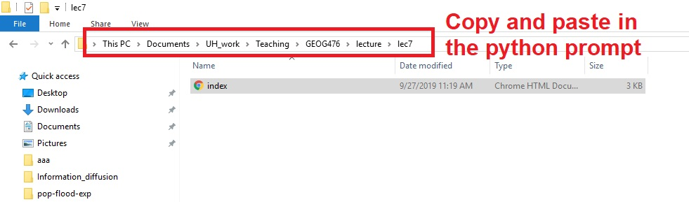

> Note: "ctrl+c" doesn't work in a prompt in Windows. You can write click in the prompt to paste the path.

. Then, launch a http server:
- If your Python version is 3.X, type and run `python3 -m http.server`.  On windows try "python" instead of "python3"
- If your Python version is 2.X, type `python -m SimpleHTTPServer`.
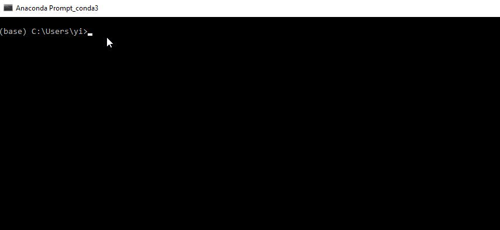

> Note: when the HTTP server is launched in a folder, that folder will become the root directory of the local server.

Leave the Anaconda prompt open (if closed, the server stops). Open a new tab in Chrome and type localhost:8000 or 127.0.0.0:8000. Now, you'll see the template website (index.html) is displayed in the browser which is rendered from the local server.

## 2. Developer tools in Chrome
Modern web browsers come installed with web developer tools. These tools come loaded with functionalities allowing you to investigate how a web page or application is structured and performing within your browser. Read more about using the [Chrome DevTools](https://developer.chrome.com/devtools), and as always look for the shortcuts to open and close the toolbar in your browser (Cmd + i in Mac OS).

In the tab with the website open, go to the **Elements** tab of the Developer tool to view the content of the HTML file as it is rendered within the browser. While this will largely mirror the HTML document itself, the rendered DOM will also contain elements dynamically produced with JavaScript when the page loads.

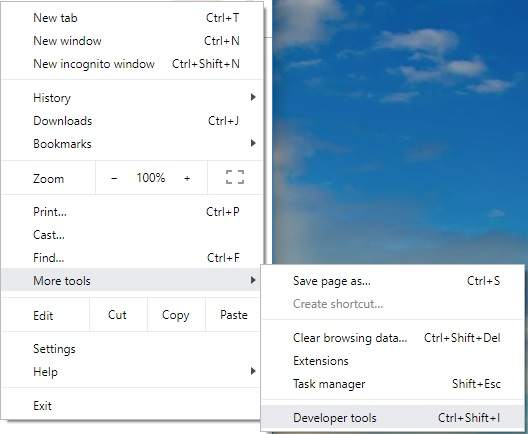

You can move your mouse cursor over different elements in the HTML file and see the corresponding graphic elements in the browser.


You can also click the right-pointing triangular arrows to toggle descendant elements within an element.


You can even double click on an element to edit it.

Double-click on `<h1>This is my first map</h1>` in the HTML. Change the title of the page to 'My first Leaflet map'.

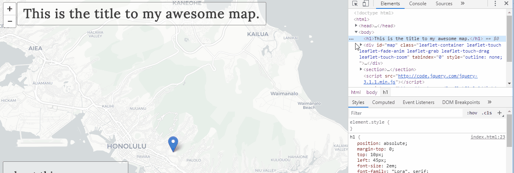

If you don't like to use alert to print variables in a popup window (you need to click to close), you can also use the Console to print variables. For instance, add the following line under the declaration of the `options` object:

```
console.log(options["zoom"]);
```
Refresh chrome (). You'll see 12 printed in the console. This is the value of `zoom` property of the `options` object.

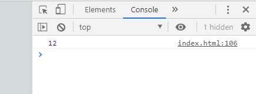


#### Reload and hard refresh a browser:
- **Reload (soft refresh)**: Whenever you visit a particular web page, your web browser is designed to automatically store a lot of that page's information on your computer's hard drive in a place called the cache. When you hit reload , the browser will re-use the cache downloaded previously instead of downloading everything again from the server.
  - Reload shortcut in Windows `ctrl+R` and in MacOS `cmd+R`.


- **Hard refresh**: Cache can increase the loading speed for web users. Because of Cache, the browser may not update everything in the webpage when new edits are made. To show the updated webpage, you would have to do a hard refresh to reload 100% webpage over from the server.
  - Shortcut of hard refresh in Windows `ctrl+F5` and in MacOS `cmd+F5`.


You can also use the console to find errors in your code. For instance, delete the  `}` at the end of the `options` declaration. Refresh chrome and check the message in Console.

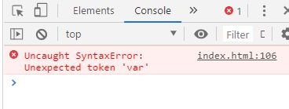

Undo the deletion before proceed

Although you can edit html webpages in the developer tools in Chrome, most developers still use text editors such as Atom to do the major part of development. The developer tools in Chrome are primarily used for debugging and minor editing.


## 3. Editing HTML
The HTML file (index.html) include the content of the webpage displayed in the browser. As you learned in previous classes, a HTML file can include HTML, CSS and Javascript.

Open index.html in Atom and review the structure of the content. Try to find the codes that belong to the three languages:

#### HTML (webpage structure)
```
Which part is HTML?
```

#### CSS (format)
```
Which part is CSS?
```

#### JavaScript (behavior)
```
Which part is JavaSript?
```
Let's quickly review what the JavaScript above is doing:

- The first statement create an `options` object with `center` and `zoom` properties. The coordinates (lat,lon) of the center is physical science building.
- The second statement create a Leaflet `map` object which uses the created `options` object as properties. The map object is inserted into a DOM element with the id value of map (i.e., our `<div id='map'></div>`) within the HTML.
- The next statement assigning a value to the variable tiles is a fun one. Leaflet uses this one to request a set of basemap tiles from a web map service. There are lots of such basemap services, and you can have fun swapping them out for one another until you find one appropriate for your map. Check out [the options](https://leaflet-extras.github.io/leaflet-providers/preview/) at Leaflet Providers.
- The final two statements assign a string value 'Physical Science Building' to the variable message and uses the Leaflet `L.Marker` class to place a marker at the center of the map, as well as the Leaflet `L.Tooltip` class to display our message on top of the map layers.

The [Leaflet API Reference](https://leafletjs.com/reference-1.5.0.html) is your source to learn more about how the Leaflet JavaScript operates.

#### Moving CSS to an external file
Having all the three types of code can make the HTML file look lengthy. We can move the CSS code to an external file so the HTML file only includes HTML and JavaScript code, this is what web developer usually do.

- Open a new empty file in atom.
- Cut the CSS codes between the `<style>` tags and paste them in the new file.
- Save the the new file as "style.css" in the same folder of the HTML file.

At this step, if you refresh Chrome, you'll see the webpage becomes blank as it lost its styles. Next, we will insert the CSS style from _style.css_.
- Add the following line in the head of the HTML file (between the `head` tags).
```
<link rel="stylesheet" href="style.css">
```
## Lab Exercise: mapping your route from home to campus

In this exercise, you are going to create a Leaflet map of your route from your home to your base building in the campus. The map will show the origin and destination of your daily commuting as well as the route between them. You can add a couple of places of interest along the way, for instance a cafeteria or your place of work on the way to class.

We want to capture this geography, convert it to an appropriate data format, and display it on a web and mobile-friendly map. Additionally, we will allow the user to retrieve specific information about these places through interacting with the map (in this case, hovering over the map or touching on a marker).

To begin, make a copy of the leaflet-map-template/ directory and rename it to app/, within the module-01/ directory.

### Step 1: Data aquisition and conversion
In this step, you will find the locations of your home and a UH building you usually visit. Next, you need to create the route from your home to the UH location and convert it into GeoJSON format for web mapping. Finally, you plot the route in a Leaflet map. You would also need to choose the mode of commuting, whether you walk, drive, ride a bike...

> Note: if you don't want expose the exact locations of your home and office, you can pick false locations.

There are many useful (and free) tools that can help us to get locations and routes. Google map is one of them.

First, find your primary campus location in Google Maps. I would use Physical Science Building as an example. You are free to choose other buildings. Right click on the location and click **Direction to here**.

Then, find your home location in Google Maps. You can also use the search box if you know the address. Right-click on your home location and click **Direction from here**. You should also choose a mode of travelling. For instance, I choose the 1st (fastest) route by bicycle.

You will see your route from home to campus calculated by Google Maps.
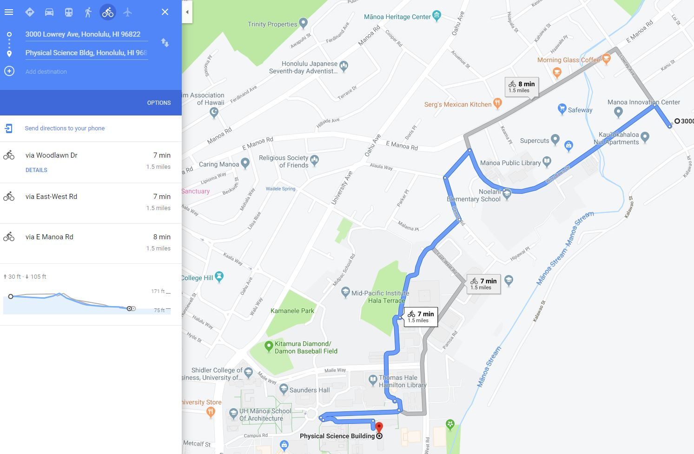

When you have selected your desired route on the map, it'll become blue. Open a new tab in your browser and go to the website [Maps to GPX](https://mapstogpx.com/). Copy the entire URL from the address bar in the Google map tab. Paste the URL into the form and hit "Let's Go." The website will convert the route into a GPX file (a common data format generated from GPS trackers) for you to download. Please save the converted GPX file in the folder of index.html. You can open and view the downloaded GPX file in Atom.
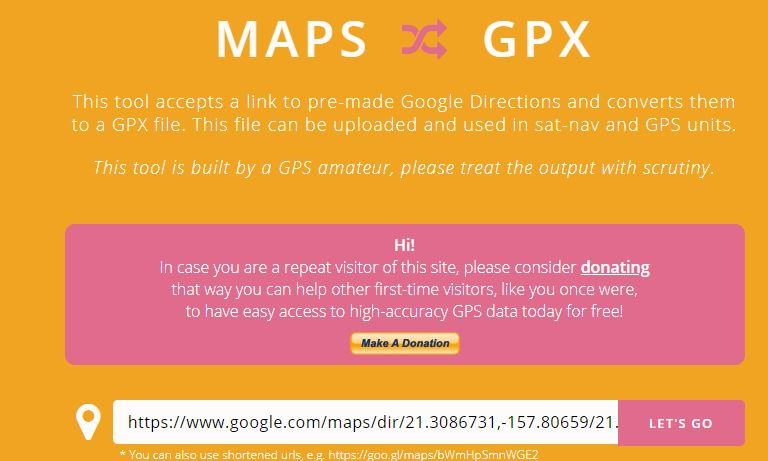

> **GPX (the GPS Exchange Format)** is a text-based format derived from XML and often used to encode GPS data. You can open this file in your text editor to examine the contents. If you use the popular Strava service, you can download all your routes in GPX format.

Next, we convert the GPX file into GeoJSON for web mapping. If the file is large, you are recommended to do it in QGIS like you did in the previous lab. But this time, we use [geojson.io](geojson.io) for the conversion as the data is pretty small and simple. You'll want to bookmark this website, as it's a very useful online tool.

Click OPEN -> FILE in the website. Find the GPX file in your computer and load it.

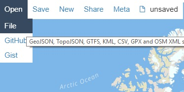

Observe the GeoJSON code generated in the right-hand panel. Unlike Shapefiles, GeoJSON can encode different geometry types (point, line and polygon) within a single Feature Collection. Note that Features have both properties and geometry attributes. The "LineString" type contains all the points that make up the route, while the two "Point" type Features encode the endpoints of the route.

The route data retained from Google Maps contains some information that we don't need. We can remove these data by editing the code in the right panel in the webpage.

Please rename the route to 'Home to School'.
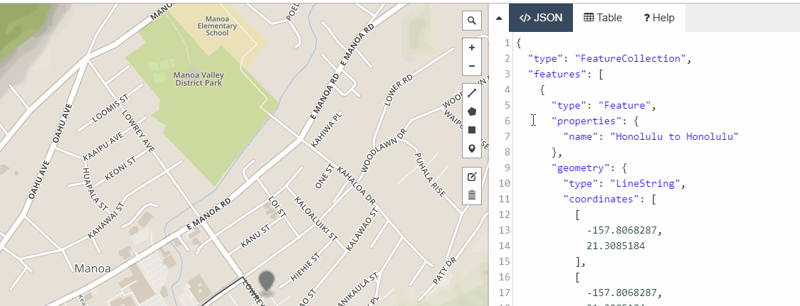

Scroll to the bottom of the code. Rename your home and campus location. For instance, I change them to "Physical Science Building" and "3030 Lowrey Ave..."

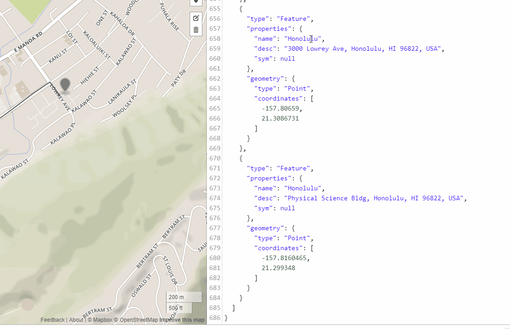

In addition to of the route between my home and PSB, I would also like to add another location in-between.

In addition to your home location and school location, you can add the third location in-between, which can be your favorite coffee shop or secondary office location. You can place a point of interest using the drawing tool in the website. Click the point added. Add an _name_ attribute (just like the other points) to the point, and give a string value (e.g. 'Saunders Hall' for me) to the attribute. In the right panel, you can see the corresponding GeoJSON code of this new feature is added.


Now click SAVE->GeoJSON to save the code in a GeoJSON file (_route.geojson_) in the your working folder (where index.html is).

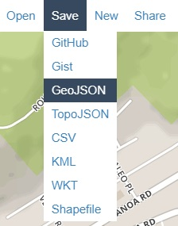

Now, you have the right format of geospatial data for creating a Leaflet map.

### Step 2: Loading external data into a web document
First, rename the saved map.geojson file to route.js. Then open the route.js file in Atom and assign the entire GeoJSON structure to a variable named data (add `var data = ` in the very beginning of the code):
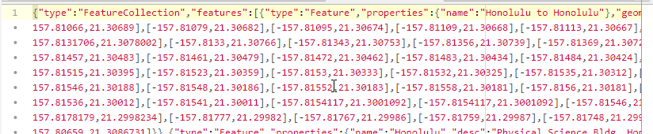

Save those changes in route.js. GeoJSON essentially encodes JavaScript objects. Here we've simply assigned the GeoJSON objects to a JavaScript variable _data_, which will be available for us within the HTML document.

The HTML code is remotely loading the jQuery and Leaflet Jabascript files before our custom code executes. Let's load this JavaScript file (route.js) into the document. As the file is in the same folder as the _index.html_ document, the relative path to the file is "route.js". Note, if the route.js is stored in a sub-folder (e.g. data), the relative path will become "data/route.js"

Add the line `<script src="route.js"></script>` under the code that load jQuery and Leaflet.
```
<script src="http://code.jquery.com/jquery-3.1.1.min.js"></script>
<script src="https://unpkg.com/leaflet@1.0.1/dist/leaflet.js"></script>

<script src="route.js"></script> // OUR DATA LOADED HERE!

<script>

    var options = {
        center: [40.00816, -105.27423],
        zoom: 12
    }
```

You can verify that the data is loaded and you have access to the JavaScript object we created. To do this, you can print the content of _data_ in the console.

```
<script>
var options = {
    center: [40.00816, -105.27423],
    zoom: 12
}

console.log(data); // output will be our GeoJSON object
```


This step saved our GeoJSON file within a JavaScript file, assigned it to a variable, and modified the HTML to load the file on page load.

Now it's time to draw it to our map!

### Step 3: Drawing GeoJSON to the map.
In the previous step, we linked the GeoJSON data to the HTML document. Now, we are ready to create a web map in the HTML document and plot the linked data.

We can plot GeoJSON data in a Leaflet map using the `L.GeoJSON` method.

First, comment out the following codes in index.html.

```
// var message = 'Physical Science Building';
// L.marker(map.getCenter())
// 	.bindTooltip(message)
// 	.addTo(map)
// 	.openTooltip();
```

> Tip: You can comment multiple lines of code at once by pressing `ctrl + /` in windows or `cmd + /` in mac. You can always comment out codes that you don't need for now but still want to keep for later use.


Next, write or paste the following statements below the commented code:

```
var myRoute = L.geoJson(data).addTo(map);
map.fitBounds(myRoute.getBounds());
```

Save your file and refresh the browser. Then, you can see that Leaflet has drawn your route to the map. As always, keep your developer tools open and check for any JavaScript errors in the Console. You may need to re-adjust the pan and zoom level to see the extent of your data.

### Step 4: Add Popups to show feature Information
Now, the map only shows geographic features (origin, destination and route). It'll be interesting to display more information in an interactive way. Interactivity is the most important advantage of web map over traditional static map. In this step, we will add popups to the features.

Add an `onEachFeature` option in the `L.geoJson` function as the following:
```
var myRoute = L.geoJson(data,{
  onEachFeature: function(feature, layer) {
    layer.bindPopup(feature.properties.name);
}
}).addTo(map);
```

Refresh chrome. Click on the map features and a popup will appear to show the feature name.

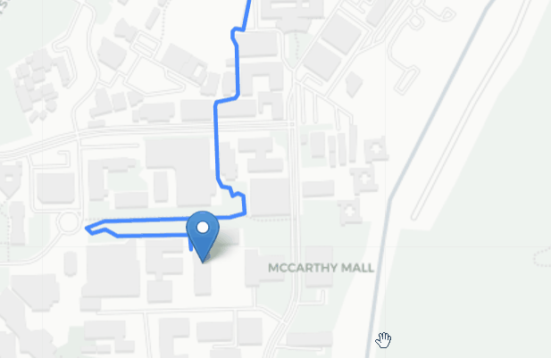

You can show multiple attributes of the features in the popups. Further modify the function:

```
var myRoute = L.geoJson(data,{
  onEachFeature: function(feature, layer) {
    //layer.bindPopup(feature.properties.name);
    layer.bindPopup('<p>Name: '+feature.properties.name+'</p><p>Address: '+feature.properties.desc+'</p>');
}
}).addTo(map);
```

Refresh Chrome. Click on the features to check the changes of the popups. The above code actually combines HTML code with values (e.g. `'<p>Name: '`) returned from JavaScript code (e.g.`feature.properties.name`).

## Summary
In this lab, we have created a simple Leaflet map to display our commuting route stored as GeoJSON data. The map is deployed in a local server in our own computer. Most web developing work is done in such a way in a local computer. When the website is finished and tested, it can be moved to a remote server for More users to access, which we will learn in our future classes.

# Assignment
1. Edit the HTML file to make the following changes to the website:
  - Replace the text in the box of 'about this map' to an appropriate description about this map.
  - Add a third point (e.g. your favorite coffee shop, bus stop...) to the map (which was missed in the class). **This is to replace the task of changing color**
  - Modify the following part in index.html to change the basemap. You can choose a basemap from [here](https://leaflet-extras.github.io/leaflet-providers/preview/).

>  Tip: you can copy a part of the plain JavaScript code of a basemap to replace a part of the following code in index.html.

```
var tiles = L.tileLayer('http://{s}.basemaps.cartocdn.com/light_all/{z}/{x}/{y}.png', {
  attribution: '&copy; <a href="http://www.openstreetmap.org/copyright">OpenStreetMap</a> &copy; <a href="http://cartodb.com/attributions">CartoDB</a>',
  subdomains: 'abcd',
  maxZoom: 19
}).addTo(map);

```

# Submission

Upload the modified website to your UH web server. Submit an URL that I can access to the web map in Laulima by **Friday Oct. 11th, 11:55pm**.
