# Thematic Map for Point Features

##### Instructor: Yi Qiang <br/>Email: yi.qiang@hawaii.edu <br/>Oct. 11th, 2019
---
This class will introduce how to LeafLet to create thematic maps with point features. This lecture is modified from the [web mapping short course](https://github.com/rgdonohue/web-mapping-short-course) by Rich Donohue.

Thematic maps often use symbols in proportional sizes to display the spatial variation of a variable (theme). Proportional symbol maps are also good at showing relative magnitudes (e.g. earthquake magnitudes). Although we can use various symbols, circles are the most common as their sizes are easy to compare.

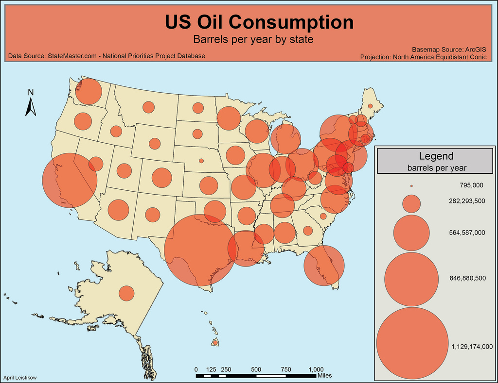

An example of thematic map using proportional symbols.

## Learning objectives:
- Learn to convert geospatial data from spreadsheet to GeoJSON
- Learn to use proportional symbols to display numerical attributes.
- Learn to add mouse-over events in map.

To begin, download the files (index.html and flight.xls) in the [course folder](https://drive.google.com/open?id=1tGZPbib8sp4AntD_y4VqsWSvwitmne36) to your computer.


## Step 1. Data wrangling and conversion

First, let's get the data and process it for web mapping. Geospatial data can be stored in various formats (e.g. shapefile, csv, xlsx). Converting the data into an appropriate format (GeoJSON, KML) for web mapping is usually the first step.

### 1.1 Getting the data
Open flight.xls using Microsoft Excel or OpenOffice (in MacOS). This file was downloaded from the EPA's [Facility Level Information on GreenHouse Gasses Tool (FLIGHT)](https://ghgdata.epa.gov/ghgp/main.do), which includes Greenhouse Gas Reporting Program (GHGRP) facilities by location, name, industry type and other criteria. You can actually go to the [EPA website](https://ghgdata.epa.gov/ghgp/main.do) to download the data by yourself. I provide you the downloaded data for this lesson because the FLIGHT website was down at the time when this lesson was created.

Take a look at the Excel file and try to tell which columns contain the spatial features and which are attributes that can be used as a theme for the proportional symbols.

### 1.2 Cleaning the data and convert to csv
As the Excel format (.xls) is a Microsoft data format, which is cannot be read by many other platforms. Thus, we need to convert it into the comma-separated values (CSV) format, which is more widely used for the open-source software.

There are some rows and columns in the spreadsheet that we don't need. This is to make the data in a standard format that can be converted into GeoJSON at the next step and also for efficiency. Remember that when serving maps over the web we want to keep file sizes as small as we can. This will increase the efficiency of your web application (your webpages will load in browser more quickly).

Delete the metadata in the first 5 rows so that the column headers are in the first row.

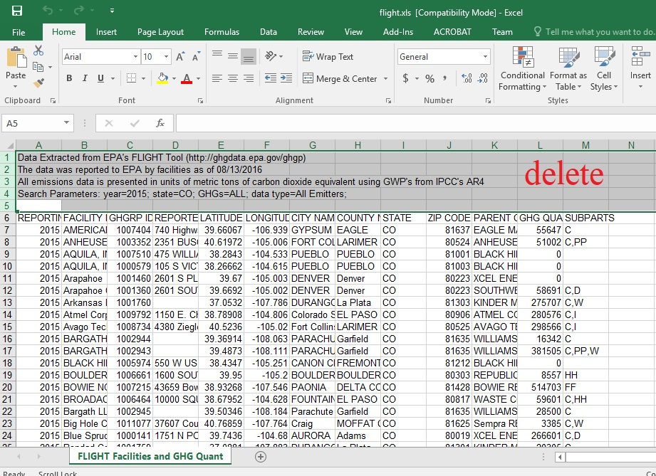

Delete the columns "REPORTING YEAR", "PARENT COMPANIES", and "SUBPARTS", which are not used for mapping in this lesson.

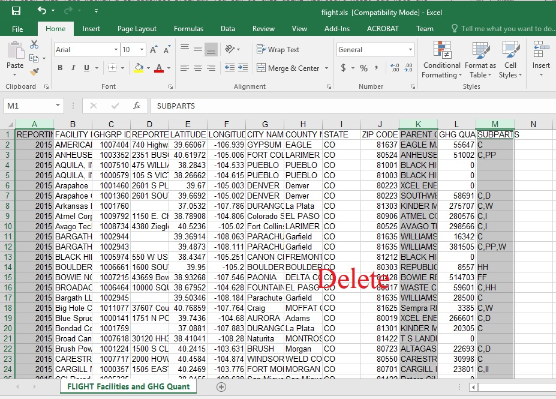

Next, we want to further prepare the data for use within a scripting environment. **Spaces can be problematic in the names of files, directories, and data attributes. DON'T USE SPACES!!!** I had to yell that one because it is important and perpetually violated.

Let's run through the column headings (i.e., our data attributes) and edit them to remove spaces and make them more useful for our script later on.

Make the following changes:

* Change "FACILITY NAME" to "FACILITY"
* Change "GHGRP ID" to "GHGRP_ID" (note how I use an underscore here)
* Change "REPORTED ADDRESS" to "ADDRESS"
* Change "CITY NAME" to "CITY"
* Change "COUNTY NAME NAME" to "COUNTY"
* Change "ZIP CODE" to "ZIP"
* Change "GHG QUANTITY (METRIC TONS CO2e)" to "GHG_QUANTITY"
*
The table should look like:


Next, we save this table in a CSV format. While this should be a simple "Save As .." we need to be careful with this step. Different programs use different character encodings to save a CSV file, as well as different line break characters. This can cause problems later on when we load and parse the data using JavaScript in the browser. The saving process is different depending on what software you use.

#### For Excel (Windows) users
If you use MS Excel, you can go the File -> Save As. Navigate to the data folder of index.html, save it as in the CSV type. You can name the file **ghg-hi-2018.csv**. In the _Save As_ dialog, you need to go to Tools ->  Web Options -> Encoding, and save this document as Unicode (UTF-8). Rename the file to something useful like **ghg-hi-2018.csv** and save it in the same folder of index.html.

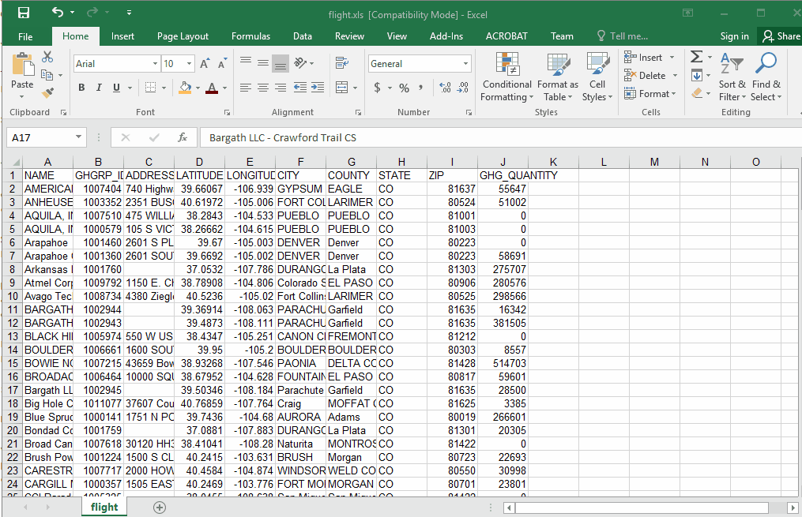


**Note: DO NOT follow the gif to type 'ghg-co-2015' as we are working with 2018 Hawaiian data (type 'ghg-hi-2018' instead).**

#### For OpenOffice (MacOS) users
If you use OpenOffice, please go to **File -> Save As ...**. Choose the File type to be "Text CSV (.csv).


Important: ensure that the _Character set_ is _Unicode (UTF-8)_, the field delimiter is a comma and that you've checked the box to "Quote all text cell"


### 1.3 Converting CSV to GeoJson
There are many ways to convert CSV to GeoJSON. For instance, you could use QGIS or ArcGIS. As the data size is small and the data structure is simple, we use [geojson.io](http://geojson.io/) for the conversion, which is convenient.

In the website, go to Open -> File, and navigate to the folder and open ghg-hi-2018.csv. You'll see GeoJSON code displayed in the _JSON_ panel to the right. You can click _Table_ to see how the data is organized in a table.

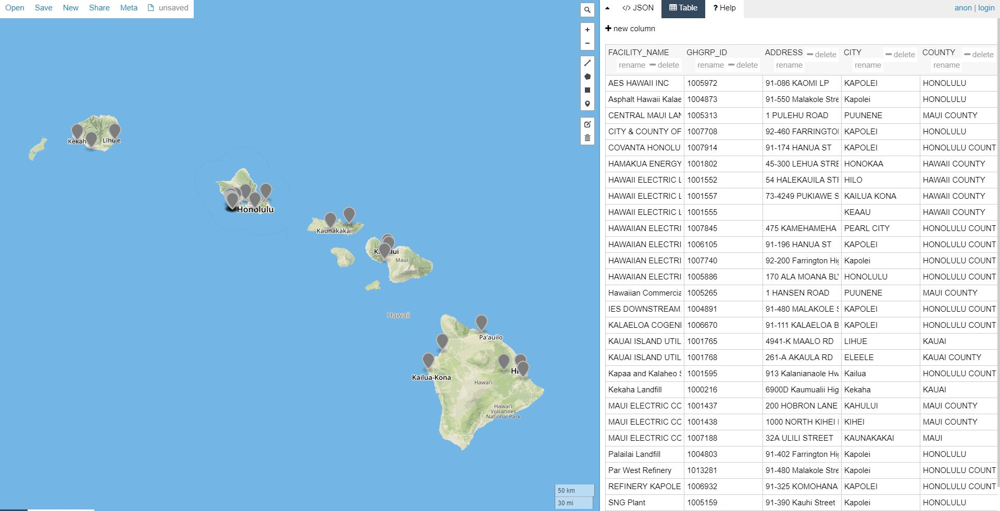

In the website, save it as a GeoJSON file. The file will automatically downloaded to your computer. Copy the downloaded file to the folder of index.html and rename it from map.geojson to **ghg-hi-2018.json**. (Note: although the content is same, you always need to change the suffix of GeoJSON files to .json as JavaScript can't recognize .geojson files.)

## Step 02: Loading data into the script

Open index.html in Atom and load the page in your browser using a local server. If you don't remember how to launch a local server, please review [lecture 7](https://github.com/qiang-yi/GEOG476/blob/master/lecture/lec7_start_web_mapping.md). Note, you would need to navigate (use `cd` command followed by the path) to the folder of index.html before launching the server so the server will use the folder as the root directory.

Type `http://localhost:8000/` in the address bar in Chrome. We can see that a basic Leaflet map template has loaded within the page (using CARTO's light basemap tiles).

### 2.1 Make the code look better
Take a look at the HTML code in Atom. Try to understand the different parts of the code. For instance, where is HTML, CSS and JavaScript? You may find the CSS code is a bit lengthy which makes it difficult to navigate in the code to find the part that you want to edit. There are some ways to make the document look more succinct.

As we learned in previous lectures, CSS can be stored in an external file and linked to the HTML file. Now let's move the CSS part to an external file.

Open a new empty file in Atom. **Cut (not copy)** the following part (CSS code) in the HTML file, and paste it in the new file. Name the new file "mystyle.css" and save it to the same folder of index.html
```ruby

body {
    margin: 0;
    padding: 0;
    background: "whitesmoke";
    font-family: "Noto Sans", sans-serif;
    color: #3d3d3d;
}

# ... ommitted lines in-between ...

#legend hr.small, #legend hr.large {
    width: 83px;
    position: absolute;
    top: -8px;
    left: 66px;
}
```
Next, add the following line below the `style` tags. We still keep the two `style` tags just in case we want to add CSS styles specifically for this page at a later time.

```ruby

<style>
</style>

<link rel="stylesheet" href="mystyle.css">

</head>
```
#### Toggle to hide/expand code
Long HTML can be difficult for developers to navigate to the different parts. To make the code display cleaner, you can click on the right-pointing arrows next to the line numbers (on the left edge of the code window) to hide and expand parts of the code. For example, you can hide the `<head>` part as we are not editing it at this moment.
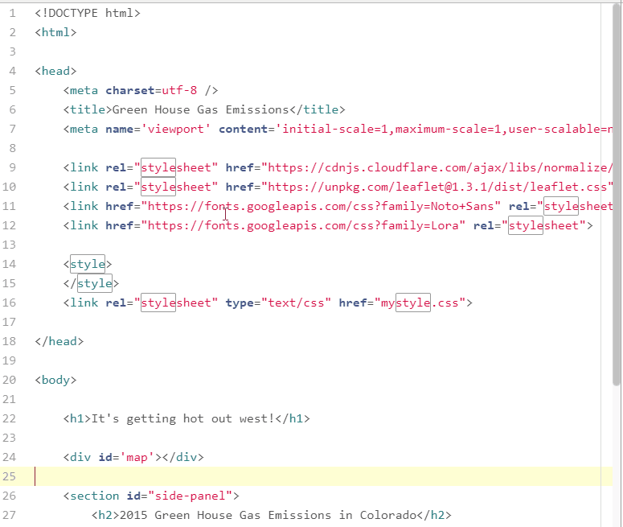

### 2.2 Adding GeoJSON data to the map
With the developer tools open, we see there is also a 404 (Not Found) error generated within the script. From the error message, you can generally tell that the error is related to 'YOURDATA' and data is not found.

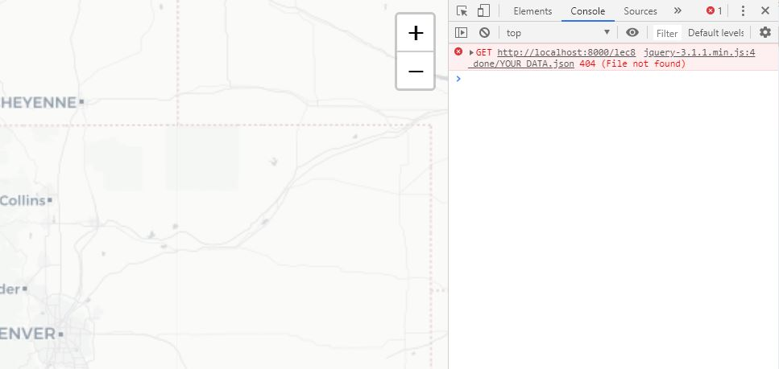

Tip: Instead of clicking with the mouse, you can use the short cut `ctr+shft+I` to open and close the developer tool panel.

Check the code in Atom. You can see there is no code that link the GeoJSON file (ghg-hi-2018.json) to the file. You can link the data to the document by replacing 'YOURDATA' into the path of the GeoJSON file, which is 'ghg-hi-2018.json'.

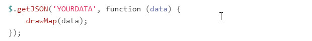

Refresh your browser and you'll see the data points are displayed in the map. Review the javascript code in the HTML document. You can see the GeoJSON data are loaded to the webpage in a different way compared to the previous lecture where we had to add `var data = ` in the GeoJSON file. `getJSON` is actually a jQuery function that send JSON data to the server. The `$` actually a shortcut for "jQuery" (you can replace the `$` with `JQuery`). This statement loads the ghg-co-2005.json and input loaded json data into a function (i.e. `drawMap`).

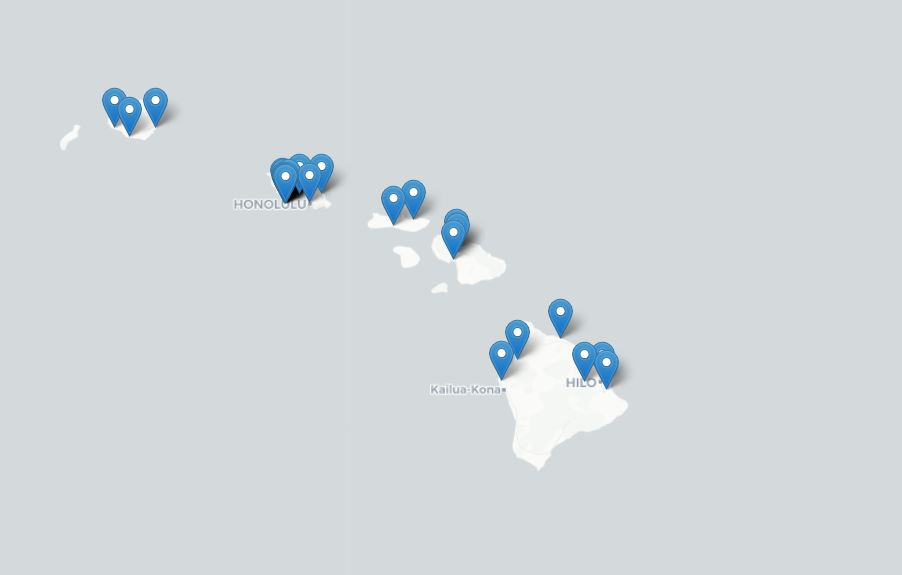

These points only show the locations of the facilities. The map will be more informative if it can also express the quantity of GreenHouse gas emission of the facilities. Proportional symbols can do this job.

Next, we will use proportional symbols to represent the 'GHG-QUANTITY' attribute of the facilities.

By default simple markers are drawn for GeoJSON Points (as you see in the original map). We can alter this by passing a [pointToLayer](https://leafletjs.com/reference-1.5.0.html#geojson-pointtolayer) function in a [GeoJSON options](https://leafletjs.com/reference-1.5.0.html#geojson) object when creating the GeoJSON layer. This function passes a [LatLng](https://leafletjs.com/reference.html#latlng) and should return an instance of ILayer, in this case likely a [Marker](https://leafletjs.com/reference.html#marker) or [CircleMarker](https://leafletjs.com/reference.html#circlemarker).

Add an `options` variable to the `drawMap` function as the following.

```ruby
function drawMap(data) {
  var options = {
    pointToLayer: function (feature, latlng) {
      return L.circleMarker(latlng)
    }
  }
    L.geoJson(data, options).addTo(map); # creating the layer from geojson data with options
}
```
Refresh Chrome to and you'll see the point symbols become circles in the map.

The [pointToLayer](https://leafletjs.com/reference-1.0.0.html#geojson-pointtolayer) function  is internally called when the GeoJSON data is added. It converts the GeoJSON point features and its LatLng to a Leaflet "layer" such as a vector layer. Specifically, we're going to convert them into Leaflet's [CircleMarker](https://leafletjs.com/reference-1.0.0.html#circlemarker) vector layer. In such a way, features become "layers" in Leaflet.

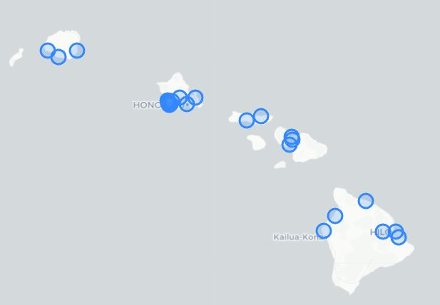

You can change the symbol size by changing the following line in the `options` object:
```ruby
return L.circleMarker(latlng, {radius:40})
```

## Step 3: Creating Proportional Symbols of GHG Emission
Next, we are going to assigned different circle sizes to the facilities according to the GHG emission (GHG_QUANTITY). To do this, we need a function to fetch the GHG_QUANTITY value of each facility and convert the value into a proportional diameter of a circle.

We first replace "40" by `feature.properties.GHG_QUANTITY` in the above line. This is to use the greenhouse quantities as the diameter values of the circles. However, you'll see the map becomes blue as the circles become enormously large and totally blocked the map. This is because the values of greenhouse quantities are too large to be used as diameters of the circles.


We need to make the circles smaller but proportional to the GreenHouse quantity. Next, we define an function to convert the GHG values to diameter values.

Add a `calcRadius` function under the `drawMap` function, and change `feature.properties.GHG_QUANTITY` to `calcRadius(feature.properties.GHG_QUANTITY)`:

```ruby
function drawMap(data) {
  var options = {
    pointToLayer: function (feature, latlng) {
      return L.circleMarker(latlng, {radius:calcRadius(feature.properties.GHG_QUANTITY)})
    }
  }
  L.geoJson(data, options).addTo(map);
}

function calcRadius(val) {
    var radius = Math.sqrt(val / Math.PI);
    return radius * .04;
}

```

Refresh Chrome, the circle sizes become smaller and proportional to the GHG_QUANTITY. Try to understand how the code works. It pass the value of GHG_QUANTITY into the `calcRadius` function, which returns a smaller value proportional to GHG_QUANTITY. Then, the proportional value of GHG_QUANTITY is used as the diameter of the circle markers.


You can change the color of the circle markers by adding the `style` property in the `drawMap` function.
```ruby
function drawMap(data) {
  var options = {
    pointToLayer: function (feature, latlng) {
      return L.circleMarker(latlng, {radius:calcRadius(feature.properties.GHG_QUANTITY)})
    },
    style: {
      fillOpacity: .6,
      color: "whitesmoke",
      fillColor: '#bd4932',
      weight: 1}
  }
  L.geoJson(data, options).addTo(map);
}
```
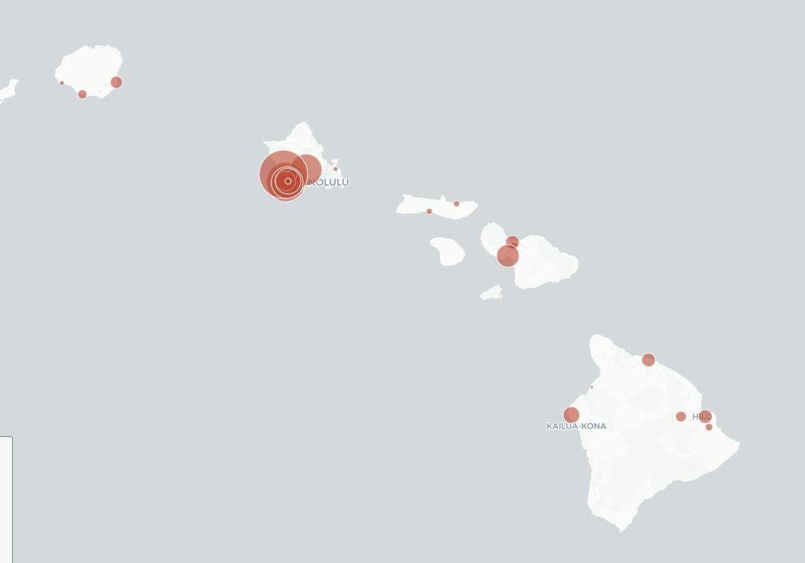

The value of the `color` is using HTML/CSS color name, while the 'fillColor' property has a Hex color code. The two types of color code can be used interchangably. You can use [this](https://www.rapidtables.com/web/color/html-color-codes.html) website to select and convert colors. You can replace the values `color` and `fillColor` with other color names or codes and see the changes in Chrome.

## Step 4. Mouse-Over Events
The map gives you an general idea where the high-emission facilities are located. However, it would be more interesting if you could see the detailed information of individual facilities. Next, we are going to add an mouse-over event to the map so you can see attribute information when your mouse move over a facility.

Add `onEachFeature` property for the options object. `onEachFeature` is like an event listener, which invokes a function when the mouse moves over each feature.


```ruby
function drawMap(data) {
  var options = {
    pointToLayer: function (feature, latlng) {
      return L.circleMarker(latlng, {radius:calcRadius(feature.properties.GHG_QUANTITY)})
    },
    style: {
      fillOpacity: .6,
      color: "whitesmoke",
      fillColor: '#bd4932',
      weight: 1},
    onEachFeature: showAttribute  #Add this line
    }
  L.geoJson(data, options).addTo(map);
}
```

Then, we declare a `ShowAttribute` function below the `calcRadius` function to respond to the `onEachFeature` listener

```ruby
function showAttribute(feature, layer) {
    var facilityInfo = "Name: " + feature.properties.FACILITY + "<br>" +
        "C02: " + feature.properties.GHG_QUANTITY.toLocaleString() + "<br>" +
        "Address: " + feature.properties.ADDRESS + ', ' +
        feature.properties.COUNTY + ', HI'
    layer.bindTooltip(facilityInfo, { sticky: true });
}
```

This function fetches the values of "FACILITY", 'GHG_QUANTITY', and 'ADDRESS' from the point features and format the values into HTML code `facilityInfo`. Then the function calls the `layer.bindTooltip` to show the content of `facilityInfo` in a small textbox in the map.

Refresh your browser and move your mouse over the facilities. The name, ghg emission and address are displayed in a small textbox.

However, when your mouse moves over areas with dense points, it's hard to tell which facility you are pointing to. We make the markers change color when the mouse is over.

Further modify the `showAttribute` function by adding an `layer.on` event:

```ruby
function showAttribute(feature, layer) {
    var facilityInfo = "Name: " + feature.properties.FACILITY + "<br>" +
        "C02: " + feature.properties.GHG_QUANTITY.toLocaleString() + "<br>" +
        "Address: " + feature.properties.ADDRESS + ', ' +
        feature.properties.COUNTY + ', CO'
    layer.bindTooltip(facilityInfo, { sticky: true });

    layer.on({
        mouseover: function () {
            layer.setStyle({
                color: "yellow",
                weight: 3
            });
        },
        mouseout: function () {
            layer.setStyle({
                color: "whitesmoke",
                weight: 1
            });
        }
    });
}

```

Refresh the browser and try to move the mouse over the markers. You should see the outline of the markers change to yellow when the mouse is over.
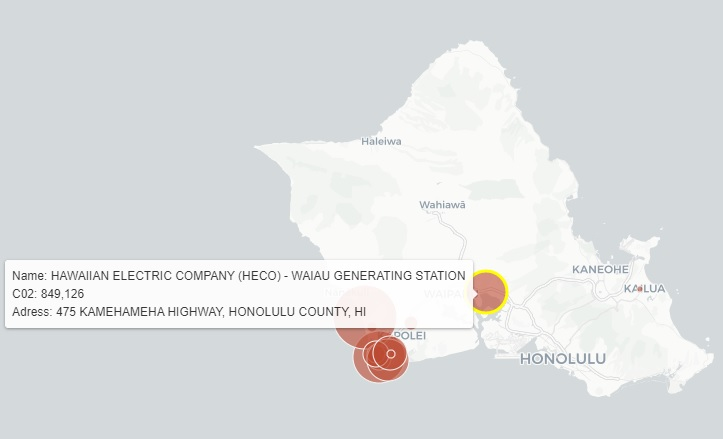

---

## Assignment
### Task 1:
Upload the Hawaii map you created in this lesson onto your UH webspace.


### Task 2:
Create a web map to show 2013 CO2 emission per capita by country as proportional symbols.
- The CO2 emission data can be downloaded from [here](https://drive.google.com/file/d/1814RXzmCxcFBACgs3mw_9G388DlEsYxf/view?usp=sharing).
- You would need to convert the downloaded data (shapefile) into GeoJSON.
- You create proportional symbols according to the attribute **Year_2013**. Remember to delete unnecessary attributes to make the app efficient.
- The map should have the same functionalities as the map you created in this lesson (You can modify from the web map you created today).
- Upload the created map and associated data to your UH webspace.

**Submission**: Submit the URLs to the Hawaiian map and world CO2 per capita emission map through Laulima by **Friday, Oct. 25th 11:55pm**.

Recommendation: you can create two folders in your public_html folder in your webspace to store the two maps and their associated data.
