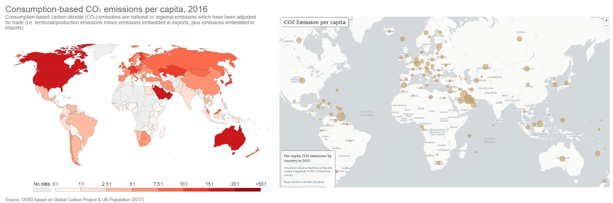
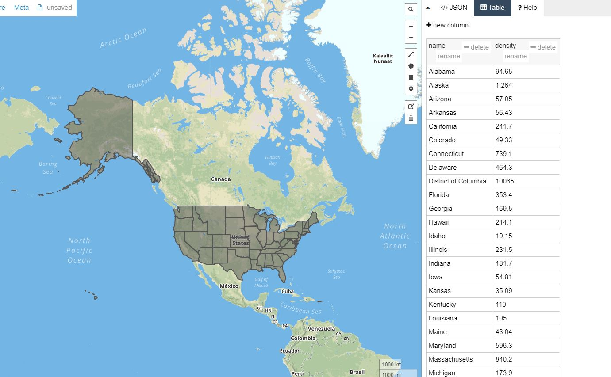
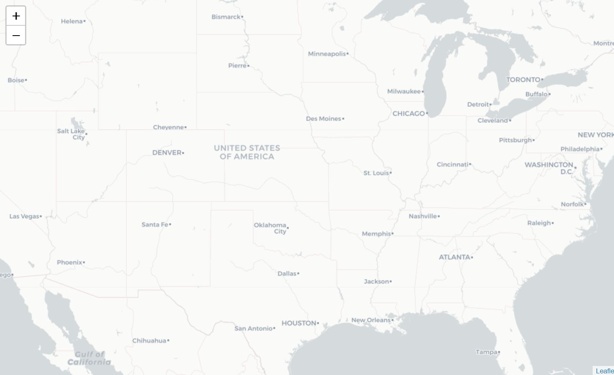
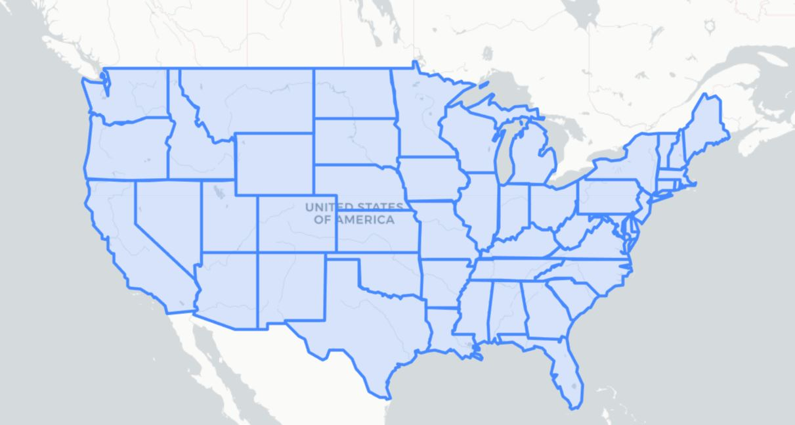
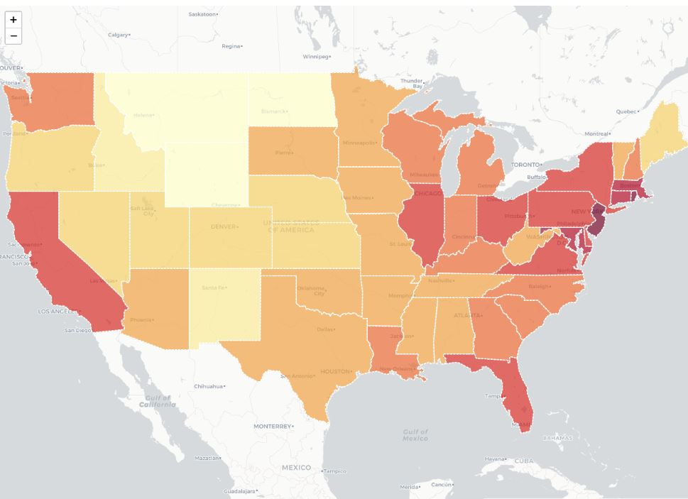
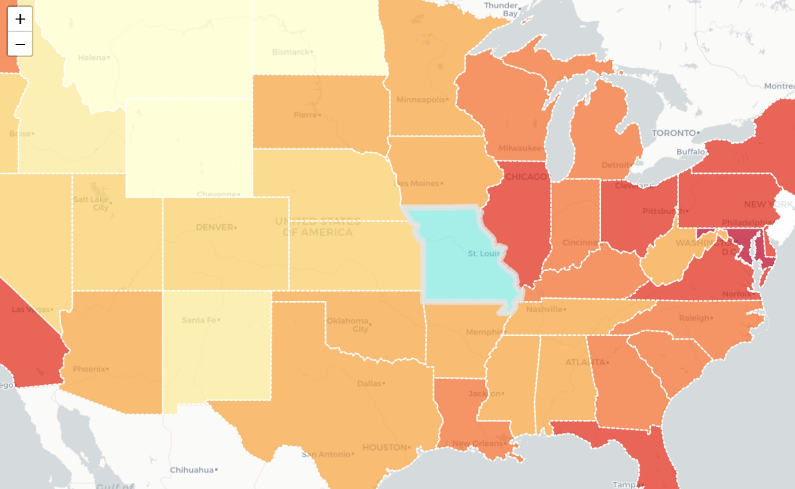
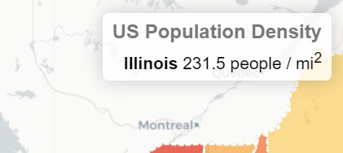
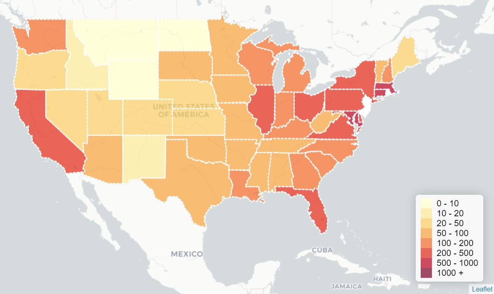

# Choropleth Map

##### Instructor: Yi Qiang <br/>Email: yi.qiang@hawaii.edu <br/>Oct. 25th, 2019
---
This lesson will introduce how to LeafLet to create a chropleth map for polygon features. This lesson is modified from the [leaflet tutorial: Interactive Choropleth Map](https://leafletjs.com/examples/choropleth/) and Web Mapping by [Bo Zhao](https://github.com/jakobzhao)

A choropleth map (from Greek χῶρος "area/region" and πλῆθος "multitude") is a thematic map in which areas are shaded or patterned in proportion to the measurement of the statistical variable being displayed on the map, such as population density or per-capita income. [More about choropleth map](https://en.wikipedia.org/wiki/Choropleth_map)


Left: choropleth map. Right: proportional symbol map.

## Learning objectives:
- Creating choropleth map using LeafLet
- Adding interactive controls in the maps

To begin, download the [template (index.html) and data (us-state.json)](https://drive.google.com/drive/folders/198J6SIN9Sfs9q_9C0_UKDW9SgpTPX90Y?usp=sharing) to a folder in your computer.

Copy the content in `us-state.json` and paste into [geojson.io](http://geojson.io). Have a look at the attribute table of the dataset.



## Step 1. Plotting polygons in a map
Open _index.html_ in chrome and open the developer tools panel. Launch a Python HTTP server using the downloaded folder as the root directory. You may refer to [Lec 7: getting started with web mapping](https://github.com/qiang-yi/GEOG476/blob/master/lecture/lec7_start_web_mapping.md) to learn how.

Now, index.html displays a blank page in Chrome. Check the HTML code, you can find the `body` element is empty, which means the webpage is empty. We first create a `div` element to create a block to hold the map.
Add the following line within the `body` element.

```html
<div id='map'></div>
```
Then, add the following lines of JavaScript in the `<script>` tags to load the map object. These codes add a base map to the `div` element with id 'map'.

```javascript
var map = L.map('map').setView([37.8, -96], 5);
L.tileLayer('http://{s}.basemaps.cartocdn.com/light_all/{z}/{x}/{y}.png').addTo(map);

```

You could also choose a basemap you like from [here](https://leaflet-extras.github.io/leaflet-providers/preview/).

At this step, you still don't see anything in the Atom preview and Chrome (after refresh). This is because you haven't defined the position and extent of the map block denoted by the `<div>` tags.

Now, add the css code below within the `<style>` tags to define the style of the `map` element. Setting the height and width to 100% is to extend the map in full extent.

```css
/*full screen the map*/
html { height:100%;}
body {
height:100%;
padding: 0;
margin: 0;
}
#map {
width: 100%;
height: 100%;
}
```

Refresh Chrome, you'll see a basemap showing in full extent.



We use `L.geoJson.ajax` function to load the geojson data into the map.

```javascript
geojson = L.geoJson.ajax("us-states.json").addTo(map);
```

Note, `L.geoJson.ajax` is a new function which is different from the JQuery function (`$.getJSON`) we in the previous class. Both functions can be used to add GeoJSON data.

You'll see the state boundaries shown in the map.



## Step 2: Assigning colors to the polygons

Next, we will assign colors to the polygons to represent their population density, which is an attribute of the polygons. This step is converting the values of population density into color values.

Add the following code within the `<script>` tags, below the `L.geoJson.ajax` function. Read the comments to understand what the codes do.

```javascript
// Determine the number of classes and the break values of the classes. For instance, a specific color will be assinged to states with apopulation density from 0 to 10, and so on.
var grades = [0, 10, 20, 50, 100, 200, 500, 1000];

// Use the chroma.scale function to break the color ramp into the same number of classes.
var colors = chroma.scale('YlOrRd').colors(grades.length);

//you can print any variable in the console of Chrome developer tool.
//console.log("grade length is " + grades.length)

//Instead of linear breaks, you can use different interpolation method lch, lab, hsl
// var colors = chroma.scale(['yellow', 'navy']).mode('hsl').colors(grades.length);


// get the color based on the class which the input value falls in.
function getColor(d) {
    for (var i = 0; i < grades.length - 1; i++) {
        if ( d > grades[i] && d < grades[i+1] ) return colors[i];
    }
    if (d > grades[grades.length - 1]) return colors[grades.length];
}
```
You can refer to [this website](http://repec.sowi.unibe.ch/stata/palettes/colors.html) for more color schemes (palettes). Choosing appropriate colors for a map can be tricky, but there’s a great tool that can help with it — [ColorBrewer](http://colorbrewer2.org/).

Next we define a `style` function for the GeoJSON layer so that its fillColor depends on `feature.properties.density` property, also adjusting the appearance a bit and adding a nice touch with dashed stroke.

Add the `style` function below the `getColor` function.

```javascript
// determine the style class based on the input feature
function style(feature) {
    return {
        weight: 2,
        opacity: 1,
        color: 'white',
        dashArray: '3',
        fillOpacity: 0.7,
        fillColor: getColor(feature.properties.density) //Convert density values into color values.
    };
}

geojson = L.geoJson.ajax("us-states.json",{style:style}).addTo(map);
```

Refresh Chrome and you'll see the colored polygons:



### Function declaration v.s. function expression
In the above javascript codes, you probably have noticed the functions (e.g. `style` and `getColor`) are declared after they are called. This is different from other programming languages where you need to declare the function before it is calling it. I would need to mention introduce the two ways to define functions in Javascript.

#### Function declaration
- The function statement declares a function.
- A declared function is “saved for later use”, and will be executed later, when it is invoked (called).
- Just as Variable Declarations must start with “var”, Function Declarations must begin with “function”.
- In javascript, **function declarations load before any code is executed**.

```javascript
alert(foo()); // Alerts 5. Declarations are loaded before any code can run.
function foo() { return 5; }
```
You can try the code in a online Javascript console such as [jsfiddle](https://jsfiddle.net/)

#### Function expression
- A JavaScript function can also be defined using an expression.
- A function expression can be stored in a variable.
- After a function expression has been stored in a variable, the variable can be used as a function. Functions stored in variables do not need function names. They are always invoked (called) using the variable name.
- Function expressions load only when the interpreter reaches that line of code.

```JavaScript
alert(foo()); // ERROR! foo wasn't loaded yet
var foo = function() { return 5; }
```

## Step 3: Adding Interaction
Now let’s make the states highlighted visually in some way when they are hovered with a mouse.

First we use the `onEachFeature` option to add the listeners on our state layers. Modify the `L.geoJson.ajax` function to add the `onEachFeature` listener. The second `onEachFeature` is a function that reacts when the mouse is on each feature in the state layer.

```javascript
// Assign the geojson data path, style option and onEachFeature option. And then Add the geojson layer to the map.
geojson = L.geoJson.ajax("us-states.json", {
    style: style,
    onEachFeature: onEachFeature    // ADD THIS LINE
}).addTo(map);
```

Then, we define the `onEachFeature` function to react to the listener. This function contain a `layer.on` function, which has two additional listeners `mouseover` and `mouseout`.
```javascript
// Add these events the layer obejct.
function onEachFeature(feature, layer) {
    layer.on({
        mouseover: highlightFeature,
        mouseout: resetHighlight
    });
}
```

Next, we define the `highlightFeature` and `resetHighlight` function to define behaviors when mouse moves on and out of the feature.

```javascript
// Highlight a feature when the mouse hovers on it.
function highlightFeature(e) {
    // e indicates the current event
    var layer = e.target; //the target capture the object which the event associates with
    layer.setStyle({
        weight: 8,
        opacity: 0.8,
        color: '#e3e3e3',
        fillColor: '#1ce3d7',
        fillOpacity: 0.5
    });
    // bring the layer to the front.
    layer.bringToFront();
    // select the update class, and update the contet with the input value.
    $(".update").html('<b>' + layer.feature.properties.name + '</b>   ' + layer.feature.properties.density + ' people / mi<sup>2</sup>');
}
```

Here we get access to the layer that was hovered through `e.target`, set a thick grey border on the layer as our highlight effect, also bringing it to the front so that the border doesn’t clash with nearby states (but not for IE, Opera or Edge, since they have problems doing `bringToFront` on mouseover).

Next we’ll define what happens on mouseout. Add the following code below the `highlightFeature` function:

```javascript
function resetHighlight(e) {
    geojson.resetStyle(e.target);
    $(".update").html("Hover over a state");
}
```
The handy `geojson.resetStyle` method will reset the layer style to its default state (defined in the `style` function).

Now You can see the state will change color when your mouse move over it.


As an additional touch, let’s define a click listener that zooms to the state:

Modify the `onEachFeature` function to add the click event.

```javascript
function onEachFeature(feature, layer) {
    layer.on({
        mouseover: highlightFeature,
        click: zoomToFeature,
        mouseout: resetHighlight
    });
}
```

Create the `zoomToFeature` function to zoom to the bound of the polygon where the mouse is on.

```javascript
function zoomToFeature(e) {
    map.fitBounds(e.target.getBounds());
}
```


Refresh Chrome and click on a state to check if the map zooms in.

## Step 4: Custom Info Control
We could use the usual popups on click to show information about different states, but we’ll choose a different route — showing the information in a textbox at a fixed location when your mouse hover over a state.

Here’s the HTML code for our control. Add it within the `<body>` tag (outside of the `<script>` tags)
```html
<div class='info'><h1>US Population Density</h1><div class='update'>Hover over a state</div></div>

```
No change in the website, right? This is because we haven't defined the style (CSS) of the `div` elmenent in the `info` class.

Now, let's define the style of the `info` class and `h1` (belong to `info`).

```
.info {
    z-index: 1000;
    position: absolute;
    right: 20px;
    top: 20px;
    padding: 6px 8px;
    font: 14px Arial, Helvetica, sans-serif;
    text-align: right;
    background: white;
    background: rgba(255, 255, 255, 0.8);
    box-shadow: 0 0 15px rgba(0, 0, 0, 0.2);
    border-radius: 5px;
}
.info h1 {
    font-size: 16px;
    margin: 0 0 5px;
    color: #777777;
}
```
Now, you can see a small text box appear in the top-right corner of map. When you move your mouse over the states, the population density displays in the text box.



Try to understand how the CSS code defines the position, size and color of the text box. You can make changes in the CSS code to see the effect.

## Step 5: Custom Legend control
Legend is important for a choropleth map as it help users to understand the quantities represented by the colors. In this step, we are going to add a legend to the map.

Add the following HTML code within the `body` tags.
```html
<div class='legend'></div>
```

Add the following JavaScript code to create the legend:
```javascript
// Create an empty list called labels
var labels = [];

//Use a for loop to add the colors and value classes in the list
for (var i = 0; i < grades.length - 1; i++) {
    labels.push('<i style="background:' + colors[i] + '"></i> ' + grades[i] + ' - ' + grades[i + 1]);
}

//Add the last color into the list
labels.push('<i style="background:' + colors[grades.length - 1] + '"></i> ' + grades[grades.length - 1] + ' +');

//Add the list in the legend block.
$(".legend").html(labels.join('<br>'));
```

CSS styles for the control (we also reuse the info class defined earlier):
```css
/*legend panel*/
.legend {
    z-index: 1000;
    position: absolute;
    right: 20px;
    bottom: 20px;
    padding: 6px 8px;
    font: 14px Arial, Helvetica, sans-serif;
    background: white;
    background: rgba(255, 255, 255, 0.8);
    box-shadow: 0 0 15px rgba(0, 0, 0, 0.2);
    border-radius: 5px;
}
.legend i {
    width: 18px;
    height: 16px;
    float: left;
    margin-right: 8px;
    opacity: 0.7;
}
```
A legend appears in the lower left corner of the map:



## Assignment
Please download the 2015 Chicago income data from [here](https://drive.google.com/file/d/1NxhL7MsuU_YuSlcjQbPOFsA0mOfKMD67/view?usp=sharing), and create a choropleth map to display per capita income in different communities in Chicago.

Requirement:
1. Use a sequential color scheme to represent per capita income (income_pc).
2. The map includes a legend.
3. The map includes a dynamic textbox to show per capita income (income_pc), number of crime (num_crime) and unemplolyment rate (unemployed) when a mouse hover the community.
4. Upload the map into your UH web space, and provide a URL to access the map.

- Tip 1: You need to convert the data from shapefile to GeoJSON using QGIS or geojson.io (you've done this in previous labs.
- Tip 2: You can modify the map you created in this lesson for the new map.
